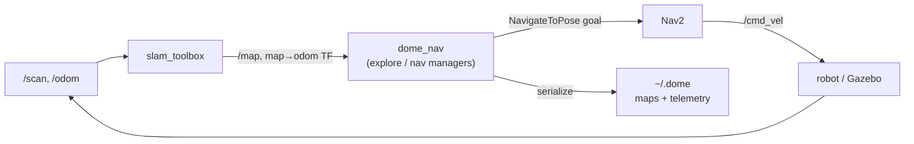
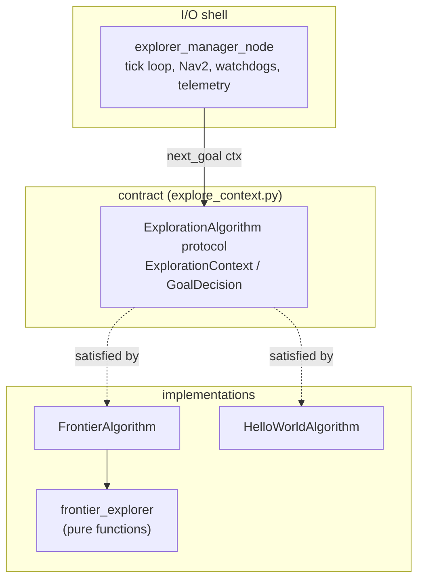

# dome_nav — Technical and Architectural Overview

`dome_nav` is a ROS 2 navigation package for the DOME robot. It does not
reimplement SLAM or path planning — it *wraps* two mature stacks, **slam_toolbox**
(mapping and localization) and **Nav2** (planning, control, recovery), and adds
the DOME-specific glue on top: autonomous frontier exploration, intent-driven
"go to that object" navigation, map persistence, and the launch machinery to
bring it all up in simulation or on the real robot. This document is the map of
the territory the per-module chapters explore in detail.

## Theory of operation

A mobile robot that must map and then move through an unknown space has three
jobs running at once: figure out where it is (localization), build a model of the
world (mapping), and decide where to go and how to get there (navigation).
`dome_nav` assigns each to a proven subsystem and concerns itself only with the
*coordination* between them.

- **slam_toolbox** consumes `/scan` and `/odom` and produces `/map` (an
  occupancy grid) plus the `map→odom` TF transform. It is pose-graph SLAM: the
  world is a graph of robot poses connected by scan-match constraints, optimized
  as loops close.
- **Nav2** consumes `/map` and a goal pose, and drives `/cmd_vel`. It maintains
  costmaps (inflating obstacles by the robot's radius), plans a path
  (SmacPlanner2D here), and follows it with a controller, invoking behavior-tree
  recoveries when it gets stuck.
- **dome_nav** sits above both. It decides *which goals to send* — either
  autonomously, by detecting the frontier between known and unknown space, or on
  demand, by translating a spoken/typed intent into the pose of a known object.

The exploration cycle is the package's signature loop: detect the frontier →
score candidate goals → send the best to Nav2 → drive there, revealing new space
→ repeat until no frontier remains.

## The two subsystems

The package has two mostly-independent feature paths that share only the
utilities and the ROS conventions:

**Exploration** (autonomous mapping). Entry point `explorer_manager_node`; the
decision logic is a *pluggable algorithm* behind the `ExplorationAlgorithm`
protocol; the default `FrontierAlgorithm` wraps the pure detection/scoring
functions in `frontier_explorer`. This is the larger and more algorithmically
interesting half.

**Intent navigation** (go-to-object) **has moved out** (F35). Mission sequencing
and go-to-label now live in the neutral `dome_mission` package; dome_nav is
navigation **primitives only**. The explorer no longer subscribes `/intent` — it
exposes exploration as a cancellable `ExploreArea` action (`dome_nav_msgs`) that
dome_mission drives. The former `nav_manager` / `nav_manager_node` are deleted;
their go-to-label logic is dome_mission's `label_resolver` + `mission_node`.

Plus two supporting concerns: **map persistence** (`slam_manager_node`, a
lifecycle node that saves the pose graph at the right moment) and **launch**
(`utils` + the `sim_*` / `robot_*` launch files).

## The one architectural idea worth internalizing

Nearly every module in this package is built around a single principle:

> **Separate the pure decision logic from the ROS I/O shell, and separate the
> stable contract from its implementations.**

It shows up three times, in three forms:

1. **Pure core / thin node.** `frontier_explorer` (pure) vs
   `explorer_manager_node` (ROS). The pure half has no rclpy import and is
   unit-tested with plain Python values — no simulator, no graph. The node owns
   only what *must* be impure: TF, action clients/servers, timers, the clock.
   (The same split, applied to go-to-label, now lives across the boundary in
   `dome_mission`.)

2. **Contract / implementations.** `explore_context` defines the data types and
   the `ExplorationAlgorithm` protocol; `frontier_algorithm` and
   `hello_world_algorithm` implement it. The node speaks only the contract's
   vocabulary (`ExplorationContext` in, `GoalDecision` out) and never names
   "frontier." Swapping strategies is a one-line registry change.

3. **Merged-per-tick tuning.** Shared params (`ExploreParams`, node-owned) and
   strategy params (`FrontierParams`, algorithm-owned) are combined into a
   per-tick `FrontierTuning` at the boundary, keeping each owner ignorant of the
   other's knobs.

## Data and control flow across a tick

The exploration tick ties the layers together and is the best single example of
the flow. At 1 Hz, when no goal is active, the node fetches the latest `/map` and
global costmap on demand (a CPU-frugality choice — standing subscriptions burned
10–20% CPU idle on the Pi), builds an `ExplorationContext`, and asks the algorithm
for a `GoalDecision`. It validates the candidate against the costmap (bounds +
lethal cells), sends the survivor to Nav2, and hands the rest to two watchdogs
(no-progress and hard-timeout) plus a persistent blacklist. Three independent
mechanisms decide the session is over: frontier exhaustion, no-target patience,
and wedge detection.

## Where the DOME state lives

Everything persistent hangs off `DOME_HOME` (default `~/.dome`): serialized SLAM
maps, exported legacy PGM/YAML, a content-addressed launch-config cache, and
per-session JSONL telemetry. `utils.py` centralizes that path so a single
`DOME_HOME` redirect relocates all of it (useful for tests).

## Reading order

The chapters are numbered by dependency — foundations first, orchestration last:

1. **01-utils** — launch/config plumbing everything leans on.
2. **02-slam_manager_node** — map persistence (lifecycle node).
3. **04-explore_context** — the exploration contract.
4. **06-frontier_explorer** — the pure detection + F31 scoring engine (the deep one).
5. **08-frontier_algorithm** — the default algorithm + its tuning.
6. **09-explorer_manager_node** — the session orchestrator + ExploreArea action server.
7. **10-algo_demo** — an interactive way to watch the algorithm think.
8. **X05–X08** — appendices: telemetry, markers, sim launch files, the minimal
   reference algorithm.

(Intent-navigation chapters 03/05 were removed when go-to-label moved to
`dome_mission`; its literate lives in that package.)
