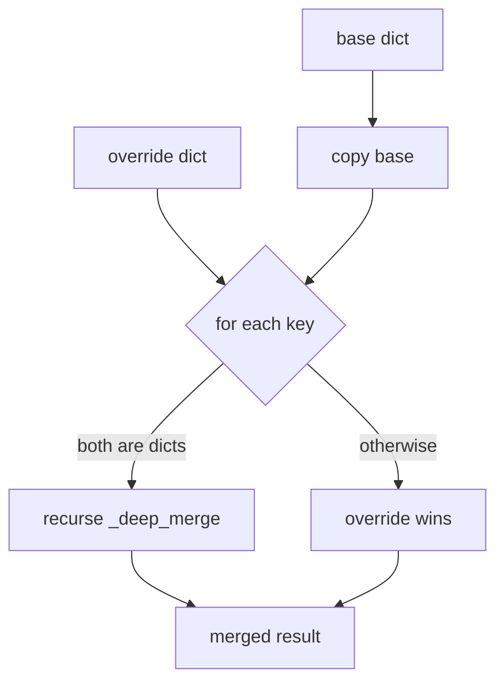

# utils.py — Shared Utilities for dome_nav

## Purpose

`utils.py` provides two services: locating the robot's home directory on disk (`dome_home`) and merging YAML configuration files at launch time (`yaml_override`, `yaml_patch_dict`). These are foundational; every launch file and node that needs config depends on them.

## The DOME_HOME Convention

Rather than hard-coding paths, all persistent state (maps, logs, calibration) lives under a single directory resolved at runtime:

```python
def dome_home() -> str:
    """Return DOME_HOME path, expanding ~ if needed."""
    return os.path.expanduser(os.environ.get("DOME_HOME", "~/.dome"))
```

The `DOME_HOME` environment variable lets CI and multi-robot deployments redirect state without touching code. The `~/.dome` default keeps a developer's workstation tidy.

## YAML Merging

ROS2 launch files often need to layer a robot-specific override on top of a shared base config. Two functions handle this:

**File-to-file merge** — reads both YAML files and merges them:

```python
def yaml_override(base_file: str, override_file: str) -> str:
    with open(base_file) as f:
        base_params = yaml.safe_load(f) or {}
    with open(override_file) as f:
        override_params = yaml.safe_load(f) or {}
    merged = _deep_merge(base_params, override_params)
    return _write_temp(merged)
```

**Dict-to-file merge** — useful when overrides are computed at launch time:

```python
def yaml_patch_dict(base_file: str, overrides: dict) -> str:
    with open(base_file) as f:
        base_params = yaml.safe_load(f) or {}
    merged = _deep_merge(base_params, overrides)
    return _write_temp(merged)
```

Both return a path to a temporary file. The caller passes that path to a ROS2 node as a params file argument. The temp file lives until the process exits.

## Deep Merge Algorithm

Shallow merge (`dict.update`) would clobber entire nested namespaces. `_deep_merge` recurses into matching dict keys so that overriding a single deeply-nested parameter doesn't erase its siblings:

```python
def _deep_merge(base: dict, override: dict) -> dict:
    result = base.copy()
    for key, value in override.items():
        if key in result and isinstance(result[key], dict) and isinstance(value, dict):
            result[key] = _deep_merge(result[key], value)
        else:
            result[key] = value
    return result
```



## Temp File Sink

```python
def _write_temp(data: dict) -> str:
    temp = tempfile.NamedTemporaryFile(mode="w", suffix=".yaml", delete=False)
    yaml.dump(data, temp, default_flow_style=False, sort_keys=False)
    temp.close()
    return temp.name
```

`delete=False` is intentional: the file must persist after `close()` because ROS2 nodes read it after the launch process creates it. The OS will clean it up on reboot; for long-running robots this is acceptable.

## Potential Improvements

- **Temp file leaks**: Files are never explicitly deleted. A `contextlib.contextmanager` wrapper that deletes on exit would make this safer for long-running processes or test suites.
- **Missing-file error messages**: `open(base_file)` raises a generic `FileNotFoundError`. A wrapper with a descriptive message pointing to the offending config path would help operators debug misconfigured launches.
- **`sort_keys=False`** preserves author intent in YAML output, but makes deterministic diffs harder. Consider documenting this choice.
