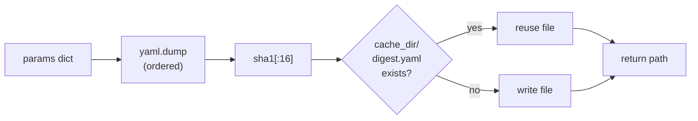

# Launch Utilities — `utils.py`

Every launch file in `dome_nav` needs to answer the same handful of small
questions before it can bring a robot up: *where does my persistent data live?
which Gazebo worlds are actually installed? where should the robot spawn in this
world? and how do I hand a big merged parameter blob to a node without leaking
temp files?* `utils.py` is the shared answer to those questions. It is pure
filesystem-and-config plumbing — no ROS, no nodes — which is exactly why it
sorts first in the reading order: everything else leans on it.

## Where DOME keeps its state

The package writes maps, telemetry, and cached configs under a single home
directory. Rather than hard-code a path, we honor a `DOME_HOME` environment
variable and fall back to `~/.dome`, expanding `~` in either case so downstream
`open()` calls never choke on an unexpanded tilde.

```python
def dome_home() -> str:
    """Return DOME_HOME path, expanding ~ if needed."""
    return os.path.expanduser(os.environ.get("DOME_HOME", "~/.dome"))
```

The single point of truth matters: if this string were duplicated across launch
files, a redirection for a test run (`DOME_HOME=/tmp/test`) would silently miss
half of them.

## Failing early on an unknown world

Gazebo's failure mode for a missing `.world` file is opaque — you get a "file
not found" deep in the simulator's startup, long after the launch has committed
to spinning up processes. We prefer to fail *before* that, with a message that
tells the operator what they could have typed instead. So we list what is
actually on disk and validate against it.

```python
def available_worlds(worlds_dir: str) -> list[str]:
    """List installed Gazebo world names (without the .world extension)."""
    return sorted(
        f[: -len(".world")] for f in os.listdir(worlds_dir) if f.endswith(".world")
    )


def require_world_name(world_name: str, worlds_dir: str, usage: str) -> str:
    choices = available_worlds(worlds_dir)
    if world_name not in choices:
        raise ValueError(
            f"world_name is required and must be one of {choices}"
            f" (got {world_name!r}): {usage}"
        )
    return world_name
```

The `usage` string is passed in by the caller so the error can name the exact
command form (`bl dome_nav sim_robot.launch.py --world_name <name>`) rather than
a generic complaint. This is the "guardrail at the boundary" pattern that recurs
throughout the package: validate once, where the bad value enters, and phrase
the error in the operator's own vocabulary.

## Per-world spawn points

A world and its natural robot-start location belong together — picking
`multi_room` should not also mean remembering that its origin is `(1.0, 1.0)`.
So the mapping lives here as data, with a sane `(0.0, 0.0)` default for worlds
we have not annotated.

```python
WORLD_SPAWN_XY: dict[str, tuple[float, float]] = {
    "simple_room": (-1.0, -1.0),
    "multi_room": (1.0, 1.0),
}


def world_spawn_xy(world_name: str) -> tuple[float, float]:
    return WORLD_SPAWN_XY.get(world_name, (0.0, 0.0))
```

## Content-addressed config caching

This is the most interesting function in the file, and the one that fixes a real
bug. Launch files often need to hand a node a merged parameter set as a YAML
file on disk (see `sim_robot.launch.py`, which cannot pass a 300-line URDF as a
command-line argument). The naive approach — `NamedTemporaryFile` — leaks one
file into `/tmp` per launch, forever.

Instead we render the config to YAML, hash the rendered bytes, and name the file
after the hash. Identical configs collapse onto one file; repeated launches with
the same params reuse it instead of accumulating.

```python
def write_config(data: dict) -> str:
    cache_dir = os.path.join(dome_home(), "launch_cache")
    os.makedirs(cache_dir, exist_ok=True)
    blob = yaml.dump(data, default_flow_style=False, sort_keys=False)
    digest = hashlib.sha1(blob.encode()).hexdigest()[:16]
    path = os.path.join(cache_dir, f"{digest}.yaml")
    with open(path, "w") as f:
        f.write(blob)
    return path
```

The design is *content-addressed storage* in miniature, the same idea Git uses
for blobs. Two subtle choices are worth calling out:

- **`sort_keys=False`** keeps the YAML in insertion order, so a human reading the
  cached file sees the params in the order the launch author wrote them.
- **Hashing the rendered string, not the dict**, means the cache key is exactly
  the file content. Two dicts that render identically *are* the same cache entry,
  which is the property we want.



## Observations and possible improvements

- **Collision handling is implicit.** A 16-hex-char SHA-1 prefix (64 bits) makes
  accidental collisions astronomically unlikely, but a *deliberate* collision
  would silently reuse the wrong config. For a launch cache this is a non-issue;
  worth a one-line comment noting the truncation is a deliberate space/safety
  trade.
- **The cache never garbage-collects.** It grows one file per *distinct* config
  rather than per launch, which is the whole point — but a long-lived robot that
  sweeps many parameter combinations will still accumulate files. A small
  "delete entries older than N days" sweep on startup would bound it.
- **`available_worlds` does no caching.** It hits the filesystem on every call.
  That is fine for launch-time use (called once), but if it ever moved into a hot
  path it would want memoization.
- **`require_world_name` returns the validated name** but most callers ignore the
  return value and re-use their own variable. Returning it enables a
  `world = require_world_name(world, ...)` idiom that some callers could adopt for
  clarity.
