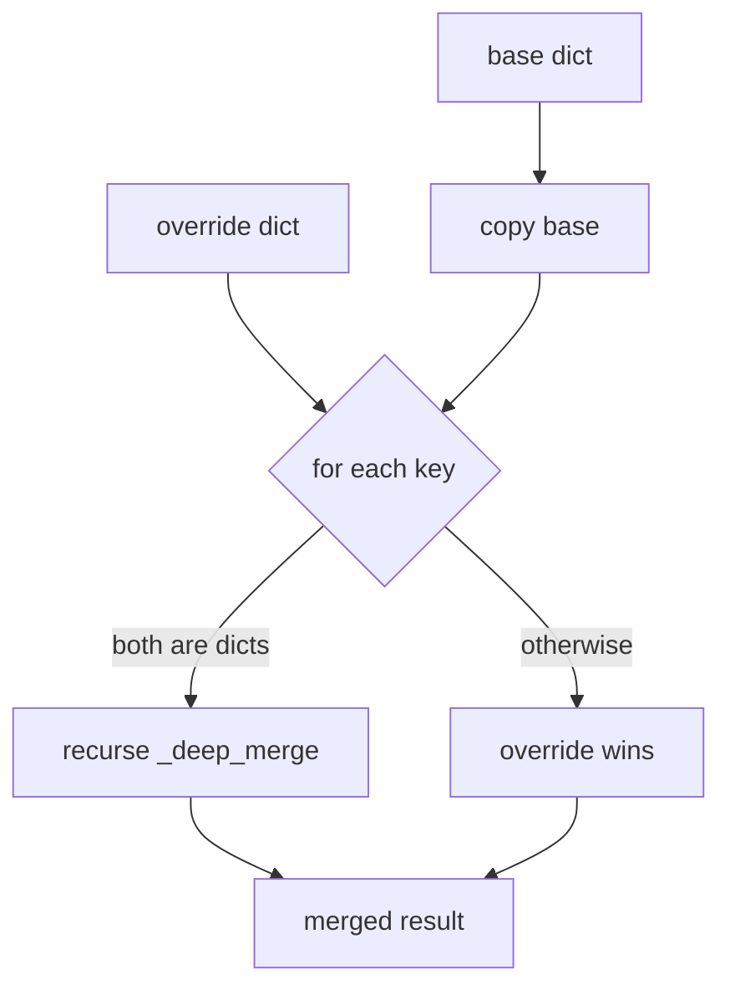

# utils.py — Shared Utilities for dome_nav

## Purpose

`utils.py` provides three services: locating the robot's home directory on disk (`dome_home`), merging YAML configuration files at launch time (`yaml_override`, `yaml_patch_dict`), and — added 2026-07-05 — validating which Gazebo world a sim launch should use (`available_worlds`, `require_world_name`, `world_spawn_xy`). These are foundational; every launch file and node that needs config or a simulated world depends on them.

## The DOME_HOME Convention

Rather than hard-coding paths, all persistent state (maps, logs, calibration) lives under a single directory resolved at runtime:

```python
def dome_home() -> str:
    """Return DOME_HOME path, expanding ~ if needed."""
    return os.path.expanduser(os.environ.get("DOME_HOME", "~/.dome"))
```

The `DOME_HOME` environment variable lets CI and multi-robot deployments redirect state without touching code. The `~/.dome` default keeps a developer's workstation tidy.

## YAML Merging

ROS2 launch files often need to layer a robot-specific override on top of a shared base config. Two functions handle this:

**File-to-file merge** — reads both YAML files and merges them:

```python
def yaml_override(base_file: str, override_file: str) -> str:
    with open(base_file) as f:
        base_params = yaml.safe_load(f) or {}
    with open(override_file) as f:
        override_params = yaml.safe_load(f) or {}
    merged = _deep_merge(base_params, override_params)
    return write_config(merged)
```

**Dict-to-file merge** — useful when overrides are computed at launch time:

```python
def yaml_patch_dict(base_file: str, overrides: dict) -> str:
    with open(base_file) as f:
        base_params = yaml.safe_load(f) or {}
    merged = _deep_merge(base_params, overrides)
    return write_config(merged)
```

Both return a path to a config file on disk. The caller passes that path to a ROS2 node as a params file argument.

## Deep Merge Algorithm

Shallow merge (`dict.update`) would clobber entire nested namespaces. `_deep_merge` recurses into matching dict keys so that overriding a single deeply-nested parameter doesn't erase its siblings:

```python
def _deep_merge(base: dict, override: dict) -> dict:
    result = base.copy()
    for key, value in override.items():
        if key in result and isinstance(result[key], dict) and isinstance(value, dict):
            result[key] = _deep_merge(result[key], value)
        else:
            result[key] = value
    return result
```



## Content-Addressed Config Sink

The merged config must persist after the function returns — ROS2 nodes read it after the launch process writes it. An earlier version used `tempfile.NamedTemporaryFile(delete=False)`, which leaked one `/tmp` file on *every* launch since nothing ever deleted them (issue I11). The fix keys the file by a hash of its own content:

```python
def write_config(data: dict) -> str:
    cache_dir = os.path.join(dome_home(), "launch_cache")
    os.makedirs(cache_dir, exist_ok=True)
    blob = yaml.dump(data, default_flow_style=False, sort_keys=False)
    digest = hashlib.sha1(blob.encode()).hexdigest()[:16]
    path = os.path.join(cache_dir, f"{digest}.yaml")
    with open(path, "w") as f:
        f.write(blob)
    return path
```

Because the filename is derived from the rendered YAML, identical configs map to the same file and repeated launches overwrite rather than accumulate. The on-disk set is bounded by the number of *distinct* configs — a handful — instead of growing without limit. The cache lives under `DOME_HOME` so it travels with the rest of the robot's state and is easy to inspect or wipe.

## World Selection (added 2026-07-05)

Once a second Gazebo world file (`multi_room.world`) existed alongside
`simple_room.world`, the world filename could no longer stay hardcoded in the
sim launch files. Rather than each launch file guessing or hand-maintaining a
list of valid names, three small pure functions centralize this:

```python
def available_worlds(worlds_dir: str) -> list[str]:
    return sorted(
        f[: -len(".world")] for f in os.listdir(worlds_dir) if f.endswith(".world")
    )
```

`available_worlds` reads the *installed* `share/dome_nav/worlds/` directory
directly, so the list of valid choices can never drift out of sync with what
actually exists on disk — no hardcoded name list to forget to update when a
third world file is added later.

```python
def require_world_name(world_name: str, worlds_dir: str, usage: str) -> str:
    choices = available_worlds(worlds_dir)
    if world_name not in choices:
        raise ValueError(
            f"world_name is required and must be one of {choices}"
            f" (got {world_name!r}): {usage}"
        )
    return world_name
```

This follows the same "fail loudly and early" pattern already used for
`map_name` throughout the launch files (see `sim_slam.launch.py`, etc.): a
missing or misspelled world name raises immediately, at launch time, with the
actual list of what's available and a copy-pasteable usage hint — rather than
letting Gazebo fail later with an opaque "world file not found" once several
other nodes have already started.

```python
WORLD_SPAWN_XY: dict[str, tuple[float, float]] = {
    "simple_room": (-1.0, -1.0),
    "multi_room": (1.0, 1.0),
}


def world_spawn_xy(world_name: str) -> tuple[float, float]:
    return WORLD_SPAWN_XY.get(world_name, (0.0, 0.0))
```

Each world was designed around a specific robot starting position —
`simple_room.world` uses a centered origin (room spans roughly -2..2), so a
sensible interior start is (-1,-1); `multi_room.world` uses a corner origin
(0,0) with a room at x:0-4, y:0-4, so (1,1) sits safely inside it.
`world_spawn_xy` means picking a world also picks the right spawn point
automatically — a caller never has to remember "oh, and if you choose that
world, also pass these particular spawn coordinates."

The `dict.get(world_name, (0.0, 0.0))` fallback is deliberately permissive
rather than raising: an unknown world name has already been rejected by
`require_world_name` before this is ever called in practice, so this
function's own contract is just "look up a spawn point, default to the
origin if nothing is known about this name" — it doesn't need to re-validate.

## Potential Improvements

- **Cache eviction**: the launch cache is bounded by distinct configs but never pruned. A startup sweep of files older than N days would keep it tidy across many map/param variations.
- **Missing-file error messages**: `open(base_file)` raises a generic `FileNotFoundError`. A wrapper with a descriptive message pointing to the offending config path would help operators debug misconfigured launches.
- **`sort_keys=False`** preserves author intent in YAML output and, conveniently, keeps the content hash stable across runs — but it does make deterministic diffs against alphabetised configs harder.
- **`WORLD_SPAWN_XY` is a hardcoded dict, unlike `available_worlds`' dynamic directory scan.** Adding a third world file requires remembering to also add its spawn point here, whereas the world-name list itself can never go stale. A small SDF convention (e.g. a comment or custom element naming the intended spawn pose) read alongside the `.world` file would close this gap, at the cost of more parsing logic for a rarely-changed value.
