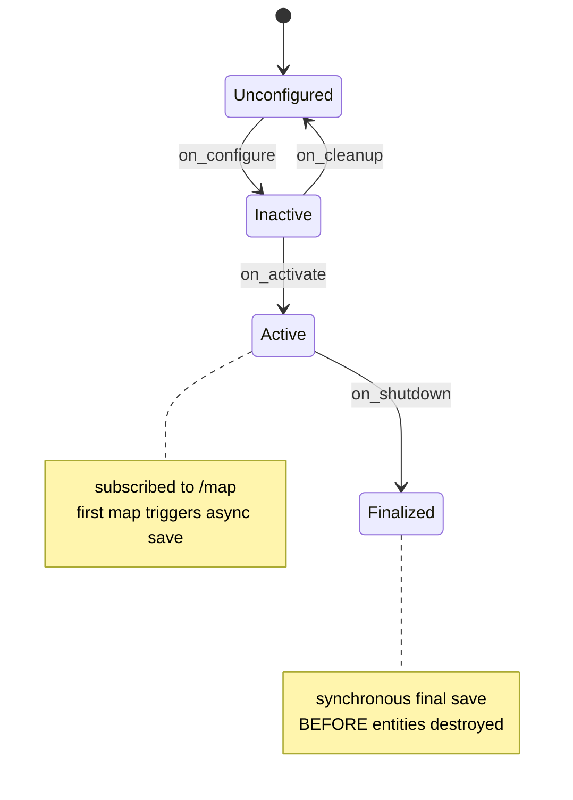
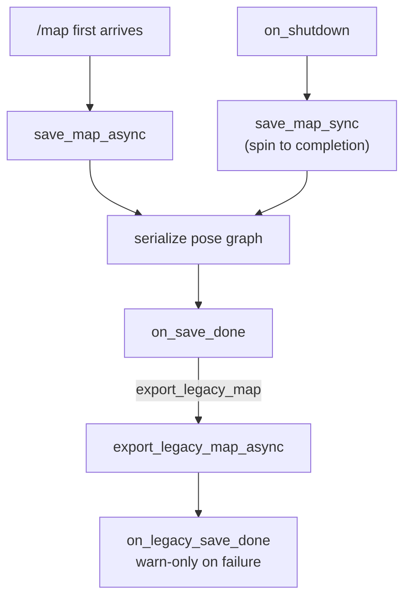

# The SLAM Manager — persisting the map at the right moment

`slam_manager_node.py` has one job that sounds trivial and turns out to be
subtle: **make sure the map slam_toolbox builds actually survives the process
exiting.** It does not do any mapping itself — slam_toolbox does that. It
watches `/map`, announces status, and drives slam_toolbox's serialization
services so that a pose graph (and, optionally, a legacy PNG/YAML map) lands on
disk. The subtlety is entirely about *timing*: an earlier version saved the map
after the event loop had already stopped, and the save silently never happened
(issue I01). Fixing that is why this is a **lifecycle node** rather than a plain
one.

## Background: what "serialize the pose graph" actually saves

slam_toolbox is a **pose-graph SLAM** system, and knowing that explains why this
node saves *two different things*. In pose-graph SLAM the map is not primarily an
image — it is a graph whose nodes are robot poses and whose edges are constraints
between them (odometry, and scan-to-scan matches). As the robot revisits a place,
a loop-closure edge is added and the whole graph is re-optimized (a sparse
nonlinear least-squares solve), which retroactively straightens drift across
every pose at once. The occupancy grid you see on `/map` is a *rendering* of that
graph, regenerated from the optimized poses and their scans.

That is why "save the map" here means **serialize the pose graph**
(`SerializePoseGraph`): the graph is the source of truth and can be reloaded to
*continue* mapping or to relocalize. The optional legacy PGM/YAML export
(`SaveMap`) is the flattened image — convenient for tools that only understand
occupancy grids, but lossy: you cannot resume SLAM from a PNG. The node saves the
graph first and treats the image as a disposable derivative, which is exactly the
right priority.

## Why a lifecycle node

A ROS 2 `LifecycleNode` has explicit `configure → activate → … → shutdown`
transitions with callbacks you can hook. That structure is what lets us run a
*synchronous* final save during `on_shutdown`, before the node's entities are
destroyed. A plain `Node` has no such hook; you are left firing an async service
call from `main()`'s cleanup after `spin()` has returned — at which point nothing
is spinning to deliver the response, so the callback never runs and the map is
lost.



## Configuration: wiring up subscriptions and clients

`on_configure` creates everything the node talks through: a subscription to
`/map`, a lifecycle publisher for status, and two service clients into
slam_toolbox — one to serialize the pose graph, one to export a legacy map.

```python
def on_configure(self, state: LifecycleState) -> TransitionCallbackReturn:
    self.map_sub = self.create_subscription(OccupancyGrid, "/map", self.on_map, 10)
    self.status_pub = self.create_lifecycle_publisher(
        String, "/dome_nav/slam_status", 10
    )
    self.serialize_client = self.create_client(
        SerializePoseGraph, "/slam_toolbox/serialize_map"
    )
    self.save_map_client = self.create_client(SaveMap, "/slam_toolbox/save_map")
    return TransitionCallbackReturn.SUCCESS
```

The persistence path is a ROS parameter (`map_persist_path`), defaulting under
`DOME_HOME` via the `dome_home()` helper from `utils.py`. A second parameter,
`export_legacy_map`, decides whether we also emit the older PGM/YAML format that
some tools still expect.

## The save state machine

Two things trigger a save, and they use two *different* mechanisms for a
deliberate reason.

**First map received → async save.** The moment the first `/map` arrives we know
slam_toolbox is genuinely mapping, so we kick off a non-blocking save. Blocking
here would stall the executor for no benefit — there is plenty of time before
shutdown.

```python
def on_map(self, msg: OccupancyGrid):
    first_map = not self.map_ready
    if first_map:
        self.map_ready = True
    status = String()
    status.data = "mapping"
    self.status_pub.publish(status)
    if first_map:
        self.save_map_async()
```

**Shutdown → synchronous save.** At shutdown we cannot afford "fire and hope."
We spin the future to completion right here, inside the transition callback,
while the executor is still alive:

```python
def on_shutdown(self, state: LifecycleState) -> TransitionCallbackReturn:
    if self.map_ready:
        self.save_map_sync()
    self.destroy_entities()
    return TransitionCallbackReturn.SUCCESS
```

The two save methods share their setup (`prepare_save`, `serialize_request`) and
differ only in how they await the result — `add_done_callback` versus
`spin_until_future_complete`:

```python
def save_map_async(self):
    if not self.prepare_save():
        return
    future = self.serialize_client.call_async(self.serialize_request())
    future.add_done_callback(self.on_save_done)

def save_map_sync(self):
    if not self.prepare_save():
        return
    future = self.serialize_client.call_async(self.serialize_request())
    rclpy.spin_until_future_complete(self, future, timeout_sec=5.0)
    self.on_save_done(future)
```

Both funnel into `on_save_done`, which — on success — optionally chains the
legacy export. That chaining is itself async (`export_legacy_map_async` →
`on_legacy_save_done`), because the legacy export is a nice-to-have and its
failure should only warn, never abort.



## The unusual `main`

Because this is a lifecycle node driven without an external lifecycle manager,
`main()` walks the transitions itself — configure, activate, spin, and on the
way out, `trigger_shutdown()` inside the `finally` block so the synchronous save
always gets its chance:

```python
def main():
    rclpy.init()
    node = SlamManagerNode()
    node.trigger_configure()
    node.trigger_activate()
    try:
        rclpy.spin(node)
    except KeyboardInterrupt:
        pass
    finally:
        try:
            node.trigger_shutdown()
        except Exception as e:
            node.get_logger().warning(f"trigger_shutdown failed on exit: {e}")
        node.destroy_node()
        if rclpy.ok():
            rclpy.shutdown()
```

The `try/except` around `trigger_shutdown` is defensive: an exception there must
not prevent `destroy_node`/`rclpy.shutdown` from running.

## Observations and possible improvements

- **Only the *first* map triggers an async save.** Between that first save and
  shutdown, the map keeps growing but is not re-serialized. The synchronous
  shutdown save is what captures the final, complete map — so a hard `kill -9`
  (which skips `on_shutdown`) would leave only the near-empty first-map snapshot.
  A periodic checkpoint save (every N seconds while mapping) would bound the loss.
- **`destroy_entities` forgets the serialize client.** It nulls `map_sub`,
  `status_pub`, and `save_map_client`, but not `serialize_client`. Harmless at
  process exit, but inconsistent, and would matter under a real cleanup/reconfigure
  cycle.
- **The 5-second sync timeout is silent on expiry.** If serialization takes
  longer than 5s at shutdown, `spin_until_future_complete` returns and
  `on_save_done` runs against a future with no result — logged as an error, but
  the map is still lost. A slow disk or a large pose graph could hit this.
- **No lifecycle manager.** Driving transitions from `main()` is fine for a
  standalone node, but it means this node cannot participate in a coordinated
  Nav2-style bringup where a `lifecycle_manager` sequences everything together.
