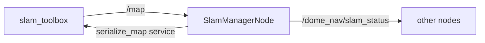

# slam_manager_node.py — SLAM State Monitor and Map Persistence

## Purpose

`SlamManagerNode` sits between `slam_toolbox` and the rest of the dome system. Its job is narrow: watch for the `/map` topic to appear (signalling that slam_toolbox is producing a map), publish a status string so other nodes can gate their behaviour on mapping readiness, and serialize the pose graph to disk when the node shuts down.

## Startup and Parameters

The node declares one ROS2 parameter — the path where the pose graph will be saved. The default comes from `dome_home()` so the path follows the `DOME_HOME` environment variable:

```python
def default_map_path() -> str:
    return os.path.join(dome_home(), "slam_map")

class SlamManagerNode(Node):
    def __init__(self):
        super().__init__("slam_manager_node")
        self.declare_parameter("map_persist_path", default_map_path())
        self.map_persist_path = (
            self.get_parameter("map_persist_path")
            .get_parameter_value()
            .string_value
        )
        self.map_ready = False
```

`map_ready` starts `False`. The first `/map` message flips it to `True` and is the signal that slam_toolbox has warmed up.

## Topic Wiring

```python
self.map_sub = self.create_subscription(OccupancyGrid, "/map", self.on_map, 10)
self.status_pub = self.create_publisher(String, "/dome_nav/slam_status", 10)
self.serialize_client = self.create_client(
    SerializePoseGraph, "/slam_toolbox/serialize_map"
)
```



## Map Arrival Callback

```python
def on_map(self, msg: OccupancyGrid):
    if not self.map_ready:
        self.map_ready = True
        self.get_logger().info("Map received — slam_toolbox is mapping.")
    status = String()
    status.data = "mapping" if self.map_ready else "waiting"
    self.status_pub.publish(status)
```

The `"waiting"` branch in the ternary is unreachable after `map_ready` is set, but the logic is clear enough to leave as-is.

## Shutdown: Pose Graph Serialization

On shutdown, `save_map()` is called from `main()`. It calls the `slam_toolbox/serialize_map` service synchronously using `spin_until_future_complete`:

```python
def save_map(self):
    os.makedirs(os.path.dirname(self.map_persist_path), exist_ok=True)
    if not self.serialize_client.wait_for_service(timeout_sec=5.0):
        self.get_logger().warning("serialize_map service not available — map not saved.")
        return False
    req = SerializePoseGraph.Request()
    req.filename = self.map_persist_path
    future = self.serialize_client.call_async(req)
    rclpy.spin_until_future_complete(self, future, timeout_sec=10.0)
    if future.result() is not None:
        self.get_logger().info(f"Pose graph saved to {self.map_persist_path}")
        return True
    self.get_logger().error("Failed to serialize pose graph.")
    return False
```

The synchronous pattern is intentional here: shutdown is the one time we want to block until the file is written before the process exits.

## Main Entry Point

```python
def main():
    rclpy.init()
    node = SlamManagerNode()
    try:
        rclpy.spin(node)
    finally:
        node.save_map()
        node.destroy_node()
        if rclpy.ok():
            rclpy.shutdown()
```

`save_map()` is in `finally` so it runs on both normal shutdown (SIGINT) and unexpected exits.

## Potential Improvements

- **`os.path.dirname` edge case**: if `map_persist_path` has no directory component, `dirname` returns `""` and `makedirs("")` raises. Guard with `if dirname := os.path.dirname(self.map_persist_path): os.makedirs(dirname, exist_ok=True)`.
- **Unreachable branch**: `status.data = "mapping" if self.map_ready else "waiting"` — once `map_ready` is `True` it never reverts; the `"waiting"` string can only publish before the first map arrives if `on_map` is somehow called with `map_ready` already `True`, which cannot happen. Simplify to `status.data = "mapping"` inside the callback, or publish `"waiting"` at a timer rate before the first map arrives.
- **No lifecycle management**: this is a plain `Node`, not a `LifecycleNode`. For production use, a lifecycle node would allow clean deactivation without process exit.
- **`spin_until_future_complete` at shutdown**: if slam_toolbox has already exited (e.g., crash), this will block for the full 10-second timeout. A shorter timeout with a retry would be more responsive.
