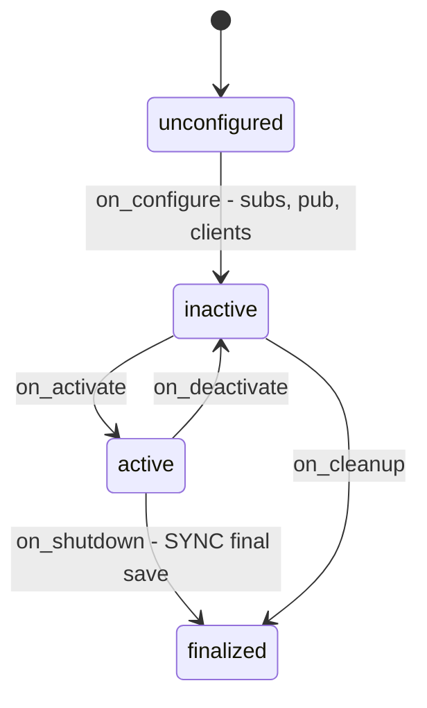

# slam_manager_node.py — Persisting the Map That slam_toolbox Builds

slam_toolbox happily builds a map in memory, but it only writes that map to disk
when someone asks it to via its `serialize_map` service. `SlamManagerNode` is the
"someone": a small **lifecycle** node whose entire job is to notice when a map
exists and to serialize slam_toolbox's pose graph to disk — on first sight and
(critically) at shutdown. Since the 2026-07-08 config refactor, slam_toolbox
itself no longer carries a `map_file_name`, so this node is the *only* thing
persisting maps. Each save also optionally exports a legacy PGM/YAML pair
(`export_legacy_map`, default on). A periodic timer used to save every couple of
minutes as well; F24 removed it — steady mapping now leans on the two
event-driven saves.

## Why a lifecycle node

The node's shape is dictated by one hard-won bug (I01): the map was being lost on
shutdown. The original plain `Node` fired the final save asynchronously *after*
`spin()` had already returned, so the callback never ran. Making this a
`LifecycleNode` gives a real `on_shutdown` transition that runs before the node
is destroyed, where a **synchronous** save can complete.

The lifecycle also gives clean start/stop semantics for the subscription, the
status publisher, and the service clients — each created in `on_configure` and
torn down in `on_cleanup`/`on_shutdown`. (`on_activate`/`on_deactivate` carry no
custom logic since F24 dropped the save timer they used to manage.)



## Where and when it saves

The persist path is a parameter (`map_persist_path`, defaulting to
`~/.dome/slam_map`) — the launch files set it to `~/.dome/slam_maps/<map_name>`,
which is how `--map_name` reaches the saved file.

Two triggers cause a save:

1. **First map received** — proof slam is actually mapping, so capture it
   immediately:
   ```python
   def on_map(self, msg):
       first_map = not self.map_ready
       if first_map:
           self.map_ready = True
           self.get_logger().info("Map received — slam_toolbox is mapping.")
       self.status_pub.publish(String(data="mapping"))
       if first_map:
           self.save_map_async()
   ```
   `on_map` also publishes a `/dome_nav/slam_status` heartbeat every message so
   the rest of the system can tell mapping is live.
2. **Shutdown** — a final synchronous save (see below).

Each successful pose-graph save then optionally fires the legacy PGM/YAML export
via slam_toolbox's `save_map` service (`export_legacy_map`, default on),
best-effort — a missing service warns rather than fails.

## Async vs sync saving: the same request, two waits

Both `save_map_async` and `save_map_sync` build the identical
`SerializePoseGraph` request; they differ only in how they wait. The first-map
path fires-and-forgets:

```python
def save_map_async(self):
    if not self.prepare_save():
        return
    future = self.serialize_client.call_async(self.serialize_request())
    future.add_done_callback(self.on_save_done)
```

Shutdown must not fire-and-forget — it spins the call to completion before the
node dies, which is the actual fix for I01:

```python
def save_map_sync(self):
    if not self.prepare_save():
        return
    future = self.serialize_client.call_async(self.serialize_request())
    rclpy.spin_until_future_complete(self, future, timeout_sec=5.0)
    self.on_save_done(future)
```

`prepare_save` is the shared guard: it ensures the target directory exists and
waits up to 5 s for the `serialize_map` service, warning (not crashing) if
slam_toolbox isn't there — a graceful degrade if the node is run without slam.

## Observations / possible improvements

- **`on_map` publishes `"mapping"` on every single map message.** That's a lot of
  redundant status traffic; a state-change-only publish (or a slow heartbeat
  timer) would be lighter.
- **Load/resume is not this node's job.** It only saves. With slam_toolbox's
  `map_file_name` now dropped, there is no auto-resume of a prior map — re-running
  a map name overwrites it. If incremental multi-session mapping is ever wanted,
  this node (or the slam config) is where a load-on-start would go.
- **The 5 s service timeout is duplicated** in `prepare_save` and
  `save_map_sync`. Fine, but a single constant would document the intent.
- **`main()` drives the lifecycle manually** (`trigger_configure` then
  `trigger_activate`), so this node self-activates rather than waiting on an
  external lifecycle manager — convenient standalone, but means it won't
  participate in a coordinated bringup sequence.
