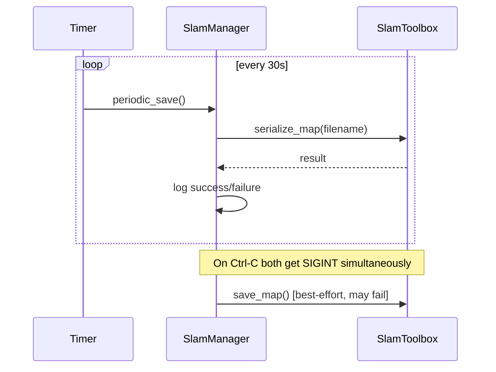

# slam_manager_node — SLAM State Monitor and Map Persistence

## Introduction

`slam_manager_node` is a thin ROS2 node that sits alongside slam_toolbox and does two things: it watches for the first `/map` message to announce that SLAM is actively building a map, and it periodically serializes the pose graph to disk so map state survives restarts.

The node deliberately does not touch slam_toolbox internals. It only observes the `/map` topic (a standard ROS2 output) and calls the `/slam_toolbox/serialize_map` service (a documented slam_toolbox API). This keeps it decoupled from slam_toolbox version changes.

## Initialization

On startup the node:

1. Declares a `map_persist_path` parameter (default: `~/.dome/slam_map`).
2. Creates a subscription to `/map`.
3. Creates a publisher on `/dome_nav/slam_status`.
4. Creates a service client for `/slam_toolbox/serialize_map`.
5. Creates a 30-second timer for periodic saves.

```python
class SlamManagerNode(Node):
    def __init__(self):
        super().__init__("slam_manager_node")
        self.declare_parameter("map_persist_path", default_map_path())
        self.map_persist_path = self.get_parameter("map_persist_path").get_parameter_value().string_value
        self.map_ready = False
        self.map_sub = self.create_subscription(OccupancyGrid, "/map", self.on_map, 10)
        self.status_pub = self.create_publisher(String, "/dome_nav/slam_status", 10)
        self.serialize_client = self.create_client(SerializePoseGraph, "/slam_toolbox/serialize_map")
        self.save_timer = self.create_timer(30.0, self.periodic_save)
```

## Detecting When SLAM Is Active

`on_map` fires every time slam_toolbox publishes an updated occupancy grid. The first time it fires, `map_ready` flips to `True` and a log message records the event. Every call publishes a status string.

```python
def on_map(self, msg: OccupancyGrid):
    if not self.map_ready:
        self.map_ready = True
        self.get_logger().info("Map received — slam_toolbox is mapping.")
    status = String()
    status.data = "mapping" if self.map_ready else "waiting"
    self.status_pub.publish(status)
```

The status is published on every `/map` callback rather than only on state transitions. This means any node or tool that subscribes to `/dome_nav/slam_status` gets the current state without needing to cache the last message.

## Periodic Save — Why Not Rely on Shutdown

The intuitive design saves the pose graph when the node shuts down. The problem: Ctrl-C sends SIGINT to every process in the launch group simultaneously. slam_toolbox and slam_manager both receive the signal at the same time. By the time the `finally` block in `main()` runs `save_map()`, slam_toolbox has often already exited and the serialize service is gone.

The fix is a 30-second timer:

```python
def periodic_save(self):
    if self.map_ready:
        self.save_map()
```

This fires while slam_toolbox is still running, well before any shutdown race. The shutdown `save_map()` call remains as a best-effort fallback, but correctness does not depend on it.



## Saving the Pose Graph

`save_map` ensures the output directory exists, waits up to 5 seconds for the service, fires the async call, and attaches a done callback. It returns immediately after dispatching — the result is handled asynchronously.

```python
def save_map(self):
    parent = os.path.dirname(self.map_persist_path)
    if parent:
        os.makedirs(parent, exist_ok=True)
    if not self.serialize_client.wait_for_service(timeout_sec=5.0):
        self.get_logger().warning("serialize_map service not available — map not saved.")
        return False
    req = SerializePoseGraph.Request()
    req.filename = self.map_persist_path
    future = self.serialize_client.call_async(req)
    future.add_done_callback(self._on_save_done)
    return True

def _on_save_done(self, future):
    if future.result() is not None:
        self.get_logger().info(f"Pose graph saved to {self.map_persist_path}")
    else:
        self.get_logger().error("Failed to serialize pose graph.")
```

Using `add_done_callback` instead of `spin_until_future_complete` avoids blocking the ROS2 executor inside a timer callback. The tradeoff: callers can no longer check a return value to know if the save succeeded — only the log reflects the outcome.

slam_toolbox appends `.posegraph` and `.data` extensions to the filename automatically. The path in `map_persist_path` is the stem only.

## Observations and Potential Improvements

1. **`makedirs` guard** — `os.path.dirname("")` returns `""`. If `map_persist_path` is ever a bare filename with no directory component, `makedirs("")` raises. A guard like `if d := os.path.dirname(...): os.makedirs(d, ...)` prevents this.

2. **Async save result unobservable by callers** — `save_map` returns `True` after dispatching the service call, but the actual success or failure is only logged in `_on_save_done`. Any caller that checked the return value for confirmation now gets no signal. This is acceptable for periodic saves and best-effort shutdown saves, but would be a problem if save success ever gates other logic.

3. **Status string vs enum** — publishing `"mapping"` as a raw string is fragile for consumers. A `std_msgs/Int8` with an enum, or a custom message, would be more robust. The current approach is fine while dome_nav is the only consumer.

4. **Configurable save interval** — the 30-second period is hardcoded. Exposing it as a ROS2 parameter would let operators tune it without recompiling.
