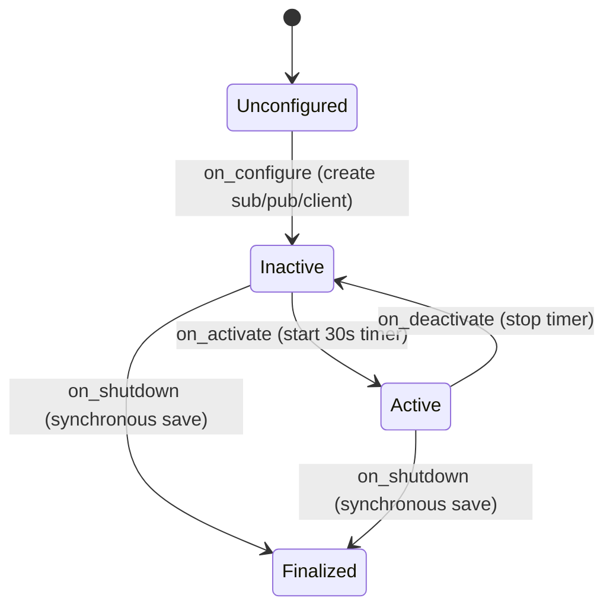

# SlamManagerNode — Lifecycle Node for SLAM Persistence

## Overview

`slam_manager_node.py` watches slam_toolbox's `/map` topic and periodically
serialises the pose graph to disk so a mapping session survives a restart. It is
a **managed (lifecycle) node**: its ROS entities and its save timer come and go
with explicit `configure`/`activate`/`deactivate`/`cleanup`/`shutdown`
transitions rather than living for the whole process.

Earlier revisions split the logic into a pure-Python `SlamManager` plus a thin
delegating wrapper. That class wrapped roughly six lines of trivial state (a
boolean and one `makedirs`), so the wrapper and its property-proxies cost more
than they saved; the logic was folded back into the node and the extra class
deleted. What justified the rewrite was not the cleanup but a real bug — see
*Shutdown*.

## Why a lifecycle node

A plain `Node` has no structured shutdown hook. The old `main()` called
`save_map()` from a `finally:` block *after* `rclpy.spin()` had already returned,
firing an async service call whose done-callback could never run because nothing
was spinning the executor — the map was silently lost on every clean exit
(issue I01). A `LifecycleNode` gives an `on_shutdown` transition that runs
synchronously while the node is still usable, which is the right home for a
final, blocking save.



## Configure: build the I/O

Resources are created in `on_configure`, not `__init__`, so the node can be
reconfigured cleanly. The status publisher is a *lifecycle* publisher — it only
emits while the node is active.

```python
    def on_configure(self, state):
        self.map_sub = self.create_subscription(OccupancyGrid, "/map", self.on_map, 10)
        self.status_pub = self.create_lifecycle_publisher(String, "/dome_nav/slam_status", 10)
        self.serialize_client = self.create_client(
            SerializePoseGraph, "/slam_toolbox/serialize_map"
        )
        return TransitionCallbackReturn.SUCCESS
```

## Activate: start the save timer

The 30-second timer only exists while the node is active. `on_activate` must
call `super().on_activate(state)` so the lifecycle publisher actually starts
emitting.

```python
    def on_activate(self, state):
        self.save_timer = self.create_timer(self.SAVE_PERIOD_SEC, self.periodic_save)
        return super().on_activate(state)
```

`on_deactivate` and `on_cleanup` tear these down through a shared
`destroy_entities()` helper so there is one place that knows how to release the
timer, subscription, and publisher.

## Map subscription

The first `/map` flips `map_ready` and logs once; later messages just re-publish
the `"mapping"` status without log spam.

```python
    def on_map(self, msg: OccupancyGrid):
        if not self.map_ready:
            self.map_ready = True
            self.get_logger().info("Map received — slam_toolbox is mapping.")
        status = String()
        status.data = "mapping"
        self.status_pub.publish(status)
```

## Saving: one request, two drive modes

Both the periodic timer and the shutdown hook build the same request, but they
drive the future differently. The periodic path is fire-and-forget; the shutdown
path blocks until the service answers so the write completes before the node
dies.

```python
    def save_map_async(self):
        if not self.prepare_save():
            return
        future = self.serialize_client.call_async(self.serialize_request())
        future.add_done_callback(self.on_save_done)

    def save_map_sync(self):
        if not self.prepare_save():
            return
        future = self.serialize_client.call_async(self.serialize_request())
        rclpy.spin_until_future_complete(self, future, timeout_sec=5.0)
        self.on_save_done(future)
```

`prepare_save()` creates the parent directory and waits briefly for the service,
so neither drive mode can fail on a missing path or an absent server.

## Shutdown: the synchronous save

```python
    def on_shutdown(self, state):
        if self.map_ready:
            self.save_map_sync()
        self.destroy_entities()
        return TransitionCallbackReturn.SUCCESS
```

`main()` drives the node through its states explicitly and triggers the shutdown
transition in a `finally:` block, so the save runs whether exit is normal or via
Ctrl-C:

```python
def main():
    rclpy.init()
    node = SlamManagerNode()
    node.trigger_configure()
    node.trigger_activate()
    try:
        rclpy.spin(node)
    except KeyboardInterrupt:
        pass
    finally:
        node.trigger_shutdown()
        node.destroy_node()
        if rclpy.ok():
            rclpy.shutdown()
```

## Observations

- The node self-drives its transitions in `main()`. If it is ever placed under a
  Nav2 `lifecycle_manager`, that manager would own the transitions instead and
  the explicit `trigger_*` calls should be removed.
- `on_shutdown` runs a blocking `spin_until_future_complete`. The 5-second
  timeout bounds a hang if slam_toolbox has already died, at the cost of possibly
  giving up on a slow save.
- Live verification (real Ctrl-C writes a fresh `.posegraph`/`.data`) still needs
  a running slam_toolbox and is tracked as a manual task (TF07 T04).
