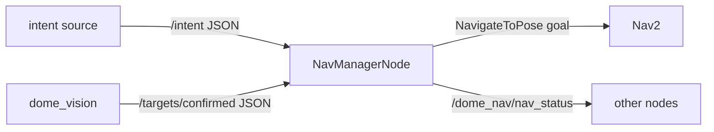

# nav_manager_node.py — Intent-Driven Navigation

## Purpose

`NavManagerNode` bridges the dome intent system and Nav2. It listens for high-level intent messages on `/intent` (e.g., "go to the red chair"), looks up a confirmed target position from `/targets/confirmed`, and sends a `NavigateToPose` action goal to Nav2. It also publishes a status string so other nodes can observe whether navigation is in progress.

## Design Philosophy

The node is deliberately thin. It does not compute paths, manage costmaps, or track goal state beyond initiating the action. Complexity lives in Nav2; this node is the translator between dome's semantic world model and Nav2's geometric API.

## Topic and Action Wiring

```python
self.nav_client = ActionClient(self, NavigateToPose, "navigate_to_pose")
self.status_pub = self.create_publisher(String, "/dome_nav/nav_status", 10)
self.intent_sub = self.create_subscription(String, "/intent", self.on_intent, 10)
self.targets_sub = self.create_subscription(String, "/targets/confirmed", self.on_targets, 10)
```



Both inputs are JSON-encoded strings over `std_msgs/String`. This avoids custom message types but requires careful parsing at the boundary.

## Target Cache

Confirmed targets arrive as a JSON array and are cached in memory:

```python
self.confirmed_targets: list[dict] = []

def on_targets(self, msg: String):
    try:
        self.confirmed_targets = json.loads(msg.data)
    except json.JSONDecodeError:
        self.get_logger().warning("Could not parse /targets/confirmed JSON.")
```

The cache is replaced wholesale on each message. No merging or aging — the publisher is responsible for sending a complete, current snapshot.

## Intent Dispatch

```python
def on_intent(self, msg: String):
    try:
        intent = json.loads(msg.data)
    except json.JSONDecodeError:
        return

    action = intent.get("action", "")
    if action == "go_to_object":
        label = intent.get("label", "")
        self.navigate_to_object(label)
    elif action == "cancel_navigation":
        self.cancel_navigation()
```

Unrecognised actions are silently dropped — intentional, since the intent bus is shared and many messages are not meant for this node.

## Building a Nav2 Goal

```python
def navigate_to_object(self, label: str):
    target = self.find_nearest_confirmed(label)
    if target is None:
        self.get_logger().warning(f"No confirmed target found for label={label!r}.")
        self.publish_status(f"no_target:{label}")
        return

    xyz = target.get("xyz_world", [0.0, 0.0, 0.0])
    goal_pose = PoseStamped()
    goal_pose.header.frame_id = "map"
    goal_pose.header.stamp = self.get_clock().now().to_msg()
    goal_pose.pose.position.x = float(xyz[0])
    goal_pose.pose.position.y = float(xyz[1])
    goal_pose.pose.position.z = 0.0
    goal_pose.pose.orientation.w = 1.0
    ...
    goal = NavigateToPose.Goal()
    goal.pose = goal_pose
    self.nav_client.send_goal_async(goal, feedback_callback=self.on_nav_feedback)
```

`z` is forced to 0 and orientation to identity — the robot navigates in a 2D plane, so only `x`, `y` matter. The `map` frame requires slam_toolbox to be running; the node will fail to navigate if the frame does not exist yet.

## Target Lookup

```python
def find_nearest_confirmed(self, label: str) -> dict | None:
    matches = [t for t in self.confirmed_targets if t.get("label") == label]
    if not matches:
        return None
    return matches[0]
```

Despite the name `find_nearest_confirmed`, the method returns the *first* match, not the geometrically nearest one. This is a known limitation — the name is aspirational.

## Potential Improvements

- **`find_nearest_confirmed` name vs behaviour**: method returns first match, not nearest. Either rename to `find_first_confirmed` or implement distance sorting using `xyz_world`.
- **`_cancel_goal_async` is private**: `self.nav_client._cancel_goal_async()` accesses an internal method of `ActionClient`. This is fragile across rclpy versions. The correct public API is to track the `GoalHandle` returned by `send_goal_async` and call `goal_handle.cancel_goal_async()`.
- **No goal result tracking**: `send_goal_async` is fire-and-forget. A result callback would allow publishing `"arrived"` or `"failed"` status and enable retry logic.
- **Silent JSON parse failure in `on_intent`**: the bare `return` on `JSONDecodeError` drops the message with no log. A warning would help operators diagnose malformed intent messages.
- **`xyz_world` default `[0.0, 0.0, 0.0]`**: navigating to the origin silently if the field is missing could be dangerous on a real robot. A `None` check with an early return and warning would be safer.
