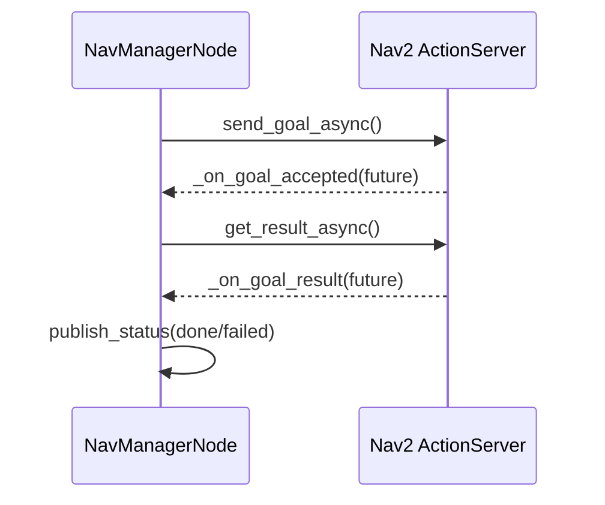

# NavManagerNode — ROS2 Adapter for Intent Navigation

## Overview

`nav_manager_node.py` is a thin ROS2 adapter around `NavManager`
(see `05-nav_manager.md`). It owns subscriptions, the Nav2 action client,
TF lookup, and status publishing. All navigation logic and JSON parsing
delegate to the pure-Python `NavManager`.

## Wiring

```mermaid
flowchart LR
    A[/intent] -->|String JSON| B[on_intent]
    C[/targets/confirmed] -->|String JSON| D[on_targets]
    B --> E[NavManager.parse_intent]
    D --> F[NavManager.on_targets]
    E -->|go_to_object| G[navigate_to_object]
    E -->|cancel| H[cancel_navigation]
    G --> I[NavigateToPose action]
    I --> J[/dome_nav/nav_status]
```

## Intent Dispatch

`on_intent` delegates parsing to the manager, then dispatches on the action
string. The node never inspects the JSON directly.

```python
    def on_intent(self, msg: String):
        result = self._manager.parse_intent(msg.data)
        if result is None:
            return
        action, intent = result
        if action == "go_to_object":
            self.navigate_to_object(intent.get("label", ""))
        elif action == "cancel_navigation":
            self.cancel_navigation()
```

## Navigation Goal Lifecycle

Nav2 goals are async. Three callbacks chain: goal accepted → result ready →
status published. The goal handle is stored so cancel can reach the in-flight goal.



## TF-Based Robot Position

Nearest-target selection needs the robot's map-frame position. The node looks
up `map→base_footprint` and passes the result to `NavManager.find_nearest_confirmed`.
If the TF is unavailable (map not yet published), `None` is passed and the manager
falls back to returning the first match.

```python
    def robot_xy_in_map(self) -> tuple[float, float] | None:
        try:
            tf = self.tf_buffer.lookup_transform("map", "base_footprint", rclpy.time.Time())
            t = tf.transform.translation
            return (t.x, t.y)
        except (tf2_ros.LookupException, tf2_ros.ExtrapolationException,
                tf2_ros.ConnectivityException):
            return None
```

## Observations

- `on_nav_feedback` is a no-op stub. Feedback could drive a progress status
  topic for UI consumers.
- F06 is complete: `/amcl_pose` subscription and `/dome_nav/localization_status`
  publisher are wired; convergence logic delegates to `NavManager.check_localization`.
- `main()` catches `KeyboardInterrupt` explicitly so Ctrl-C exits cleanly without
  a traceback (rclpy's SIGINT handler raises it during `spin()`).
