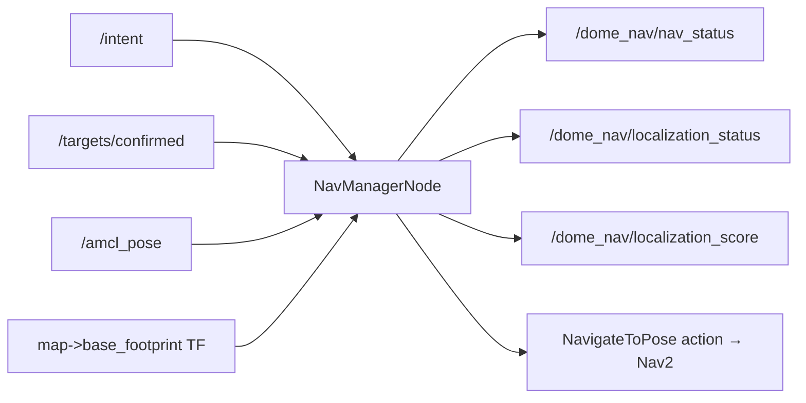
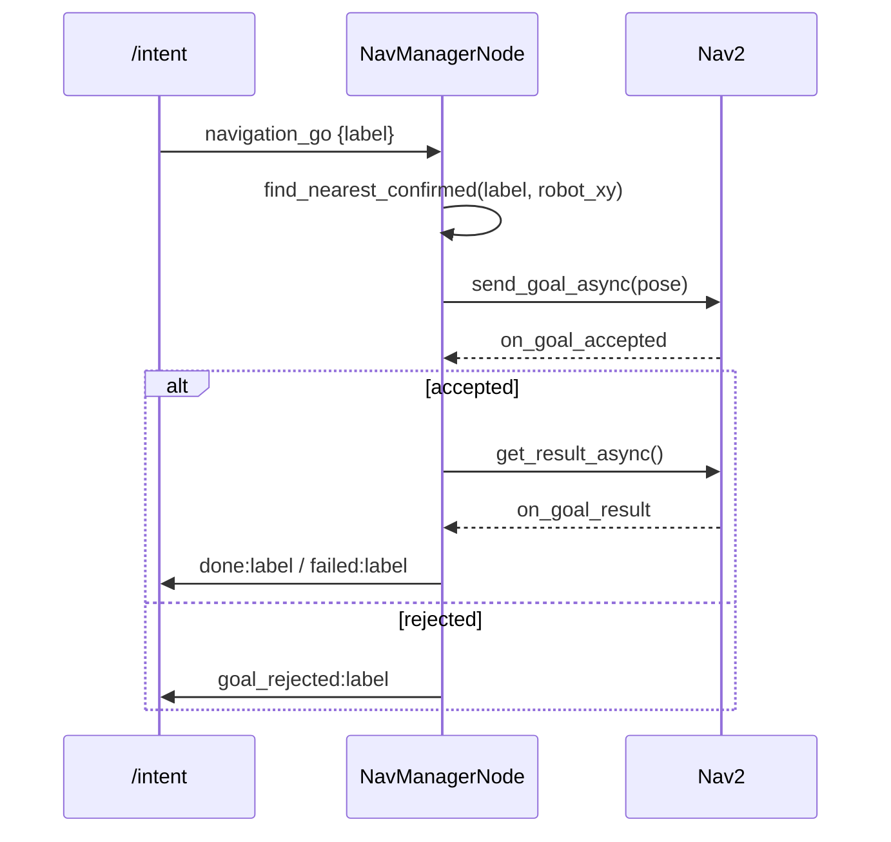

# The Nav Manager Node — turning intents into Nav2 goals

`nav_manager_node.py` is the ROS-facing half of the "go to that object" feature.
It listens for high-level *intents* ("navigate to the chair"), looks up where the
chair actually is, and drives Nav2's `NavigateToPose` action to get there. It is
deliberately thin: every decision that can be made without ROS — parsing the
intent JSON, choosing which of several candidate targets to head for, scoring
localization quality — is delegated to a pure `NavManager` object (documented in
`05-nav_manager.md`). This node's own job is the part that *cannot* be pure: TF
lookups, action clients, publishers, and the ROS clock.

That split — **pure policy in one class, I/O shell in another** — is the single
most important idea in this file, and it is what makes the interesting logic
unit-testable without a running ROS graph.

## What flows in and out



The node subscribes to three topics, publishes three, holds a TF listener, and
owns one action client. Notice the QoS on `/amcl_pose`: AMCL latches its last
pose with `TRANSIENT_LOCAL` durability, so we must match that to receive it.

```python
amcl_qos = QoSProfile(
    depth=1,
    reliability=ReliabilityPolicy.RELIABLE,
    durability=DurabilityPolicy.TRANSIENT_LOCAL,
)
self.amcl_sub = self.create_subscription(
    PoseWithCovarianceStamped, "/amcl_pose", self.on_amcl_pose, amcl_qos
)
```

A QoS mismatch here is a classic silent failure: a volatile subscriber never
sees a transient-local latched publisher's last message, and you spend an hour
wondering why localization status never updates.

## The intent pipeline

An intent arrives as a JSON string. The node hands it straight to the pure
manager, which returns either `None` (malformed/unknown) or an `(action, intent)`
pair. The node only decides *what to do* with a well-formed action:

```python
def on_intent(self, msg: String):
    result = self.manager.parse_intent(msg.data)
    if result is None:
        self.get_logger().warning(f"Malformed or unknown intent: {msg.data!r}")
        return
    action, intent = result
    if action == "navigation_go":
        label = intent.get("slots", {}).get("label", "")
        self.navigate_to_object(label)
    elif action == "navigation_cancel":
        self.navigation_cancel()
```

## From label to pose

`navigate_to_object` is where policy meets I/O. Choosing *which* confirmed target
matching the label is nearest is pure logic — but it needs the robot's current
position, which is a TF lookup. So the node fetches the pose, hands it to the
manager, and gets back a target dict:

```python
def robot_xy_in_map(self) -> tuple[float, float] | None:
    try:
        tf = self.tf_buffer.lookup_transform("map", "base_footprint", rclpy.time.Time())
        trans = tf.transform.translation
        return (trans.x, trans.y)
    except (tf2_ros.LookupException, tf2_ros.ExtrapolationException,
            tf2_ros.ConnectivityException):
        return None
```

If TF is unavailable the node warns and lets the manager fall back to the first
match — navigation should degrade, not block. Once a target is chosen, the node
builds the `PoseStamped`. The one piece of real geometry here is turning a yaw
angle into a quaternion, using the half-angle identity for a rotation about Z:

```python
yaw = target.get("yaw_world", 0.0)
goal_pose.pose.orientation.z = math.sin(yaw / 2.0)
goal_pose.pose.orientation.w = math.cos(yaw / 2.0)
```

## Driving the action, asynchronously

Nav2's `NavigateToPose` is a long-running action, so everything is callback
chained. The node sends the goal, and a `functools.partial` threads the `label`
through each callback so status messages can name the target:

```python
future = self.nav_client.send_goal_async(goal)
future.add_done_callback(functools.partial(self.on_goal_accepted, label=label))
```



The `goal_handle` is stashed so a later `navigation_cancel` intent can cancel an
in-flight goal. Each transition publishes a status string on
`/dome_nav/nav_status` — `navigating:label`, `done:label`, `failed:label`,
`goal_rejected:label`, `nav_unavailable`, or `no_target:label` — a compact wire
protocol that a supervising process can watch.

## Localization reporting

Independently of navigation, the node republishes localization health once per
second (and immediately whenever a fresh AMCL pose arrives). It converts AMCL's
6×6 pose covariance into a human-friendly `(status, score)` — again, pure logic
in the manager — and publishes both:

```python
def on_amcl_pose(self, msg: PoseWithCovarianceStamped):
    status, score = self.manager.check_localization(list(msg.pose.covariance))
    self.last_loc_status = status
    self.last_loc_score = score
    self.publish_localization()
```

The 1 Hz timer means downstream consumers get a heartbeat even when AMCL is quiet,
so "no message" unambiguously means "node is down" rather than "robot is holding
still."

## Observations and possible improvements

- **`find_nearest_confirmed` is called twice-deep.** The node's wrapper fetches
  the pose and delegates to the manager's method of the same name. The naming
  collision is intentional (thin shell over pure core) but can confuse a reader
  scanning for the "real" implementation — a `_impl` suffix or a comment pointer
  would help.
- **No feedback handling.** The action's periodic feedback (distance remaining,
  recoveries) is ignored; only the terminal result is used. Surfacing feedback
  would let `/dome_nav/nav_status` report progress, not just start/finish.
- **`nav_unavailable` is terminal and silent to the caller's retry logic.** If
  the action server is briefly down at goal time, the intent is simply dropped.
  A short retry or a queued goal would make the feature more robust on a cold
  Nav2 stack.
- **The 1 Hz localization timer publishes even before any AMCL pose** (score 0.0,
  status "localizing"). That is a reasonable default, but a consumer cannot
  distinguish "genuinely lost" from "AMCL not started yet" — a distinct
  "no_estimate" state would.
