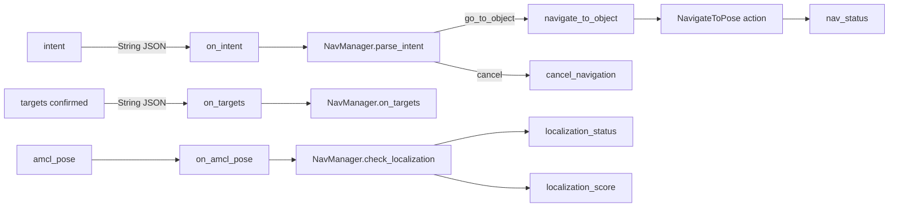
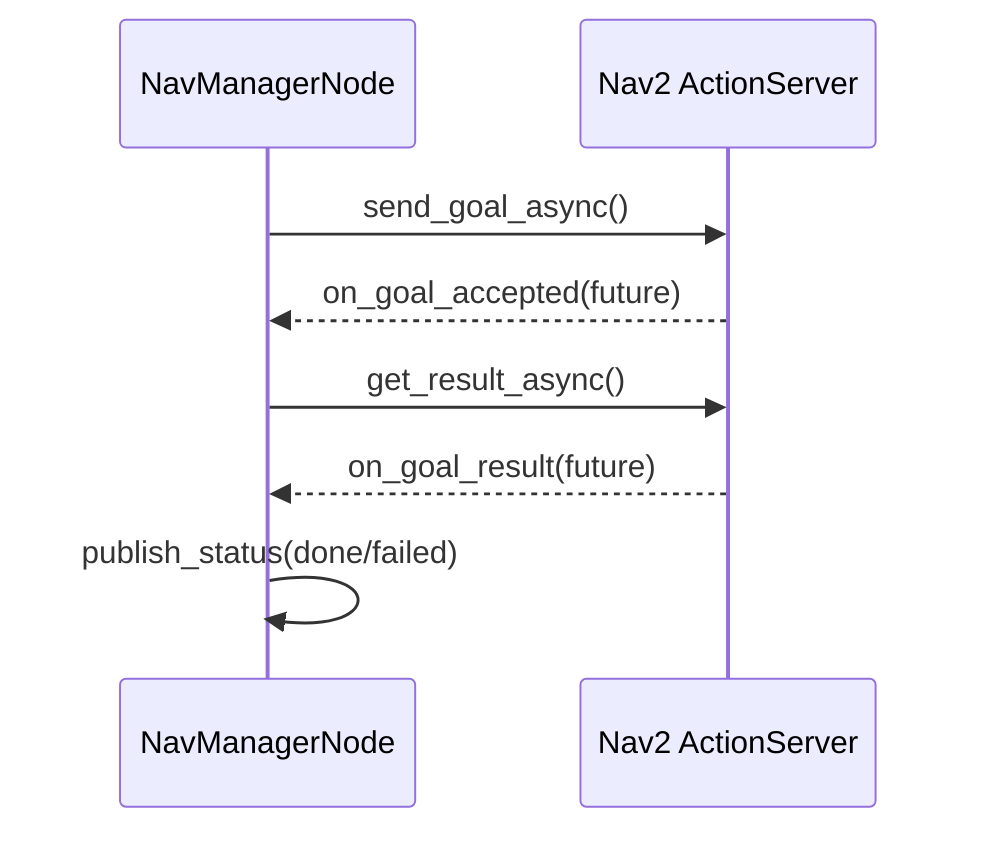

# NavManagerNode — ROS2 Adapter for Intent Navigation

## Overview

`nav_manager_node.py` is a thin ROS2 adapter around `NavManager`
(see `05-nav_manager.md`). It owns subscriptions, the Nav2 action client,
TF lookup, and status publishing. All navigation logic and JSON parsing
delegate to the pure-Python `NavManager`.

## Wiring



## Intent Dispatch

`on_intent` delegates parsing to the manager, then dispatches on the action
string. The node never inspects the JSON directly. Label is extracted from
`slots` — matching dome_control's intent contract.

```python
    def on_intent(self, msg: String):
        result = self.manager.parse_intent(msg.data)
        if result is None:
            self.get_logger().warning(f"Malformed or unknown intent: {msg.data!r}")
            return
        action, intent = result
        if action == "go_to_object":
            label = intent.get("slots", {}).get("label", "")
            self.navigate_to_object(label)
        elif action == "cancel_navigation":
            self.cancel_navigation()
```

The warning log on `None` is important: previously a bad intent was silently
dropped, making the mismatch between dome_control's `"name"` key and the old
`"action"` key invisible. The log surfaces contract violations immediately.

## Navigation Goal Lifecycle

Nav2 goals are async. Three callbacks chain: goal accepted → result ready →
status published. The goal handle is stored so cancel can reach the in-flight goal.



### xyz_world Guard

Before building the Nav2 goal, the node checks that `xyz_world` is present in
the target. A missing key previously caused the robot to navigate silently to
map origin (0, 0).

```python
        xyz = target.get("xyz_world")
        if xyz is None:
            self.get_logger().warning(f"Target {label!r} missing xyz_world — skipping.")
            self.publish_status(self.manager.navigate_status(label, None))
            return
```

## TF-Based Robot Position

Nearest-target selection needs the robot's map-frame position. The node looks
up `map→base_footprint` and passes the result to `NavManager.find_nearest_confirmed`.
If the TF is unavailable (map not yet published), `None` is passed and the manager
falls back to returning the first match.

```python
    def robot_xy_in_map(self) -> tuple[float, float] | None:
        try:
            tf = self.tf_buffer.lookup_transform("map", "base_footprint", rclpy.time.Time())
            t = tf.transform.translation
            return (t.x, t.y)
        except (tf2_ros.LookupException, tf2_ros.ExtrapolationException,
                tf2_ros.ConnectivityException):
            return None
```

## Observations

- `on_nav_feedback` is a no-op stub. Feedback could drive a progress status
  topic for UI consumers.
- The intent contract (`"name"` / `"slots"`) is dome_control's canonical format.
  F08 (typed messages) would replace the JSON-in-String encoding but is deferred.
- `main()` catches `KeyboardInterrupt` explicitly so Ctrl-C exits cleanly without
  a traceback.
