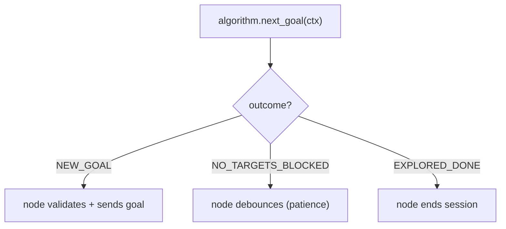

# The Exploration Contract — `explore_context.py`

Before a single frontier is detected, the exploration subsystem has to answer a
design question: *how does the session manager talk to an exploration algorithm
without knowing which algorithm it is?* `explore_context.py` is that answer. It
contains no behavior — no loops, no ROS, no math — only the **data types and the
protocol** that define the seam between the node (`explorer_manager_node.py`) and
any pluggable strategy (`frontier_algorithm.py`, `hello_world_algorithm.py`).

Reading this file first is like reading an interface header: everything
downstream makes sense once you know the shapes that cross the boundary. This is
the "define the contract, then implement against it" pattern, and it is why a new
exploration algorithm can be dropped in by satisfying one small protocol.

## The shapes that cross the boundary

Four dataclasses and one enum carry all the information. The organizing principle
is **who owns what**: geometry and session state the node owns; tuning is split
between shared (node-owned) and strategy-specific (algorithm-owned).

`MapInfo` is the occupancy grid's geometry, deliberately decoupled from any ROS
message so pure functions can take it directly:

```python
@dataclass
class MapInfo:
    width: int
    height: int
    resolution: float
    origin_x: float
    origin_y: float
```

`ExplorationContext` is the *input* to a decision: everything an algorithm needs
to pick a goal this tick. Note the comment on `map_data` — the node passes the
`OccupancyGrid`'s `array.array` **uncopied**, because copying a full map every
tick was pure waste on the Pi.

```python
@dataclass
class ExplorationContext:
    """Read-only view; the node passes the OccupancyGrid's array.array uncopied."""
    map_data: Sequence[int]
    map_info: MapInfo
    robot_xy: tuple[float, float]
    blacklist: set[tuple[float, float]]
    start_xy: tuple[float, float] | None
    params: ExploreParams
```

## The decision, made self-describing

An algorithm could return `None` to mean "no goal," but *why* there is no goal
matters to the node: did the map run out of frontiers (session is genuinely
done), or are there frontiers but all of them are filtered/blacklisted (blocked,
worth retrying)? Collapsing those two into `None` would force the node to peek at
the algorithm's internals to tell them apart. Instead, the outcome is named:

```python
class GoalOutcome(Enum):
    NEW_GOAL = auto()
    NO_TARGETS_BLOCKED = auto()  # targets exist but all filtered/blacklisted
    EXPLORED_DONE = auto()       # algorithm finished — end the session


@dataclass(frozen=True)
class GoalDecision:
    outcome: GoalOutcome
    xy: tuple[float, float] | None = None

    @classmethod
    def new_goal(cls, xy): return cls(GoalOutcome.NEW_GOAL, xy)
    @classmethod
    def blocked(cls): return cls(GoalOutcome.NO_TARGETS_BLOCKED)
    @classmethod
    def done(cls): return cls(GoalOutcome.EXPLORED_DONE)
```

The three named constructors make call sites read like prose:
`return GoalDecision.done()`. `frozen=True` makes the decision an immutable
value — a returned decision cannot be mutated by the node before it is acted on.



## Splitting the tuning

There are two kinds of knobs. Some are *session-level* and the node itself uses
them (`blacklist_radius` drives the node's own reselection policy). Others are
*strategy-specific* and belong to the algorithm (frontier cluster size, novelty
weights — see `frontier_params.py`). The shared ones live here:

```python
@dataclass
class ExploreParams:
    max_explore_radius: float = 0.0
    blacklist_radius: float = 0.5
    preferred_goal_distance: float = 1.0
```

Keeping strategy tuning *out* of this shared struct is what stops the contract
from bloating every time a new algorithm needs a new knob.

## The protocol, with optional hooks

The algorithm interface is a `typing.Protocol` — structural, not inherited. A
class *is* an `ExplorationAlgorithm` if it has the right methods; it need not
import or subclass anything. Only `next_goal` is required. Everything else is
optional and called via `getattr`, so a minimal algorithm implements exactly one
method (see `hello_world_algorithm.py`).

```python
class ExplorationAlgorithm(Protocol):
    def next_goal(self, ctx: ExplorationContext) -> GoalDecision: ...

    def declare_params(self, node) -> None:
        """Optional: declare/read the algorithm's ROS params in the node namespace."""
        ...
```

The docstring enumerates the opaque hooks the node will *try* to call if present:
`render_markers`, `exhaustion_report`, `failure_report`, `telemetry_extra`,
`session_params`. "Opaque" means the node treats whatever comes back as a black
box — it publishes the `MarkerArray`, logs the string, merges the dict — without
understanding it. `RenderContext` is the read-only session snapshot handed to
those viz/diagnostic hooks:

```python
@dataclass
class RenderContext:
    now: Time
    is_exploring: bool
    map_info: MapInfo | None
    robot_xy: tuple[float, float] | None
    blacklist: set[tuple[float, float]]
    goal_xy: tuple[float, float] | None
    params: ExploreParams
    patience: int  # node's no-target debounce threshold, for report labels
```

## Why this design pays off

The node never mentions "frontier." It builds an `ExplorationContext`, calls
`next_goal`, switches on the `GoalOutcome`, and opportunistically calls hooks.
Swap `FrontierAlgorithm` for anything satisfying the protocol and the node is
unchanged. That is the entire payoff of putting the contract in its own,
behavior-free module.

## Observations and possible improvements

- **`RenderContext` and `ExplorationContext` overlap** (map_info, robot_xy,
  blacklist, params). They serve different call sites (decision vs. reporting)
  and one is nullable where the other is not, so the duplication is defensible —
  but a shared base or a note explaining the split would save a reader from
  wondering.
- **Optional hooks are stringly-typed.** `getattr(algo, "render_markers", None)`
  has no static guarantee the signature matches. A set of `Protocol`s (one per
  hook) or `runtime_checkable` checks would catch a mis-typed hook at load time
  rather than at first call.
- **`blacklist` as `set[tuple[float, float]]`** keys on exact float coordinates.
  That works because the node stores canonical post-nudge points, but float-exact
  set membership is fragile in general; the radius-based filtering in
  `frontier_explorer.keep_off_blacklist` is what actually does the work.
