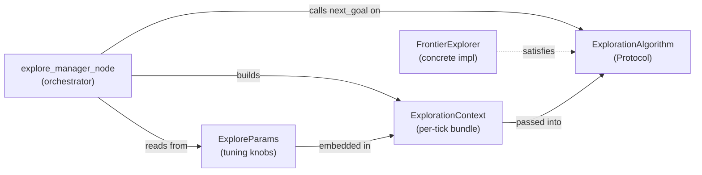
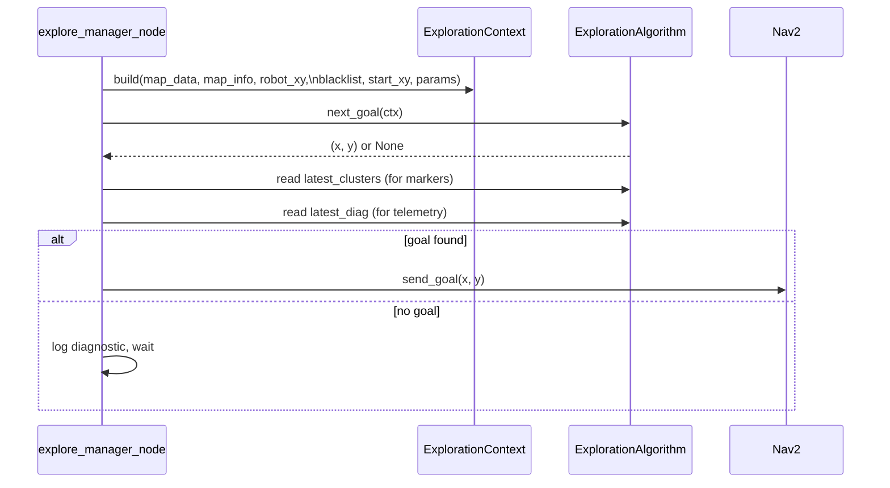

# ExploreContext — Data Types and Protocol for Pluggable Exploration

## Overview

`explore_context.py` is a small but architecturally pivotal module. It defines
the shared vocabulary for the pluggable exploration system introduced in F12.
Three things live here: `ExploreParams` (all tuning knobs in one place),
`ExplorationContext` (the per-tick input bundle passed to an algorithm), and
`ExplorationAlgorithm` (a structural Protocol that describes what an algorithm
must look like, without requiring inheritance).

The file has no logic — no conditionals, no loops, no math. It is pure
declaration. That restraint is intentional: this module is the contract between
the orchestrator (`explore_manager_node`) and any algorithm that plugs into it.
Keeping it logic-free means the contract is easy to read, easy to test, and
stable even as algorithms evolve.

## Why Separate This Module at All?

Before F12, tuning constants lived as class-level attributes scattered across
`explore_manager_node`. Algorithms were not swappable — there was exactly one
hard-wired algorithm baked into the node. Adding a second approach would have
required forking the entire node.

Extracting `explore_context.py` creates a clean seam. The node assembles inputs,
wraps them in `ExplorationContext`, and hands the bundle to whatever algorithm
is currently plugged in. The algorithm returns a goal coordinate or `None`. The
node never needs to know which algorithm ran.



## ExploreParams — Centralising Tuning Knobs

The single most practical win of this refactor is `ExploreParams`. Every
numeric constant that controls exploration behaviour is now in one dataclass
with descriptive names and typed defaults:

```python
@dataclass
class ExploreParams:
    min_frontier_size: int = 10
    blacklist_radius: float = 0.5
    min_frontier_dist: float = 0.8
    max_frontier_dist: float = 0.0
    goal_inset_m: float = 0.3
    max_explore_radius: float = 0.0
```

What each field controls:

| Field | Unit | Meaning |
|---|---|---|
| `min_frontier_size` | cells | Clusters smaller than this are noise; skip them |
| `blacklist_radius` | metres | Radius around a failed goal within which cells are excluded |
| `min_frontier_dist` | metres | Ignore frontier cells closer than this to the robot |
| `max_frontier_dist` | metres | Ignore frontier cells farther than this from the robot; 0.0 = unbounded |
| `goal_inset_m` | metres | Pull the nav goal this far toward the robot (keeps it inside the costmap) |
| `max_explore_radius` | metres | Bound exploration to a circle around `start_xy`; 0.0 = unbounded |

The choice of `0.0` as the sentinel for "disabled" on `max_explore_radius` (and
now `max_frontier_dist`) is worth noting. A negative value might feel more
self-documenting, but `0.0` was chosen because it maps cleanly to a simple
`if max_radius > 0.0:` guard without requiring an `Optional[float]`.

**`max_frontier_dist` added 2026-07-03** for the Gazebo sim work: caps how far a
single exploration hop can be, on the theory that short hops reduce exposure to
any one bad costmap region. The dataclass default stays `0.0` (unlimited) to
keep this module's own tests and the real-robot algorithm unaffected;
`pluggable_explore_manager_node` sets an operational default of `1.0` m via its
own ROS parameter (see `09-pluggable_explore_manager_node.md`). Splitting the
"safe algorithmic default" from the "operational sim default" this way avoids
the two use cases fighting over one constant.

Using a dataclass rather than a plain dict has two advantages. First, attribute
access is type-checked by the type checker and autocompleted by the IDE —
`params.min_frontier_size` is less error-prone than `params["min_frontier_size"]`.
Second, `@dataclass` generates `__repr__` for free, making the current parameter
set trivially loggable during debugging.

## ExplorationContext — The Per-Tick Input Bundle

Each call to `next_goal` represents one exploration tick. The algorithm needs
several inputs: the raw map data, the map geometry, the robot's current
position, a set of positions to avoid, an optional origin for radius bounding,
and the tuning parameters. Rather than passing six separate arguments, they are
bundled into a single context object:

```python
@dataclass
class ExplorationContext:
    map_data: list[int]
    map_info: MapInfo
    robot_xy: tuple[float, float]
    blacklist: set[tuple[float, float]]
    start_xy: tuple[float, float] | None
    params: ExploreParams
```

The `map_data` field is a flat `list[int]` — the raw occupancy values from
`nav_msgs/OccupancyGrid`. Values are 0 (free), 100 (occupied), or -1 (unknown).
It is passed by reference; the algorithm is expected to read but not mutate it.

`map_info` is `MapInfo` imported from `frontier_explorer`. This deliberate
import tethers `explore_context` to the frontier module, but that coupling is
acceptable: `MapInfo` is a plain data description of an OccupancyGrid and is
unlikely to change. Pulling it into a third neutral module would create
indirection without benefit.

`blacklist` is a `set[tuple[float, float]]` — world-coordinate pairs of
previously attempted goal positions that should not be retried. A `set` is
chosen over a `list` for O(1) membership testing; the algorithm does many
per-cell proximity comparisons against the blacklist on every tick. The
blacklist lives in the node and is passed in fresh on each tick, so the
algorithm itself is stateless with respect to history.

`start_xy` is typed `tuple[float, float] | None`. The union with `None`
encodes the semantics directly in the type: the robot's starting position is
only known after the first map callback. Before that, radius bounding is
impossible and must be skipped.

## ExplorationAlgorithm — Structural Protocol (Duck Typing)

The most significant design decision in this file is the use of `Protocol`
rather than an abstract base class:

```python
class ExplorationAlgorithm(Protocol):
    latest_clusters: list[list[int]]
    latest_diag: dict | None

    def next_goal(self, ctx: ExplorationContext) -> tuple[float, float] | None: ...
```

`Protocol` enables structural subtyping: any class that has `latest_clusters`,
`latest_diag`, and a matching `next_goal` method satisfies the protocol —
without inheriting from it, without registering, without any explicit
declaration of intent. This is the Python equivalent of Go interfaces or
Haskell typeclasses.

The practical consequence: writing a new exploration algorithm requires no
changes to `explore_context.py`, no changes to `explore_manager_node`
(beyond the injection point), and no risk of accidentally inheriting unwanted
behaviour from a base class. The protocol purely describes shape.

The two instance attributes `latest_clusters` and `latest_diag` are part of
the protocol because the node uses them after each `next_goal` call for
telemetry and RViz2 marker publishing. They are output channels from the
algorithm back to the orchestrator — side-channel data beyond the return value.
Including them in the protocol makes the contract explicit: any algorithm that
plugs in must maintain these two attributes.

`latest_diag` is typed `dict | None`. The `None` value indicates that no
diagnostic information is available (e.g., a goal was found and no failure
analysis was performed). The `dict` is intentionally unstructured — different
algorithms may produce different diagnostic keys — so a fixed schema would be
premature.

## Data Flow at a Single Tick



The sequence makes explicit that `latest_clusters` and `latest_diag` are read
after `next_goal` returns, not passed in. The algorithm accumulates them as a
side effect of its internal computation.

## Relationship to MapInfo

`MapInfo` is imported from `frontier_explorer` rather than redefined here.
This means `ExplorationContext` carries a live reference to the same type
that `find_frontier_clusters` and `pick_best_frontier` expect. An algorithm
that delegates to those functions can pass `ctx.map_info` directly:

```python
clusters = find_frontier_clusters(ctx.map_data, ctx.map_info)
goal = pick_best_frontier(clusters, ctx.map_info, ctx.robot_xy, ...)
```

No conversion, no unpacking. The context and the frontier functions speak the
same dialect.

## Observations

- **Protocol attribute verification at runtime.** `Protocol` attributes are
  checked by the static type checker (mypy, pyright) but not at runtime.
  If an algorithm omits `latest_diag`, the node will raise `AttributeError`
  at the first telemetry read, not at injection time. A small `__init_subclass__`
  check or a `runtime_checkable` decorator (from `typing`) would catch this
  earlier, at the cost of slightly more boilerplate.

- **`latest_clusters` type is algorithm-specific.** The protocol declares it
  as `list[list[int]]` — cell indices, which is what `FrontierExplorer`
  produces. A future algorithm that works differently (e.g., sampling-based,
  or operating on a graph rather than a grid) might not produce cell-index
  clusters at all. The marker-publishing code in the node would need to
  handle `None` or a different representation. Abstracting this to
  `list[Any] | None` would increase flexibility at the cost of type safety.

- **`ExploreParams` is passed by value inside `ExplorationContext`.** If the
  node wants to hot-swap parameters between ticks (e.g., in response to a
  ROS2 parameter event), it simply builds a new `ExploreParams` and a new
  `ExplorationContext`. No mutable shared state, no thread safety concerns.
  This is a subtle but real benefit of the immutable-dataclass style.

- **No validation on `ExploreParams`.** There is nothing preventing
  `min_frontier_dist = -1.0` or `blacklist_radius = 0.0`, both of which
  would produce silent misbehaviour. Adding a `__post_init__` that asserts
  positivity of the distance fields would catch configuration errors early.

- **The module has no `__all__`.** Defining `__all__ = ["ExploreParams",
  "ExplorationContext", "ExplorationAlgorithm"]` would make the public API
  explicit and prevent accidental re-export of `MapInfo`, which belongs to
  `frontier_explorer`.
