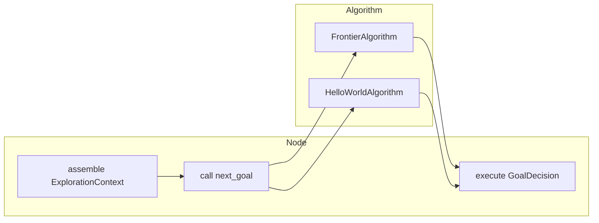

# The Exploration Algorithm Contract

`explore_context.py` is the narrow waist of the `dome_nav` exploration system.
Everything else — the manager node, the frontier algorithm, the hello-world
reference, and any future plugin — agrees to speak only the types and protocol
defined here. Keeping this file small and free of ROS details makes it possible
to unit-test algorithms without spinning up a full stack.

## What problem this solves

An exploration algorithm needs information from the robot (map, pose, blacklist,
tuning) and must return a decision (go here, blocked right now, or finished). The
naive design would let the algorithm reach directly into the node: read fields,
publish markers, declare parameters, inspect internal state. That collapses as
soon as you want a second algorithm, because the second algorithm has different
internals.

The contract here inverts that dependency:

- The **node** gathers session state and hands it to the algorithm as plain data.
- The **algorithm** returns a self-describing decision.
- Optional hooks (markers, diagnostics, telemetry) are opaque payloads the node
  forwards without parsing.

This is the same shape as a strategy pattern, but with explicit data contexts
instead of an object-oriented hierarchy.

## The decision type: `GoalDecision`

In earlier versions, `next_goal` returned `(x, y) | None`. That was lossy: `None`
could mean "no usable target this tick" or "the map is fully explored." The node
had to peek at frontier-specific state to tell them apart, which leaked the
frontier algorithm into the manager.

`GoalDecision` fixes this with an explicit enum:

```python
class GoalOutcome(Enum):
    NEW_GOAL = auto()
    NO_TARGETS_BLOCKED = auto()
    EXPLORED_DONE = auto()

@dataclass(frozen=True)
class GoalDecision:
    outcome: GoalOutcome
    xy: tuple[float, float] | None = None
```

The three factory methods make the intended states easy to read at the call
site:

```python
return GoalDecision.new_goal((1.5, 2.3))
return GoalDecision.blocked()
return GoalDecision.done()
```

`EXPLORED_DONE` is a terminal state: the manager ends the session immediately,
without waiting through a patience debounce. `NO_TARGETS_BLOCKED` is transient:
the manager increments a counter, clears the blacklist once, and tries again
later. This lets a coverage algorithm like frontier exploration distinguish
"filtered out this tick" from "truly finished."

## Shared session parameters: `ExploreParams`

`ExploreParams` holds the small set of tuning values that make sense for any
coverage strategy, not just frontier detection:

```python
@dataclass
class ExploreParams:
    max_explore_radius: float = 0.0
    blacklist_radius: float = 0.5
    preferred_goal_distance: float = 1.0
```

- `max_explore_radius` bounds how far from the start position the robot may go.
- `blacklist_radius` defines the suppression neighborhood around failed goals.
- `preferred_goal_distance` lets the user bias selection toward a particular
  range, regardless of how the algorithm ranks candidates.

Notice what is deliberately absent: `min_frontier_size`, `frontier_buffer_cells`,
`goal_inset_m`, and similar frontier-only knobs live in the algorithm's own
parameter dataclass. The node does not know their names.

## The algorithm input: `ExplorationContext`

Each tick, the node assembles everything the algorithm needs into one value
object:

```python
@dataclass
class ExplorationContext:
    map_data: list[int]
    map_info: MapInfo
    robot_xy: tuple[float, float]
    blacklist: set[tuple[float, float]]
    start_xy: tuple[float, float] | None
    params: ExploreParams
```

A few design choices are worth calling out:

- `map_data` is a flat copy of the `OccupancyGrid.data` array. Passing a plain
  `list[int]` keeps the algorithm implementations free of ROS message imports.
- `MapInfo` is a tiny dataclass with just the grid geometry. It originally lived
  in `frontier_explorer.py`, but that created a dependency from the generic
  protocol into a frontier-specific module, so it was moved here.
- `blacklist` is passed as a set; the algorithm reads it but never mutates it.
  Failure memory is session state, and session state belongs to the node.

## The rendering context: `RenderContext`

Visualization and diagnostics are optional hooks, but they still need the same
node-owned session state that `next_goal` receives. `RenderContext` carries that
state without any frontier-specific fields:

```python
@dataclass
class RenderContext:
    now: Time
    is_exploring: bool
    map_info: MapInfo | None
    robot_xy: tuple[float, float] | None
    blacklist: set[tuple[float, float]]
    goal_xy: tuple[float, float] | None
    params: ExploreParams
    patience: int
```

`patience` was added later so that the frontier algorithm's exhaustion report
can print the same debounce threshold the node is using, without hardcoding a
duplicate constant.

## The protocol: `ExplorationAlgorithm`

The protocol itself requires only one method:

```python
class ExplorationAlgorithm(Protocol):
    def next_goal(self, ctx: ExplorationContext) -> GoalDecision: ...

    def declare_params(self, node) -> None:
        ...
```

`declare_params` is optional for implementers; the node calls it once at
construction so an algorithm can register its own ROS parameters in the node's
namespace. `FrontierAlgorithm` uses this to declare frontier tuning.
`HelloWorldAlgorithm` leaves it as a no-op.

The optional visualization and diagnostics hooks are documented in comments but
not listed as required protocol members. That keeps the barrier low for new
plugins while still giving the node a consistent way to call them via
`getattr`.

## How the pieces fit together



The contract is intentionally thin. Any class that implements `next_goal` and
optionally the hook methods can be dropped into the manager without changing the
manager's code.

## Observations for improvement

- The optional hooks are documented as comments rather than typed Protocol
  members. Adding them to the Protocol (or a companion mixin with no-op defaults)
  would give plugin authors autocomplete and type checking.
- `ExploreParams.blacklist_radius` is defined here but not declared as a ROS
  parameter by the node, so it cannot be changed from launch/yaml. Exposing it
  would make the blacklist neighborhood tunable at runtime.
- As more algorithms are added, the shared param set may need to grow slowly and
  deliberately. The temptation is to move every tuning knob into `ExploreParams`,
  but that would recreate the frontier-leak problem F23 was meant to fix.
