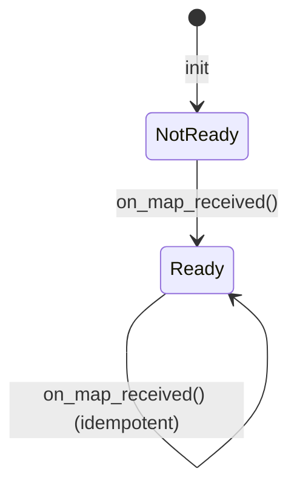

# SlamManager — Pure Python SLAM State

## Overview

`slam_manager.py` holds the testable logic that was previously tangled into
`slam_manager_node.py`. It knows nothing about ROS. Its job: track whether
a map has arrived yet, gate periodic saves, and ensure the map directory exists.

Extracting this logic makes it unit-testable without a running ROS graph and
reduces the node to a thin I/O adapter.

## State Machine

The manager tracks a single boolean: `map_ready`. Before any `/map` message
arrives, saves are blocked. After the first message, saves are allowed and the
state never reverts.



```python
class SlamManager:
    def __init__(self, map_persist_path: str):
        self.map_persist_path = map_persist_path
        self.map_ready = False

    def on_map_received(self) -> str:
        if not self.map_ready:
            self.map_ready = True
        return "mapping"

    def should_save(self) -> bool:
        return self.map_ready
```

`on_map_received` always returns `"mapping"` so the node can publish a status
string without needing to know the internal state.

## Directory Setup

The node calls `ensure_map_dir()` before every save. The map path might be
`~/.dome/slam_maps/basement1` — the parent `slam_maps/` must exist before
slam_toolbox writes the `.posegraph` file.

```python
    def ensure_map_dir(self):
        parent = os.path.dirname(self.map_persist_path)
        if parent:
            os.makedirs(parent, exist_ok=True)
```

Using `exist_ok=True` makes this idempotent — safe to call on every save
without checking first.

## Observations

- `map_ready` could be an enum if more states (e.g. `saving`, `error`) are ever needed.
- The class holds no save logic itself — that stays in the node where async ROS
  service calls live. This keeps the pure class free of async complexity.
- `map_persist_path` is mutable so the node's ROS parameter can update it after
  construction during tests.
