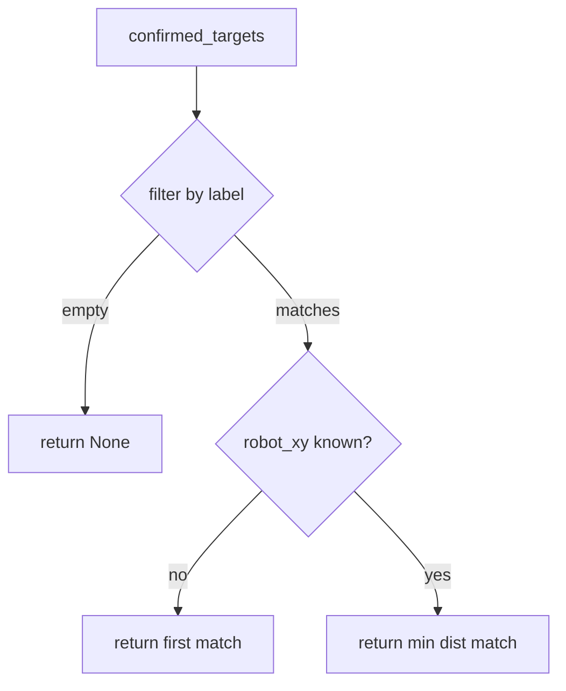

# NavManager — Pure Python Navigation Logic

## Overview

`nav_manager.py` holds all testable navigation logic extracted from
`nav_manager_node.py`. No ROS imports. Covers: JSON intent parsing,
confirmed-target list maintenance, nearest-target selection, and status
string generation.

## Confirmed Targets

The `/targets/confirmed` topic carries a JSON array of object sightings,
each with a label and world-frame XYZ. `on_targets` replaces the list on
each message — no merging, no deduplication. The latest confirmed snapshot
is authoritative.

```python
    def on_targets(self, json_str: str) -> bool:
        try:
            self.confirmed_targets = json.loads(json_str)
            return True
        except json.JSONDecodeError:
            return False
```

Returns `False` on bad JSON so the node can log a warning without this class
needing a logger.

## Intent Parsing

Intents arrive as JSON strings with an `action` field. Only two actions are
recognized; anything else is rejected so the node ignores unknown intents
rather than acting on them.

```python
    def parse_intent(self, json_str: str) -> tuple[str, dict] | None:
        try:
            intent = json.loads(json_str)
        except json.JSONDecodeError:
            return None
        action = intent.get("action", "")
        if action not in ("go_to_object", "cancel_navigation"):
            return None
        return (action, intent)
```

Returning `None` is a valid "nothing to do" signal — not an error. The node
checks for `None` and returns early.

## Nearest Target Selection

When multiple confirmed targets share a label (the same object seen from
different viewpoints), we pick the closest to the robot's current map position.



```python
    def find_nearest_confirmed(self, label: str, robot_xy: tuple | None) -> dict | None:
        matches = [t for t in self.confirmed_targets if t.get("label") == label]
        if not matches:
            return None
        if robot_xy is None:
            return matches[0]
        rx, ry = robot_xy

        def dist(target: dict) -> float:
            xyz = target.get("xyz_world", [0.0, 0.0, 0.0])
            return math.sqrt((xyz[0] - rx) ** 2 + (xyz[1] - ry) ** 2)

        return min(matches, key=dist)
```

`robot_xy` is `None` when the TF lookup fails (e.g. map not yet published).
Falling back to the first match is a reasonable degradation — still navigates,
just not necessarily to the closest instance.

## Status Strings

`navigate_status` produces the string the node publishes on `/dome_nav/nav_status`.
Centralizing this in the pure class means tests can assert on status strings
without a running publisher.

```python
    def navigate_status(self, label: str, target: dict | None) -> str:
        if target is None:
            return f"no_target:{label}"
        return f"navigating:{label}"
```

## Observations

- `on_targets` replaces the entire list; if dome_vision sends partial updates
  in the future, this will need a merge strategy.
- `find_nearest_confirmed` uses 2D Euclidean distance — correct for flat-floor
  navigation where Z is always ~0.
- A `check_localization(covariance)` method is planned (F06) to sit alongside
  this class, returning `"converged"` or `"localizing"` based on AMCL covariance.
