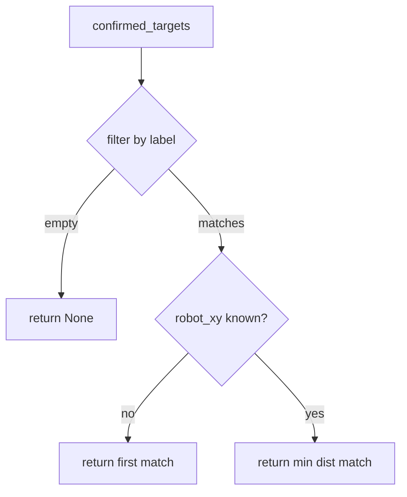

# NavManager — Pure Python Navigation Logic

## Overview

`nav_manager.py` holds all testable navigation logic extracted from
`nav_manager_node.py`. No ROS imports. Covers: JSON intent parsing,
confirmed-target list maintenance, nearest-target selection, localization
scoring, and status string generation.

## Confirmed Targets

The `/targets/confirmed` topic carries a JSON array of object sightings,
each with a label and world-frame XYZ. `on_targets` replaces the list on
each message — no merging, no deduplication. The latest confirmed snapshot
is authoritative.

```python
    def on_targets(self, json_str: str) -> bool:
        try:
            result = json.loads(json_str)
        except json.JSONDecodeError:
            return False
        if not isinstance(result, list):
            return False
        self.confirmed_targets = result
        return True
```

Returns `False` on bad JSON or a non-list payload so the node can log a
warning without this class needing a logger. The `isinstance` guard prevents
a dict-shaped payload from corrupting `confirmed_targets` and causing a
downstream `AttributeError`.

## Intent Parsing

Intents arrive as JSON strings matching dome_control's established contract:
`{"name": ..., "source": ..., "slots": {...}}`. Only two action names are
recognized; anything else returns `None` so the node ignores unknown intents.

```python
    def parse_intent(self, json_str: str) -> tuple[str, dict] | None:
        try:
            intent = json.loads(json_str)
        except json.JSONDecodeError:
            return None
        if not isinstance(intent, dict):
            return None
        action = intent.get("name", "")
        if action not in ("navigation_go", "navigation_cancel"):
            return None
        return (action, intent)
```

The key is `"name"` — not `"action"` — because that is the field dome_control's
`IntentPublisher` and `IntentParser` use. Using `"action"` would cause every
real intent to be silently ignored. The label for `navigation_go` lives in
`intent["slots"]["label"]`, following dome_control's slot convention.

Returning `None` is a valid "nothing to do" signal — not an error. The node
checks for `None` and logs a warning before returning early.

## Nearest Target Selection

When multiple confirmed targets share a label (the same object seen from
different viewpoints), we pick the closest to the robot's current map position.



```python
    def find_nearest_confirmed(self, label: str, robot_xy: tuple | None) -> dict | None:
        matches = [t for t in self.confirmed_targets if t.get("label") == label]
        if not matches:
            return None
        if robot_xy is None:
            return matches[0]
        rx, ry = robot_xy

        def dist(target: dict) -> float:
            xyz = target.get("xyz_world", [0.0, 0.0, 0.0])
            return math.sqrt((xyz[0] - rx) ** 2 + (xyz[1] - ry) ** 2)

        return min(matches, key=dist)
```

`robot_xy` is `None` when the TF lookup fails (e.g. map not yet published).
Falling back to the first match is a reasonable degradation — still navigates,
just not necessarily to the closest instance.

## Localization Scoring

AMCL covariance diagonal entries [0] and [7] represent x and y position
uncertainty in m². The score maps the worst of the two onto [0, 1] with 1 = fully
converged and 0 = maximum uncertainty.

```python
    MAX_COV = 1.0
    CONVERGED_THRESHOLD = 0.9

    def check_localization(self, covariance: list[float]) -> tuple[str, float]:
        worst = max(covariance[0], covariance[7])
        score = min(1.0, max(0.0, 1.0 - worst / self.MAX_COV))
        status = "converged" if score >= self.CONVERGED_THRESHOLD else "localizing"
        return (status, score)
```

`min(1.0, ...)` clamps the top end — AMCL should never produce negative
variances, but the guard is cheap.

## Status Strings

`navigate_status` produces the string published on `/dome_nav/nav_status`.
Centralizing this in the pure class means tests can assert on status strings
without a running publisher.

```python
    def navigate_status(self, label: str, target: dict | None) -> str:
        if target is None:
            return f"no_target:{label}"
        return f"navigating:{label}"
```

## Observations

- `on_targets` replaces the entire list; if dome_vision sends partial updates
  in the future, this will need a merge strategy.
- `find_nearest_confirmed` uses 2D Euclidean distance — correct for flat-floor
  navigation where Z is always ~0.
- The intent contract (`"name"` / `"slots"`) is defined by dome_control and
  consumed here; F08 (typed messages) would eliminate the JSON-in-String encoding
  entirely but is deferred pending cross-package coordination.
