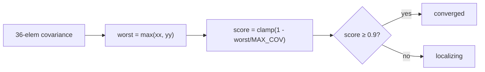

# `nav_manager.py` — the pure brain behind navigation

This is the counterpart to `nav_manager_node.py`. The node handles ROS; this
class handles *thinking*. Every decision that can be made from plain data —
parsing an intent, validating a target list, choosing the nearest matching
target, translating AMCL covariance into a localization score — lives here, with
zero ROS imports. The payoff is that all of it is unit-testable with ordinary
Python values (see `test/test_nav_manager_pure.py`), no rclpy, no simulator, no
TF.

The whole file is an exercise in **validating at the boundary and trusting
afterward**. Data enters through two doors (`on_targets`, `parse_intent`); both
are strict. Once past them, the rest of the code assumes clean data.

## Guarding the target boundary

Confirmed targets arrive as a JSON array from perception. A malformed entry
should not crash a later distance computation, so we filter the list down to
*valid* targets once, at ingest, and store only those. Validity is precise: a
dict with an `xyz_world` holding at least two numeric coordinates —

```python
def is_valid_target(target) -> bool:
    if not isinstance(target, dict):
        return False
    xyz = target.get("xyz_world")
    return (
        isinstance(xyz, (list, tuple)) and len(xyz) >= 2
        and all(
            isinstance(coord, (int, float)) and not isinstance(coord, bool)
            for coord in xyz[:2]
        )
    )
```

The `not isinstance(coord, bool)` clause is the kind of detail that only shows up
after a bug: in Python `bool` is a subclass of `int`, so `True` would sail
through an `isinstance(coord, (int, float))` check and later be used as a
coordinate. Excluding it explicitly closes that hole.

`on_targets` applies this filter and reports parse success as a bool, so the node
can warn without needing to know *why*:

```python
def on_targets(self, json_str: str) -> bool:
    try:
        result = json.loads(json_str)
    except json.JSONDecodeError:
        return False
    if not isinstance(result, list):
        return False
    self.confirmed_targets = [t for t in result if is_valid_target(t)]
    return True
```

## Guarding the intent boundary

`parse_intent` is the other door. It returns `None` for anything it does not
recognize — bad JSON, non-dict, or an action outside the known set — and
otherwise hands back the `(action, intent)` pair. Returning `None` rather than
raising lets the node treat "unknown intent" as a warn-and-ignore, not a crash:

```python
def parse_intent(self, json_str: str) -> tuple[str, dict] | None:
    try:
        intent = json.loads(json_str)
    except json.JSONDecodeError:
        return None
    if not isinstance(intent, dict):
        return None
    action = intent.get("name", "")
    if action not in ("navigation_go", "navigation_cancel"):
        return None
    return (action, intent)
```

## Choosing the nearest target

Given a label and the robot's position, pick the closest confirmed target with
that label. Because every stored target was validated at ingest, this method can
trust `xyz_world` exists and is numeric — no defensive checks needed here. The
graceful-degradation case is `robot_xy is None` (no pose available): rather than
block navigation, fall back to the first match.

```python
def find_nearest_confirmed(self, label, robot_xy):
    matches = [t for t in self.confirmed_targets if t.get("label") == label]
    if not matches:
        return None
    if robot_xy is None:
        return matches[0]
    rx, ry = robot_xy

    def dist(target):
        xyz = target["xyz_world"]
        return math.sqrt((xyz[0] - rx) ** 2 + (xyz[1] - ry) ** 2)

    return min(matches, key=dist)
```

Using `min(..., key=dist)` is both the clearest and the most efficient
expression — one linear pass, no sort.

## Reading localization health from covariance

AMCL reports its confidence as a 6×6 pose covariance matrix, flattened to 36
row-major floats. The diagonal entries `[0]` and `[7]` are the *x* and *y*
position variances (in meters²). Big variance means the filter is unsure. We
collapse that to a single 0–1 score and a status label:

```python
def check_localization(self, covariance):
    worst = max(covariance[0], covariance[7])
    score = min(1.0, max(0.0, 1.0 - worst / self.MAX_COV))
    status = "converged" if score >= self.CONVERGED_THRESHOLD else "localizing"
    return (status, score)
```

**The theory behind the numbers.** AMCL is a particle filter: it represents the
robot's pose belief as a cloud of weighted hypotheses. The 6×6 covariance it
reports is the second moment of that cloud — geometrically, the *uncertainty
ellipse* around the estimate. The two diagonal entries we read, `[0]` and `[7]`,
are the variances of that ellipse along *x* and *y* (its axes, ignoring
correlation); the off-diagonal terms we ignore only tilt the ellipse. A tight,
converged filter has a small ellipse (low variance); a "kidnapped" or freshly
initialized robot has a broad one. Taking `max(xx, yy)` reports the ellipse's
worst semi-axis — honest, because localization is only as trustworthy as its
least-certain direction. Squared meters are the natural unit (variance, not
standard deviation), which is why `MAX_COV = 1.0 m²` — a 1-meter-ish spread — is a
sensible "lost" ceiling.

The design choices worth naming:

- **Take the *worst* of the two axes.** Localization is only as good as its least
  certain direction, so `max(xx, yy)` is the honest summary.
- **`MAX_COV = 1.0` is the "lost" ceiling.** A variance at or above it maps to
  score 0.0; a variance of 0 maps to 1.0. The `min/max` clamp keeps the score in
  `[0, 1]` for any input.
- **`CONVERGED_THRESHOLD = 0.9`** draws the line between "converged" and still
  "localizing."



## Status string helper

Finally, a tiny formatter for the node's status topic, keeping the wire vocabulary
in one place:

```python
def navigate_status(self, label, target):
    if target is None:
        return f"no_target:{label}"
    return f"navigating:{label}"
```

## Observations and possible improvements

- **The covariance→score mapping is linear and uncalibrated.** `MAX_COV = 1.0 m²`
  is a reasonable but arbitrary ceiling; a real deployment would tune it (or use a
  log/exponential mapping) against observed AMCL behavior on the actual robot.
- **`find_nearest_confirmed` uses Euclidean distance**, not path distance. Two
  targets equidistant in a straight line can differ greatly in travel cost when a
  wall sits between the robot and one of them. Path-aware selection would need the
  costmap, which this pure module deliberately does not have.
- **Only two intents are recognized.** Extending the vocabulary means editing the
  tuple in `parse_intent`; a set constant or a small registry would make the
  supported actions self-documenting.
- **`MAX_COV` and `CONVERGED_THRESHOLD` are class constants, not params.** Moving
  them to `ExploreParams`-style tuning would let them be set per robot without a
  code change.
