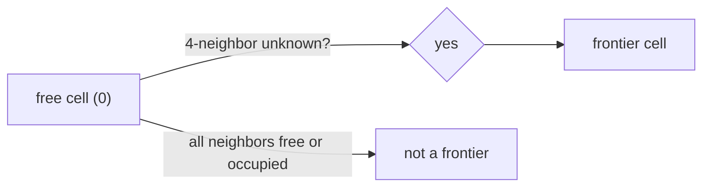
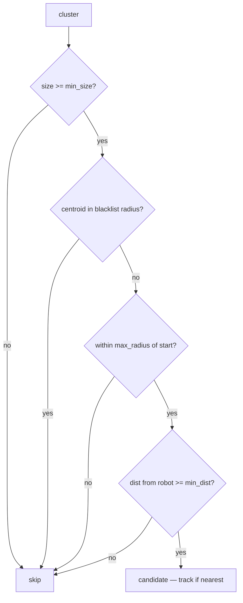

# FrontierExplorer — Pure Python Frontier Detection

## Overview

`frontier_explorer.py` implements frontier-based exploration: given an
OccupancyGrid map, find the boundary between known-free and unknown space,
cluster those boundary cells, and return the best target for the robot to
drive toward. No ROS imports — fully testable with plain pytest.

## What is a Frontier?

An occupancy grid cell can be free (0), occupied (100), or unknown (-1).
A **frontier cell** is a free cell that has at least one unknown 4-neighbor.
It sits on the edge of what the robot has already seen — driving there will
expose new territory.



## MapInfo Dataclass

All coordinate math needs four map properties. Rather than passing them
individually through every function, `MapInfo` bundles them:

```python
@dataclass
class MapInfo:
    width: int
    height: int
    resolution: float
    origin_x: float
    origin_y: float
```

Cell index to world coordinates: `x = origin_x + (col + 0.5) * resolution`.
The `+ 0.5` centers the point in the cell rather than placing it at the corner.

## Finding Frontier Clusters

`find_frontier_clusters` runs in two passes. First, scan every cell and mark
frontier cells — free cells with an unknown 4-neighbor:

```python
    is_frontier: set[int] = set()
    for idx in range(width * height):
        if data[idx] != 0:
            continue
        for nb in neighbors4(idx):
            if data[nb] == -1:
                is_frontier.add(idx)
                break
```

4-connectivity for detection is deliberate: a diagonal-only unknown neighbor
does not expose new space the robot can reach by driving there.

Second pass: flood-fill clusters using 8-connectivity. Adjacent frontier
cells belong to the same frontier region, and 8-connectivity avoids splitting
a diagonal chain into many tiny single-cell clusters:

```python
    for seed in is_frontier:
        if seed in visited:
            continue
        cluster: list[int] = []
        stack = [seed]
        while stack:
            cell = stack.pop()
            if cell in visited or cell not in is_frontier:
                continue
            visited.add(cell)
            cluster.append(cell)
            for nb in neighbors8(cell):
                if nb not in visited and nb in is_frontier:
                    stack.append(nb)
        clusters.append(cluster)
```

## Picking the Best Frontier

`pick_best_frontier` applies four filters in sequence, then returns the
nearest passing centroid to the robot:



**min_size** — avoids sending the robot to chase single-pixel noise.

**blacklist_radius** — previously failed or visited goals are stored as world
coordinates. Any centroid within 0.5 m of a blacklisted point is skipped,
preventing infinite retry loops on unreachable frontiers.

**max_radius / start_xy** — limits exploration to a circle around the start
position, useful for mapping a single room without wandering the building.
Disabled when `max_radius == 0.0`.

**min_dist** — skips frontiers too close to the robot. Nav2's `xy_goal_tolerance`
is 0.25 m; a frontier at 0.2 m is declared "reached" without movement, causing
the same frontier to reappear immediately.

## Observations

- Performance: linear scan is O(W×H) per tick. A 200×200 map (2500 m² at 5 cm
  resolution) = 40,000 cells — fast enough at 2 Hz. For very large maps (>10,000
  m²) a BFS-from-robot approach like m-explore would be more efficient.
- Frontier ranking uses pure distance. m-explore weights by `size × gain -
  distance × scale`, which steers toward large unexplored regions over small
  nearby gaps. A size-weighted score could improve exploration efficiency.
- The blacklist uses exact centroid coordinates. A centroid computed from a
  slightly different cluster (map updated between ticks) may not match exactly.
  The `blacklist_radius` tolerance (0.5 m) covers this drift in practice.
