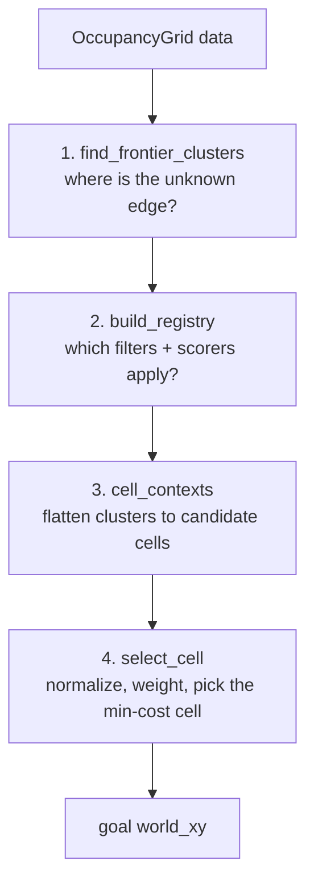

# Frontier Detection and Goal Scoring — `frontier_explorer.py`

This is the algorithmic heart of the package: the pure-Python machinery that
turns an occupancy grid into "where should the robot go next to see the most new
world?" It has no ROS dependencies and no class hierarchy — just a family of
functions over grids and coordinates, which makes every one of them directly
testable (see `test/test_frontier_explorer.py`). `frontier_algorithm.py` wraps
these functions behind the exploration protocol; here we study the ideas.

Frontier-based exploration is a classic robotics technique (Yamauchi, 1997): the
*frontier* is the boundary between known-free space and the unknown beyond it.
Drive to a frontier and your sensors reveal what lies past it, pushing the
boundary outward. Repeat until no frontiers remain and the space is mapped. The
file breaks the problem into four stages.



## Algorithmic background and complexity

A few classic techniques hide behind these functions; naming them makes the code
easier to reason about and to cost.

- **Frontier-based exploration** (Yamauchi, 1997) rests on one insight: the most
  information-rich place to go is the boundary of what you know, because that is
  where a sensor sweep converts unknown cells to known ones fastest. Everything
  here serves that idea.
- **Multi-source BFS as a distance transform.** `clearance_field` seeds *every*
  wall cell at distance 0 and relaxes outward. Seeding all sources at once yields
  the distance to the *nearest* wall for every cell in a single sweep — the same
  trick as a brushfire/`cv2.distanceTransform`, done on a graph. With diagonal
  moves weighted √2 it approximates true Euclidean distance far better than a
  4-connected (Manhattan) transform would.
- **Bresenham line rasterization** (novelty, and line-of-sight in the demo) walks
  a grid line using only integer additions — no floating point, no per-step
  `sqrt` — which is why novelty scoring is cheap enough to run per candidate.
- **Min-max feature normalization** is the standard fix for combining
  incommensurable scores (meters vs cell-counts vs clearance) into one weighted
  sum; without it the largest-magnitude term silently dominates.

Rough per-tick cost, for a grid of `N = width·height` cells with `F` frontier
cells and `C` surviving candidates and `S` scorers:

| Stage | Work | Cost |
|-------|------|------|
| `find_frontier_clusters` | full-grid scan + ring walk + flood fill | `O(N)` |
| `clearance_field` | multi-source relaxation BFS (8-conn) | `~O(N)` (cells re-enqueued a bounded number of times) |
| `path_novelty_score` | Bresenham per candidate | `O(C · max(w,h))` |
| `select_cell` | normalize + weighted sum | `O(S · C)` |

The dominant term on a large map is the pair of `O(N)` grid sweeps
(`find_frontier_clusters` and `clearance_field`), which is why the improvements at
the end target *avoiding recomputation* rather than shaving constants.

## Grid conventions

The SLAM `/map` uses the standard occupancy encoding: `-1` unknown, `0` free,
`100` occupied. We treat anything at or above a threshold as a wall:

```python
OCCUPIED_THRESHOLD = 65
```

Cells are stored as a flat row-major array; index `idx` is row `idx // width`,
column `idx % width`. Two conversions bridge grid and world space:

```python
def cell_to_world(idx: int, info: MapInfo) -> tuple[float, float]:
    r, c = divmod(idx, info.width)
    x = info.origin_x + (c + 0.5) * info.resolution   # +0.5 → cell center
    y = info.origin_y + (r + 0.5) * info.resolution
    return (x, y)


def world_to_cell(xy: tuple[float, float], info: MapInfo) -> tuple[int, int]:
    # math.floor, not int(): int() truncates toward zero, so a point just left
    # of the origin would land in cell 0 (in-bounds) instead of -1.
    col = math.floor((xy[0] - info.origin_x) / info.resolution)
    row = math.floor((xy[1] - info.origin_y) / info.resolution)
    return (row, col)
```

The `math.floor` vs `int()` note is a genuine correctness bug waiting to happen:
`int(-0.3)` is `0`, silently placing an out-of-bounds point *inside* the grid.

## Stage 1 — finding frontier clusters (with a buffer)

The naive frontier is any free cell touching an unknown cell. This code does
something more deliberate: it walks *`buffer_cells` rings inward* from that raw
boundary and treats the innermost ring as the frontier. Why? A goal placed right
on the unknown edge tends to fail Nav2's `worldToMap` (it can fall just outside
the costmap), and cells right at the seam are noisy. Backing off a couple of
cells gives goals that sit safely in known-free space while still adjacent to the
unknown.

The algorithm proceeds in three moves:

**Find the depth-0 boundary** — free cells 4-adjacent to any unknown:

```python
boundary: set[int] = set()
for idx in range(width * height):
    if data[idx] != 0:
        continue
    for nb in neighbors4(idx):
        if data[nb] == -1:
            boundary.add(idx)
            break
```

**Walk `buffer_cells` free-cell rings inward** — each ring is the set of
unclaimed free cells adjacent to the previous ring. The *last* ring reached
becomes the frontier:

```python
claimed: set[int] = set(boundary)
ring: set[int] = boundary
is_frontier: set[int] = boundary
for _ in range(buffer_cells):
    next_ring = set()
    for idx in ring:
        for nb in neighbors4(idx):
            if data[nb] == 0 and nb not in claimed:
                next_ring.add(nb)
    claimed |= next_ring
    ring = next_ring
    is_frontier = next_ring
```

**Cluster the frontier cells** with a flood fill (8-connected), so each connected
patch of frontier becomes one candidate region:

```python
for seed in is_frontier:
    if seed in visited:
        continue
    cluster: list[int] = []
    stack = [seed]
    while stack:
        cell = stack.pop()
        if cell in visited or cell not in is_frontier:
            continue
        visited.add(cell)
        cluster.append(cell)
        for nb in neighbors8(cell):
            if nb not in visited and nb in is_frontier:
                stack.append(nb)
    clusters.append(cluster)
```

The default `buffer_cells = 2` is the empirically chosen compromise between
"close enough to the unknown to be worth visiting" and "far enough in to be a
valid, reachable goal."

## The clearance field — a distance transform

Some scorers want to know how *open* a cell is: a goal in the middle of a room is
easier to reach than one wedged against a wall. `clearance_field` computes, for
every cell, the distance (in cells) to the nearest wall. It is a **multi-source
BFS distance transform**: seed the queue with every wall cell at distance 0, then
relax outward, 8-connected, with diagonal steps costing √2.

```python
def clearance_field(data: Sequence[int], info: MapInfo) -> list[float]:
    width, height = info.width, info.height
    dist = [float("inf")] * (width * height)
    queue: deque[int] = deque()
    for idx, value in enumerate(data):
        if value >= OCCUPIED_THRESHOLD:
            dist[idx] = 0.0
            queue.append(idx)
    steps = (
        (-1, 0, 1.0), (1, 0, 1.0), (0, -1, 1.0), (0, 1, 1.0),
        (-1, -1, SQRT2), (-1, 1, SQRT2), (1, -1, SQRT2), (1, 1, SQRT2),
    )
    while queue:
        idx = queue.popleft()
        row, col = divmod(idx, width)
        base = dist[idx]
        for dr, dc, step in steps:
            nr, nc = row + dr, col + dc
            if 0 <= nr < height and 0 <= nc < width:
                nidx = nr * width + nc
                nd = base + step
                if nd < dist[nidx]:
                    dist[nidx] = nd
                    queue.append(nidx)
    return dist
```

A cell keeps `inf` only if *no* wall is reachable from it (a map with no walls at
all) — callers read `inf` as "maximally open." Note this is a relaxation BFS, not
strict Dijkstra, so a cell can be enqueued more than once; for the grid sizes
here that is cheap and simpler than a priority queue.

## The novelty score — Bresenham through the unknown

The other information-hungry scorer asks: *how much new territory does travelling
to this goal reveal?* We approximate that by counting unknown cells on the
straight line from robot to goal, using Bresenham's line algorithm to walk the
raster:

```python
def path_novelty_score(
    start_xy: tuple[float, float], end_xy: tuple[float, float],
    data: Sequence[int], info: MapInfo,
) -> int:
    r0, c0 = world_to_cell(start_xy, info)
    r1, c1 = world_to_cell(end_xy, info)
    score = 0
    for row, col in bresenham_cells(r0, c0, r1, c1):
        if 0 <= row < info.height and 0 <= col < info.width:
            if data[row * info.width + col] == -1:
                score += 1
    return score
```

More unknown cells crossed = more new map revealed by going there. It is pure
integer arithmetic, out-of-bounds cells simply skipped.

## Stages 2–4 — the F31 scoring pipeline

Older versions picked frontiers by a single criterion (nearest, or farthest).
The **F31 pipeline** generalizes this into a small, composable scoring engine.
The vocabulary:

```python
Filter = Callable[[CellCtx], bool]        # True = keep
Scorer = Callable[[CellCtx], float]       # raw cost, lower = better
WeightedScorer = tuple[float, Scorer]     # weight 0.0 disables in place
```

Each candidate cell is described by a `CellCtx` bundle (its world position,
distance to robot, clearance, the map, tuning, blacklist…). `build_registry`
assembles the active filters and weighted scorers for this tick, adding the
novelty and clearance tenants only when enabled:

```python
def build_registry(
    tuning: "FrontierTuning", info: MapInfo, start_xy: tuple[float, float] | None
) -> Registry:
    scorers: list[WeightedScorer] = [(tuning.w_distance, score_distance_to_preferred)]
    if tuning.use_novelty_scoring:
        scorers.append((tuning.w_novelty, score_novelty))
    cell_filters: list[Filter] = [keep_off_blacklist, keep_within_dist_range]
    if tuning.w_clearance > 0.0:
        cell_filters.append(keep_clearance_floor)
        scorers.append((tuning.w_clearance, score_clearance_bonus))
    return Registry(
        cluster_filters=[
            make_min_size_filter(tuning),
            make_max_radius_filter(tuning, info, start_xy),
        ],
        cell_filters=cell_filters,
        scorers=scorers,
    )
```

The scorers are small and each expresses one preference. Note the sign
convention — everything is a *cost*, lower is better, so "more is better"
quantities are negated:

```python
def score_distance_to_preferred(ctx: CellCtx) -> float:
    reach = ctx.dist_to_robot_m - ctx.tuning.goal_inset_m  # account for the nudge
    return abs(reach - ctx.tuning.preferred_goal_distance)


def score_novelty(ctx: CellCtx) -> float:
    return -float(path_novelty_score(
        ctx.robot_world_xy, ctx.world_xy, ctx.map_data, ctx.map_info
    ))


def score_clearance_bonus(ctx: CellCtx) -> float:
    return -ctx.clearance_cells   # more open = lower cost
```

> **F15 migration note:** Path novelty used to be a two-stage
> short-list-then-re-rank special case in `FrontierAlgorithm.select_target`. With
> the F31 pipeline it is simply one weighted scorer among others; `novelty_top_n`
> is retired as a deprecated no-op.

### The key trick: per-scorer normalization

Distance-to-preferred is in meters, novelty is a cell count, clearance is in
cells — utterly different scales. Summing them raw would let whichever happens to
have the biggest numbers dominate. So `select_cell` **min-max normalizes each
scorer's column to [0, 1] across the surviving cells** before taking the weighted
sum. Normalization is inherently cross-cell, so it lives in the selector, not in
the scorers:

```python
def select_cell(
    cells: list[CellCtx],
    cell_filters: list[Filter],
    scorers: list[WeightedScorer],
) -> tuple[float, float] | None:
    survivors = [c for c in cells if all(f(c) for f in cell_filters)]
    if not survivors:
        return None
    columns = [
        (weight, minmax_normalize([scorer(c) for c in survivors]))
        for weight, scorer in scorers
    ]
    best_xy: tuple[float, float] | None = None
    best_cost = float("inf")
    for i, cell in enumerate(survivors):
        cost = sum(weight * col[i] for weight, col in columns)
        if cost < best_cost:
            best_cost = cost
            best_xy = cell.world_xy
    return best_xy
```

`minmax_normalize` has a carefully chosen degenerate case: when all values are
equal (including a lone survivor, or an all-`inf` clearance column on a wall-less
map), it returns **zeros** — a scorer that cannot discriminate must not sway the
weighted sum. It compares `lo == hi` rather than the span so `inf` stays
finite-safe:

```python
def minmax_normalize(values: list[float]) -> list[float]:
    lo, hi = min(values), max(values)
    if lo == hi:
        return [0.0] * len(values)
    return [(v - lo) / (hi - lo) for v in values]
```

### Per-cell, not per-centroid

A crucial subtlety: selection is over individual *cells*, not cluster centroids.
A ring-shaped frontier's centroid can land in the middle of the ring — an
unknown or occupied cell that is not itself a frontier. Scoring every cell avoids
that "hollow centroid" trap, and the blacklist is likewise per-cell.

`pick_best_frontier` is the front door that runs all four stages, computing the
clearance field only when clearance scoring is actually on:

```python
def pick_best_frontier(
    clusters: list[list[int]],
    info: MapInfo,
    robot_xy: tuple[float, float],
    params: "FrontierTuning",
    blacklist: set[tuple[float, float]] | None = None,
    start_xy: tuple[float, float] | None = None,
    data: Sequence[int] = (),
) -> tuple[float, float] | None:
    registry = build_registry(params, info, start_xy)
    use_clearance = params.w_clearance > 0.0 and bool(data)
    clearance = clearance_field(data, info) if use_clearance else None
    cells = cell_contexts(
        clusters, data, info, robot_xy, params, blacklist or set(), start_xy,
        registry.cluster_filters, clearance,
    )
    return select_cell(cells, registry.cell_filters, registry.scorers)
```

## The filters

Cluster-level filters run first and cheaply (min size, max radius from start).
Cell-level filters cull individual candidates:

```python
def keep_off_blacklist(ctx: CellCtx) -> bool:
    br = ctx.tuning.blacklist_radius
    wx, wy = ctx.world_xy
    return not any(
        math.sqrt((wx - bx) ** 2 + (wy - by) ** 2) < br for bx, by in ctx.blacklist
    )


def keep_clearance_floor(ctx: CellCtx) -> bool:
    floor_m = ctx.tuning.robot_radius + ctx.tuning.clearance_margin_m
    return ctx.clearance_cells * ctx.map_info.resolution >= floor_m
```

The clearance *floor* is a reachability guarantee (a goal the robot's body cannot
fit into is worthless), kept deliberately low so corridors — whose maximum
clearance is only half their width — still yield goals. The clearance *bonus*
does the "prefer open space" work; the floor only rejects the impossible.

## The final nudge

The winning cell is a frontier point, close to the unknown edge. Before it
becomes a Nav2 goal it is pulled `inset_m` back toward the robot, keeping it
inside the costmap and off the unknown boundary:

```python
def nudge_toward_robot(
    xy: tuple[float, float], robot_xy: tuple[float, float], inset_m: float
) -> tuple[float, float]:
    dx = robot_xy[0] - xy[0]
    dy = robot_xy[1] - xy[1]
    dist = math.sqrt(dx * dx + dy * dy)
    if dist < inset_m:
        return xy
    scale = inset_m / dist
    return (xy[0] + dx * scale, xy[1] + dy * scale)
```

This is why `score_distance_to_preferred` subtracts `goal_inset_m`: the score
must reflect where the goal will actually *end up* after the nudge, not the raw
cell.

## Diagnostics

When `pick_best_frontier` returns `None`, the node wants to know *why* — too many
small clusters? all out of range? `frontier_diag` re-scans to bucket the
clusters, and it is only called on the no-goal path so it never taxes the normal
tick.

## Observations and possible improvements

- **Straight-line novelty ignores walls.** `path_novelty_score` counts unknown
  cells on the raster line even if a wall blocks the path — the robot could never
  travel it. A line-of-sight cutoff (stop counting at the first wall) would make
  novelty honest; the `algo_demo` tool already has a `has_line_of_sight` helper
  that does exactly this.
- **Euclidean distance-to-robot, not path distance.** `dist_to_robot_m` is
  straight-line; the `CellCtx` comment already flags "path distance when F30
  lands." A goal behind a wall looks closer than it is.
- **`clearance_field` recomputes the whole grid every tick** it is enabled. For a
  large map that is the tick's dominant cost. Caching it against the map's version
  stamp, or computing it only near candidate cells, would cut that.
- **Relaxation BFS re-enqueues cells.** Correct and simple, but a bucket/priority
  queue would touch each cell fewer times on large maps.
- **`find_frontier_clusters` scans every cell** to find the boundary. Tracking the
  known/unknown boundary incrementally as the map grows would avoid the full sweep.
