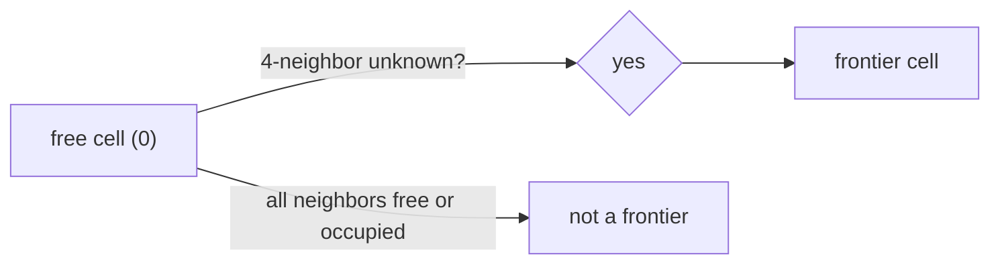
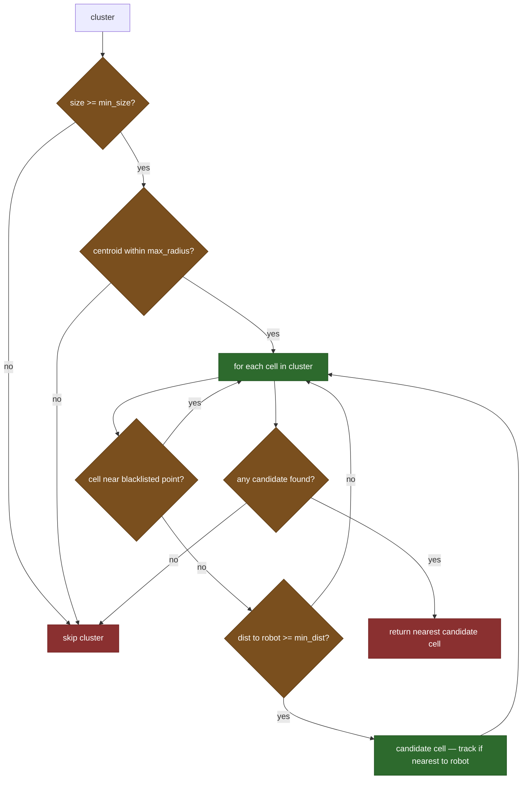

# FrontierExplorer — Pure Python Frontier Detection

## Overview

`frontier_explorer.py` implements frontier-based exploration: given an
OccupancyGrid map, find the boundary between known-free and unknown space,
cluster those boundary cells, and return the best target for the robot to
drive toward. No ROS imports — fully testable with plain pytest.

## What is a Frontier?

An occupancy grid cell can be free (0), occupied (100), or unknown (-1).
A **frontier cell** is a free cell that has at least one unknown 4-neighbor.
It sits on the edge of what the robot has already seen — driving there will
expose new territory.



## MapInfo Dataclass

All coordinate math needs four map properties. Rather than passing them
individually through every function, `MapInfo` bundles them:

```python
@dataclass
class MapInfo:
    width: int
    height: int
    resolution: float
    origin_x: float
    origin_y: float
```

Cell index to world coordinates: `x = origin_x + (col + 0.5) * resolution`.
The `+ 0.5` centers the point in the cell rather than placing it at the corner.

## Finding Frontier Clusters

`find_frontier_clusters` runs in two passes. First, scan every cell and mark
frontier cells — free cells with an unknown 4-neighbor:

```python
    is_frontier: set[int] = set()
    for idx in range(width * height):
        if data[idx] != 0:
            continue
        for nb in neighbors4(idx):
            if data[nb] == -1:
                is_frontier.add(idx)
                break
```

4-connectivity for detection is deliberate: a diagonal-only unknown neighbor
does not expose new space the robot can reach by driving there.

Second pass: flood-fill clusters using 8-connectivity. Adjacent frontier
cells belong to the same frontier region, and 8-connectivity avoids splitting
a diagonal chain into many tiny single-cell clusters:

```python
    for seed in is_frontier:
        if seed in visited:
            continue
        cluster: list[int] = []
        stack = [seed]
        while stack:
            cell = stack.pop()
            if cell in visited or cell not in is_frontier:
                continue
            visited.add(cell)
            cluster.append(cell)
            for nb in neighbors8(cell):
                if nb not in visited and nb in is_frontier:
                    stack.append(nb)
        clusters.append(cluster)
```

## Picking the Best Frontier

The original centroid-based approach had a critical failure mode: when a large
frontier ring surrounds the robot (the common case at the start of exploration),
the centroid of all those cells averages to approximately the robot's own
position. Any `min_dist` filter then rejects the entire cluster — even though
individual cells are far away at the map boundary.

The fix: select the **nearest non-blacklisted cell** within the cluster rather
than the centroid. The centroid is only retained for the `max_radius` check,
where it serves as a cheap cluster-level position proxy.



**min_size** — avoids sending the robot to chase single-pixel noise.

**max_radius / start_xy** — limits exploration to a circle around the start
position, useful for mapping a single room. Checked on the centroid as a fast
cluster-level proxy. Disabled when `max_radius == 0.0`.

**blacklist per-cell** — previously failed or visited goal positions are stored
as world coordinates. Each cell in the cluster is individually compared against
the blacklist, so only cells near previously attempted positions are excluded.
The whole cluster is never rejected — the robot naturally traces along the
frontier boundary as cells get blacklisted one by one.

**min_dist** — skips cells too close to the robot. With the nudge applied in
`explore_manager_node` (`GOAL_INSET_M`), the actual Nav2 goal lands at
`frontier_dist - GOAL_INSET_M`. `min_dist` must be large enough that this
result exceeds Nav2's `xy_goal_tolerance`, otherwise the goal is declared
reached without movement.

**max_dist** — the mirror-image filter, added for the Gazebo sim work: skips
cells *farther* than `max_dist` from the robot. The `pluggable_explore_manager_node`
uses this to cap each exploration hop to a short distance, on the theory that
short hops are less likely to run through a costmap region the robot can't
actually cross (see the doorway-inflation finding in `09-pluggable_explore_manager_node.md`).
Disabled when `max_dist == 0.0`, matching the `min_dist`/`max_radius` convention
of "0.0 means unlimited" used throughout this module.

**prefer_farthest** — added 2026-07-04. Flips the selection tie-break from
"closest candidate wins" to "farthest candidate wins," both within a cluster
and across clusters — every filter above (blacklist, `min_dist`/`max_dist`,
`max_radius`) still applies first; only which *surviving* candidate gets
chosen changes. The motivation: frontier cells are, almost by definition,
close to whatever obstacle is still hiding unknown space behind it, so
nearest-first is structurally biased toward wall-hugging cells — exactly
where costmap inflation makes an approach hardest (see the doorway-inflation
finding in `09-pluggable_explore_manager_node.md`). Since `blacklist_radius`
only excludes a small bubble around each failed attempt, retrying
nearest-first after a failure often just lands on the next cell over in the
same unreachable neighborhood. Farthest-first tends to pick cells in open,
still-unexplored areas instead, which are less likely to be pinned against a
wall early in exploration. Implemented by making both `best_dist`/`goal_dist`
initialize to `-1.0` instead of `+inf` when enabled, and flipping the `<`/`>`
comparison — the same loop structure handles both modes to avoid duplicating
the nested cluster/cell scan. Defaults to `False` (today's nearest-first
behavior) everywhere; only the sim launch files default their ROS parameter
to `True`.

## frontier_diag

`_frontier_diag` is a diagnostic helper called only when `pick_best_frontier`
returns `None`. It makes a second pass over the clusters to count how many
were rejected at each filter stage:

| field | meaning |
|---|---|
| `too_small` | clusters with `len < min_size` |
| `large_clusters` | clusters that passed min_size |
| `all_cells_out_of_range` | large clusters where every cell is outside the `[min_dist, max_dist]` band |

These counts are written into the `no_frontier` telemetry event. If
`all_cells_out_of_range > 0` and `large_clusters == all_cells_out_of_range`,
frontiers exist but none fall in the valid distance band — either
`MIN_FRONTIER_DIST` is too large, or `MAX_FRONTIER_DIST` is too small, for the
current map size.

**Bug fixed 2026-07-03**: this field used to be named `all_cells_too_close` and
only checked `min_dist`, a leftover from before `max_dist` existed. That made
the diagnostic blind to the (very real, in a small room) case where clusters
are rejected for being too *far* rather than too close — telemetry would show
`large_clusters: 7` with the too-close counter at `0`, an apparent
contradiction with no explanation, while `pick_best_frontier` correctly
returned `None`. Renamed to `all_cells_out_of_range` and extracted the shared
per-cell check into `_cell_out_of_range()` so both bounds are covered by one
code path instead of two independently-maintained ones.

Both helper functions are named with a leading underscore because they are
internal diagnostic/support functions, not part of the public API — callers
outside `explore_manager_node` and `frontier_algorithm` should not depend on
them.

## nudge_toward_robot

Pulls a frontier coordinate toward the robot by `inset_m` along the
robot→frontier vector. Keeps the Nav2 goal inside the costmap boundary rather
than on the unknown-cell edge (which causes `worldToMap` out-of-bounds errors).

```python
def nudge_toward_robot(xy, robot_xy, inset_m):
    dx = robot_xy[0] - xy[0]
    dy = robot_xy[1] - xy[1]
    dist = math.sqrt(dx*dx + dy*dy)
    if dist < inset_m:
        return xy
    scale = inset_m / dist
    return (xy[0] + dx*scale, xy[1] + dy*scale)
```

The guard `dist < inset_m` returns the point unchanged if it is already
closer than `inset_m` — avoids division by zero and prevents the nudge
from overshooting past the robot.

## Observations

- Performance: linear scan is O(W×H) per tick plus O(C×B) for blacklist checks
  per cell (C = cluster size, B = blacklist size). A 200×200 map at 2 Hz with
  a 875-cell cluster and 10 blacklisted points = ~8,750 distance checks per
  tick. Acceptable on a Raspberry Pi 4; for larger maps a spatial index would
  help.
- Frontier ranking uses pure nearest-cell distance. m-explore weights by
  `size × gain - distance × scale`, steering toward large unexplored regions.
  A size-weighted score could improve exploration efficiency for multi-room maps.
- The blacklist stores frontier centroids (original `pick_best_frontier` return
  values), not nudged goal coordinates. This keeps the per-cell comparison in
  `pick_best_frontier` exact — the same centroid that was blacklisted is the
  same value compared on the next tick.
- `prefer_farthest` is a blunt instrument: it doesn't know anything about
  *why* a frontier is close (open floor vs. a wall), just distance. A
  costmap-aware filter (reject cells sitting inside the inflation gradient,
  reading `/global_costmap/costmap`) would target the actual problem more
  directly — noted as a future direction in `02-doc/notes.md`, not yet built.
