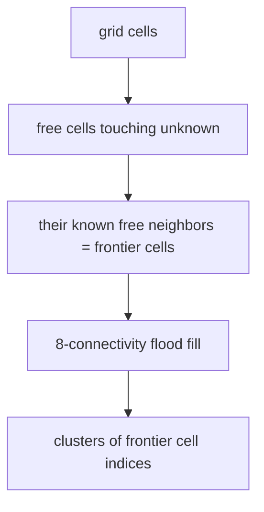

# frontier_explorer.py — Frontier Detection from an Occupancy Grid

This is the algorithmic heart of autonomous exploration, and it is deliberately
pure: it takes a flat list of occupancy values plus grid geometry and returns
where to go next, with no ROS, no TF, and no I/O. That purity is what lets the
whole thing be tested against hand-drawn grids. The module answers three
questions in sequence — *where are the frontiers?*, *which one should we drive
to?*, and *where exactly should the goal go?* — plus a diagnostic helper for when
the answer is "none."

## The grid model

A ROS `OccupancyGrid` is a 1-D array; `MapInfo` carries the geometry needed to
map between a flat index and world coordinates.

```python
@dataclass
class MapInfo:
    width: int
    height: int
    resolution: float
    origin_x: float
    origin_y: float
```

Cells encode `0` = free, `-1` = unknown, `>0` = occupied. Index arithmetic is the
recurring idiom: `row = idx // width`, `col = idx % width`, and back with
`cell_to_world`, which returns the *center* of the cell:

```python
def cell_to_world(idx, info):
    r, c = divmod(idx, info.width)
    x = info.origin_x + (c + 0.5) * info.resolution
    y = info.origin_y + (r + 0.5) * info.resolution
    return (x, y)
```

## What counts as a frontier (the buffer-ring definition)

The classic definition of a frontier is "a free cell adjacent to unknown." This
module uses a deliberately stricter one, and it is now *tunable* by depth. First
we find the **boundary ring**: free cells that directly touch unknown. Then we
walk `buffer_cells` rings of free cells *inward* from that boundary, each ring
being the free cells 4-adjacent to the previous one that no shallower ring has
already claimed. The last ring reached is the frontier — so every candidate goal
sits exactly `buffer_cells` confirmed-known cells away from the ragged edge.

```python
boundary: set[int] = set()
for idx in range(width * height):
    if data[idx] != 0:
        continue
    for nb in neighbors4(idx):
        if data[nb] == -1:
            boundary.add(idx)
            break

claimed: set[int] = set(boundary)
ring: set[int] = boundary
is_frontier: set[int] = set()
for _ in range(max(1, buffer_cells)):
    next_ring = set()
    for idx in ring:
        for nb in neighbors4(idx):
            if data[nb] == 0 and nb not in claimed:
                next_ring.add(nb)
    claimed |= next_ring
    ring = next_ring
    is_frontier = next_ring
```

Why the extra step? Goals sitting *directly* on the ragged known/unknown boundary
are exactly where Nav2's planners were historically unreliable (the NavFn "legal
potential" bug) and where costmap geometry is most ambiguous. Keeping every
candidate deeper into confirmed-known space made goals more reliably plannable —
a real, hard-won design choice, not a cosmetic one.

The default is now **`buffer_cells=2`** (was hard-coded to 1). The reason is
concrete: the frontier detector reads the SLAM `/map`, but the goal is ultimately
handed to Nav2's *global costmap*, which can lag the map by a cell or more at the
growing edge. A goal one cell inside the map could still map *outside* the
costmap, and the planner rejects it (`worldToMap` failure → `PLAN/NO_VALID_PATH`).
A 2-cell buffer keeps goals further inside that seam. The tradeoff: a free region
narrower than `2*buffer_cells+1` cells has no cell far enough from unknown and
yields no frontier there — acceptable for a robot that can't fit such gaps
anyway. `buffer_cells=1` reproduces the original single-ring behaviour.

Adjacent frontier cells are then grouped into clusters by an 8-connectivity
flood-fill, so a long wall-opening becomes one cluster rather than dozens of
singletons:

```python
for seed in is_frontier:
    if seed in visited: continue
    cluster, stack = [], [seed]
    while stack:
        cell = stack.pop()
        if cell in visited or cell not in is_frontier: continue
        visited.add(cell); cluster.append(cell)
        for nb in neighbors8(cell):
            if nb not in visited and nb in is_frontier:
                stack.append(nb)
    clusters.append(cluster)
```



## Picking the goal: nearest cell, not centroid

`pick_best_frontier` chooses among clusters, and its most important decision is
what point *within* a cluster to aim at. It uses a qualifying **cell**, not the
cluster centroid. As of F23 the picker is a thin wrapper over
`best_frontier_candidates`, which returns the top-`n` cells ranked by score (one
best cell per surviving cluster); `pick_best_frontier` just takes the first:

```python
def pick_best_frontier(clusters, info, robot_xy, params, blacklist=None, start_xy=None):
    candidates = best_frontier_candidates(
        clusters, info, robot_xy, params, blacklist, start_xy, top_n=1
    )
    return candidates[0] if candidates else None
```

Inside a cluster, `best_cell_in_cluster` scores each cell by
`abs((d - goal_inset_m) - preferred_goal_distance)` — the F14 change that
replaced the old binary `prefer_farthest` flag, refined to score the goal
*actually dispatched*: `nudge_toward_robot` (below) pulls the chosen cell
exactly `goal_inset_m` closer along the same ray, so scoring the raw distance
`d` biased selection about one inset too close. A `preferred_goal_distance` of
0 reproduces nearest-first; a large value reproduces farthest-first;
intermediate values aim for a comfortable step size. The centroid is used only for the `max_radius`
cluster-level filter, never as the goal — because a frontier that *surrounds* the
robot has a centroid ≈ the robot's own position, useless as a goal, while its
cells are out at the boundary where the robot must go.

The filters stack per cell: **blacklist** (within `blacklist_radius` of a failed
point) and the **`min_dist`/`max_dist`** distance band, plus cluster-level
`min_size` and `max_radius`. Splitting selection into "collect candidates, then
pick" is what makes the novelty re-ranking below possible without touching the
filter logic.

## Path novelty scoring (F15, opt-in)

Distance scoring answers "how far?" but not "how much *new* space does getting
there reveal?" A robot re-traversing a mapped corridor to reach a far frontier
learns little on the way. `path_novelty_score` estimates that payload: the count
of **unknown** cells (`-1`) a straight line from the robot to the candidate
crosses. More unknown cells crossed = more territory revealed by the trip.

It needs the inverse of `cell_to_world` and an integer line. `world_to_cell`
floors world coordinates back to a `(row, col)` — `math.floor`, not `int()`,
because `int()` truncates toward zero and would land a point just left of the
origin in cell 0 (in-bounds) instead of −1. `bresenham_cells` walks the
integer raster line between two cells, both endpoints included:

```python
def path_novelty_score(start_xy, end_xy, data, info):
    r0, c0 = world_to_cell(start_xy, info)
    r1, c1 = world_to_cell(end_xy, info)
    score = 0
    for row, col in bresenham_cells(r0, c0, r1, c1):
        if 0 <= row < info.height and 0 <= col < info.width:
            if data[row * info.width + col] == -1:
                score += 1
    return score
```

Out-of-bounds cells are skipped rather than counted — the line may leave the grid
near the edge. The score is over the *straight* line, not Nav2's eventual planned
path: the planned path isn't known at selection time, and the straight-line
approximation is cheap and directionally correct.

Re-ranking is a separate step so the default path is untouched.
`pick_by_novelty` takes the pre-filtered, distance-ranked short-list and returns
the highest-novelty candidate, keeping input order on ties (so distance breaks
ties):

```python
def pick_by_novelty(candidates, robot_xy, data, info):
    if not candidates:
        return (None, 0)
    best = candidates[0]
    best_score = path_novelty_score(robot_xy, best, data, info)
    for cand in candidates[1:]:
        score = path_novelty_score(robot_xy, cand, data, info)
        if score > best_score:
            best_score, best = score, cand
    return (best, best_score)
```

Cost stays negligible because novelty runs only on the short-list (≤ `novelty_top_n`,
default 5), never on every frontier cell. The feature is off by default
(`use_novelty_scoring=False`); `frontier_algorithm` wires the branch.

## Placing the goal off the boundary: `nudge_toward_robot`

Even a buffer cell can sit near the costmap edge. `nudge_toward_robot` pulls the
final goal a fixed `inset_m` back toward the robot:

```python
def nudge_toward_robot(xy, robot_xy, inset_m):
    dx, dy = robot_xy[0] - xy[0], robot_xy[1] - xy[1]
    dist = math.sqrt(dx*dx + dy*dy)
    if dist < inset_m:
        return xy
    scale = inset_m / dist
    return (xy[0] + dx * scale, xy[1] + dy * scale)
```

This keeps the sent goal inside known, navigable space and avoids Nav2
`worldToMap` errors at the grid edge. (It's why `min_frontier_dist` is set 0.3 m
higher than the desired sent-goal floor — see `explore_context`.)

## When nothing qualifies: `frontier_diag`

If `pick_best_frontier` returns `None`, the node needs to know *why* — was
everything too small, all blacklisted, or all outside the distance band?
`frontier_diag` does one extra pass to count exactly that, and is only called on
the None path so it never taxes the normal case:

```python
def frontier_diag(clusters, info, robot_xy, min_size, min_dist, max_dist=0.0):
    too_small = sum(1 for c in clusters if len(c) < min_size)
    large = [c for c in clusters if len(c) >= min_size]
    all_out_of_range = sum(
        1 for cluster in large
        if all(cell_out_of_range(cell_to_world(i, info), robot_xy, min_dist, max_dist)
               for i in cluster)
    )
    return {"too_small": too_small, "large_clusters": len(large),
            "all_cells_out_of_range": all_out_of_range}
```

Those three counts are what turn a mute "no frontier found" into an actionable
telemetry record. (`cell_out_of_range` is the shared distance-band predicate,
also used implicitly by the picker's own filters.)

## Observations / possible improvements

- **A full grid scan plus `buffer_cells` ring passes per call.** At current map
  sizes and 2 Hz this is fine; for large maps a single pass that records the
  boundary set would trim the work.
- **`pick_best_frontier` has grown to eleven parameters.** They all matter, but
  it's at the edge of readability — bundling the filter params (they already
  travel together as `ExploreParams`) would tighten the signature.
- **Buffer depth is now configurable** (`buffer_cells`, default 2). This closed a
  real failure mode — goals landing in the seam between the SLAM map and the
  smaller global costmap. A deeper buffer trades reach into narrow passages for
  robustness; 2 has been the sweet spot in sim.
- **`frontier_diag` recomputes `cell_to_world` for every cell of every large
  cluster.** Only on the failure path, so acceptable, but it duplicates work the
  picker just did.
