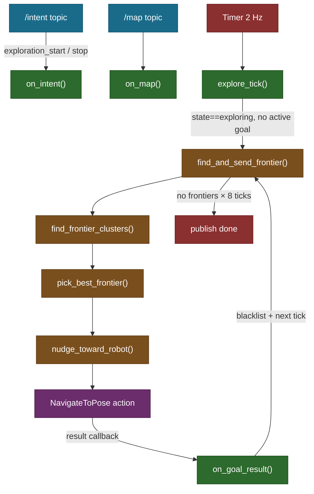
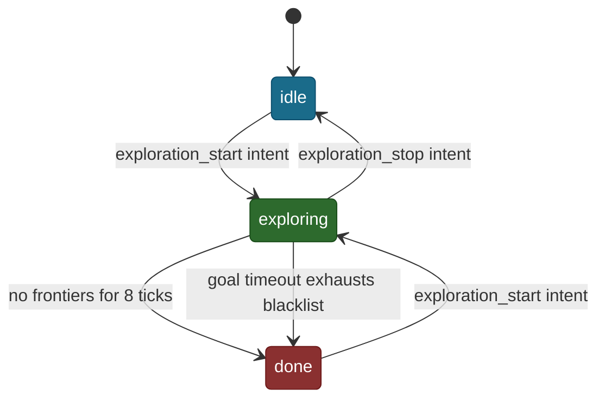

# ExploreManagerNode — Autonomous Frontier Exploration

## Overview

`explore_manager_node.py` wires `FrontierExplorer` (pure Python map analysis)
to Nav2 (path planning and motion) via a ROS2 node. It listens for
`exploration_start` / `exploration_stop` intents on `/intent`, drives a
timer-based exploration loop, and publishes `/explore/status`.

## Architecture



## State Machine

The node has three states: `idle`, `exploring`, `done`. Transitions are
intent-driven except the `done` transition which is map-driven.



Starting from `done` (not just `idle`) allows re-exploration after a
completed run without restarting the node.

## Timer-Driven Exploration Loop

Rather than a recursive `makePlan()` call (m-explore's approach), we use a
2 Hz timer. Each tick checks state and whether a goal is active before acting:

```python
    def explore_tick(self):
        self.publish_status(self.state)
        if self.state != "exploring":
            return
        if self.has_active_goal:
            self.check_goal_timeout()
            return
        self.find_and_send_frontier()
```

`has_active_goal` is a boolean set True when a goal is sent and False when the
result arrives. This prevents double-sending while a goal is in flight.

## Frontier Goal Selection and Inset

After picking the best frontier cell, the goal is nudged 0.3 m toward the
robot via `nudge_toward_robot()` (pure function in `frontier_explorer.py`).
Frontier cells sit at the edge of known space — placing the goal there lands
it on or past the costmap boundary, causing a `worldToMap failed` planner error.

`MIN_FRONTIER_DIST` (0.8 m) ensures the frontier cell is far enough that the
nudged goal (`frontier_dist − 0.3 m`) still exceeds Nav2's `xy_goal_tolerance`
(0.25 m). Minimum valid value: `GOAL_INSET_M + xy_goal_tolerance = 0.55 m`.

## Blacklisting

The blacklist is a `set[tuple[float, float]]` of world-coordinate points.
`pick_best_frontier` skips any frontier cell within `BLACKLIST_RADIUS` (0.5 m)
of a blacklisted point. Without it the robot re-picks the same unreachable
frontier every tick and gets stuck indefinitely.

**Three events add to the blacklist**, all using the frontier centroid (the
original `pick_best_frontier` return value, not the nudged nav goal):

| Event | Code |
|---|---|
| Goal completed (success or failure) | `on_goal_result` → `self.blacklist.add(centroid)` |
| Goal timed out (25 s) | `check_goal_timeout` → `self.blacklist.add(self.current_goal_centroid)` |
| Goal rejected by Nav2 action server | `on_goal_accepted` → `self.blacklist.add(centroid)` |

Blacklisting on **success** prevents re-visiting a frontier the map hasn't
yet updated to mark as explored — without it the same cell reappears on the
next tick and Nav2 declares it already reached (within `xy_goal_tolerance`).

**Centroid, not nudged goal, is stored.** `pick_best_frontier` returns the
nearest frontier cell; that exact coordinate is what gets blacklisted and
what the per-cell distance check in `pick_best_frontier` compares against.
Using the nudged coordinate instead would introduce drift and require a
larger radius to compensate.

**Check is per-cell, not per-cluster.** Inside `pick_best_frontier`:

```python
for cell_idx in cluster:
    wx, wy = cell_to_world(cell_idx, info)
    if any(math.sqrt((wx-bx)**2 + (wy-by)**2) < blacklist_radius for bx, by in bl):
        continue
    ...
```

Only cells near a blacklisted point are skipped. The rest of the cluster
remains valid. As goals are sent and blacklisted one by one, the robot
progressively works around the frontier boundary.

**Ring-cluster case.** A large frontier ring surrounding the robot has a
centroid ≈ robot position, filtered by `MIN_FRONTIER_DIST`. The code picks
the nearest individual cell instead (beyond `MIN_FRONTIER_DIST`). After that
goal completes, that cell's coordinates are blacklisted. The next tick picks
the next-nearest unblacklisted cell in the ring, and so on.

**Blacklist resets** only on `exploration_start`. It persists for the entire
session so previously-failed frontiers are not retried.

## Max Radius Constraint

`max_explore_radius` (ROS param, default 0.0 = disabled) limits exploration
to a circle around the position captured at `exploration_start`. Useful for
mapping a single room. Passed through to `pick_best_frontier`.

## /explore/status JSON

Published at 2 Hz. Always includes `state`, `reached`, `failed`. Additional
fields when exploring:

```json
{
  "state": "exploring",
  "reached": 3,
  "failed": 1,
  "goal_num": 5,
  "blacklisted": 2,
  "no_frontier_ticks": 0,
  "goal_xy": [1.23, 4.56],
  "dist_m": 1.87,
  "elapsed_s": 4.2
}
```

`goal_xy`, `dist_m`, and `elapsed_s` are omitted when no goal is currently
active (between goals or when TF is unavailable).

## Observations

- Goal timeout (25 s) prevents Nav2 BT recovery loops from blocking the
  exploration tick indefinitely. The cancelled goal's centroid is blacklisted
  so the same frontier is not immediately retried.
- Blacklist grows monotonically within a session. In a large space with many
  unreachable pockets the set could grow large, but the per-cell O(B) scan
  is fast in practice (B stays small relative to cluster size).
