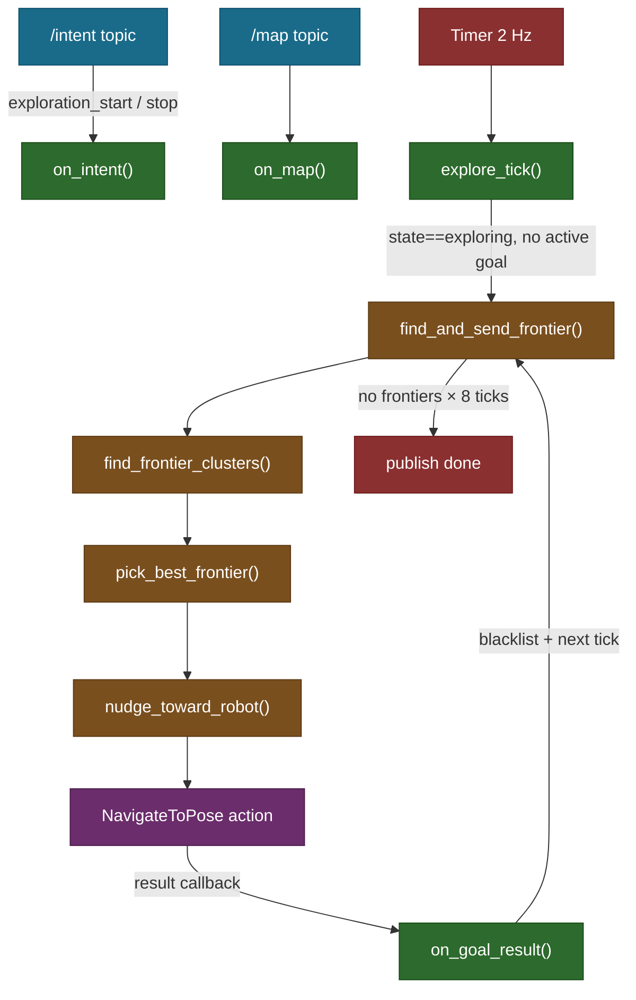
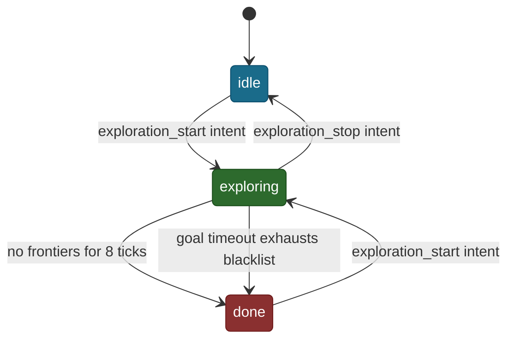

# ExploreManagerNode — Autonomous Frontier Exploration

## Overview

`explore_manager_node.py` wires `FrontierExplorer` (pure Python map analysis)
to Nav2 (path planning and motion) via a ROS2 node. It listens for
`exploration_start` / `exploration_stop` intents on `/intent`, drives a
timer-based exploration loop, and publishes `/explore/status`.

## Architecture



## State Machine

The node has three states: `idle`, `exploring`, `done`. Transitions are
intent-driven except the `done` transition which is map-driven.



Starting from `done` (not just `idle`) allows re-exploration after a
completed run without restarting the node.

## Timer-Driven Exploration Loop

Rather than a recursive `makePlan()` call (m-explore's approach), we use a
2 Hz timer. Each tick checks state and whether a goal is active before acting:

```python
    def explore_tick(self):
        if self.state != "exploring" or self.active_goal:
            return
        self.find_and_send_frontier()
```

`active_goal` is a boolean set True when a goal is sent and False when the
result arrives. This prevents double-sending while a goal is in flight.

## Frontier Goal Selection and Inset

After picking the best frontier centroid, the goal is nudged 0.3 m toward
the robot. Frontier centroids sit at the edge of known space — placing the
goal there lands it on or past the costmap boundary, causing a
`worldToMap failed` planner error.

```python
    def nudge_toward_robot(self, xy, robot_xy):
        dx = robot_xy[0] - xy[0]
        dy = robot_xy[1] - xy[1]
        dist = math.sqrt(dx * dx + dy * dy)
        if dist < self.GOAL_INSET_M:
            return xy
        scale = self.GOAL_INSET_M / dist
        return (xy[0] + dx * scale, xy[1] + dy * scale)
```

The guard `if dist < GOAL_INSET_M` avoids a division-by-zero when the
centroid is already very close to the robot (caught earlier by `MIN_FRONTIER_DIST`,
but defensive here too).

## Blacklisting

Every completed goal — success or failure — is added to the blacklist:

```python
    def on_goal_result(self, future, xy):
        ...
        self.blacklist.add(xy)
```

Blacklisting on success prevents revisiting a frontier that the map hasn't
yet updated to mark as explored. Without this, the same frontier reappears
on the next tick and the robot drives there again without moving (because
Nav2's `xy_goal_tolerance` declares it already reached).

## Max Radius Constraint

`max_explore_radius` (ROS param, default 0.0 = disabled) limits exploration
to a circle around the position captured at `exploration_start`. Useful for
mapping a single room. Passed through to `pick_best_frontier`.

## Observations

- No progress timeout: if Nav2 navigates slowly but never aborts, the node
  waits indefinitely. m-explore blacklists a goal after 30 s of no progress.
  Adding a watchdog timer would close this gap.
- Blacklist stores nudged goal coordinates, not raw centroids. If the same
  frontier is picked again at a slightly different centroid (map updated),
  the nudged coordinate may differ and escape the blacklist. The 0.5 m
  `BLACKLIST_RADIUS` covers most of this drift.
- `/explore/status` publishes String (idle/exploring/done). A structured
  message (frontier count, blacklist size, coverage %) would help monitoring.
