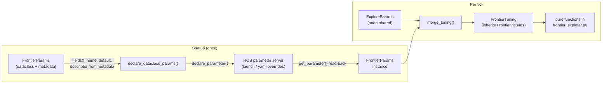

# Frontier Params — one dataclass as the single source of truth

`frontier_params.py` owns the frontier algorithm's tuning knobs and the per-tick
merge with the node's shared params. The *machinery* that moves any tuning
dataclass across the ROS boundary — declaration on the node, descriptors,
read-back with launch/yaml overrides applied — lives one level down in
`explore_context.py` (`tuning_field`, `ros_descriptor_for`,
`declare_dataclass_params`), because it is generic: the node's own shared
`ExploreParams` and each algorithm's private params (here `FrontierParams`) are
declared by exactly the same code. This module is the answer to a specific
maintenance failure: before F34, each knob was hand-transcribed about four
times (the dataclass, the merged-tuning dataclass, the merge function, and the
declare/read function), so adding one parameter — F31 added five — meant ~28
hand edits, any one of which could drift silently.

The design that replaces it has one idea at its center: **the dataclass is the
only place a knob is ever named**. Everything else — ROS declaration,
descriptors, read-back, and the merged per-tick view — is derived from
`dataclasses.fields()` at runtime.



## Declaring a knob: metadata travels with the field

A tunable field is not a bare dataclass field; it is built by `tuning_field()`
(from `explore_context.py`, shared by both param dataclasses), which attaches
the field's ROS-facing documentation as dataclass metadata. The field and its
description can never drift apart because they are written in the same breath:

```python
def tuning_field(
    default, desc: str, important: bool, dynamic: bool,
    min_value: float | None = None,
):
    metadata = {
        "ros_description": desc,
        "ros_important": important,
        "ros_dynamic": dynamic,
    }
    if min_value is not None:
        metadata["ros_min"] = min_value
    return field(default=default, metadata=metadata)
```

The four metadata keys have distinct fates:

- **`ros_description`** is live: it becomes the `ParameterDescriptor`, so
  `ros2 param describe /explore_manager w_clearance` explains the knob to an
  operator. Units are stated in the text (`(m)`, `cells`) because ROS has no
  unit system.
- **`ros_important`** and **`ros_dynamic`** are documentation-only. Nothing
  reads them in code. They record design intent — which knobs an operator
  should touch versus structural ones, and which are *meant* to become
  mid-run-adjustable once a parameter-event callback exists (today every param
  is read once at startup, so "dynamic" is aspiration, not mechanism). Their
  intended consumers are generated docs and tuning tooling; a test asserts
  every field carries both flags so the doc surface cannot silently rot.
- **`ros_min`** is live: it becomes a `FloatingPointRange` on the descriptor,
  so ROS itself — not our code — rejects a negative scorer weight at
  `ros2 param set` time.

## FrontierParams: the single source

The dataclass lists each knob exactly once, with its default and its metadata:

```python
@dataclass
class FrontierParams:
    min_frontier_size: int = tuning_field(
        15, "Minimum cells in a frontier cluster to be a candidate",
        important=True, dynamic=False)
    # ... ten more ...
    w_clearance: float = tuning_field(
        1.0, "Clearance scorer weight; 0 disables F31 clearance",
        important=True, dynamic=True, min_value=0.0)
```

Two deprecated fields (`prefer_farthest`, `novelty_top_n`) lingered here for
backward compatibility until 2026-07-30; their removal proved the design —
deleting a field removed it from declaration, read-back, and `FrontierTuning`
in one edit, with no other code touched.

## FrontierTuning: inheritance as a dedup trick

The pure functions in `frontier_explorer.py` need one flat object per tick:
the frontier knobs *plus* the two node-shared fields they also consult
(`blacklist_radius`, `max_explore_radius`). The old code restated every field
by hand in a second dataclass. The new one inherits:

```python
@dataclass
class FrontierTuning(FrontierParams):
    blacklist_radius: float = 0.5
    max_explore_radius: float = 0.0
```

Dataclass inheritance appends the subclass's fields to the parent's, so a knob
added to `FrontierParams` appears in `FrontierTuning` with zero edits. This is
the load-bearing trick of the whole module: the "merged view" can never fall
out of sync with the source because it *is* the source, plus two fields.
(`preferred_goal_distance` used to be a third shared field; F34 T03 moved it
into `FrontierParams` — see below.)

## merge_tuning: derive everything, overlay the exceptions

The merge runs once per tick. Its shape is: validate the one cross-parameter
invariant, then pass every frontier field through mechanically and overlay the
two shared fields explicitly:

```python
def merge_tuning(shared: ExploreParams, frontier: FrontierParams) -> FrontierTuning:
    if shared.blacklist_radius <= frontier.goal_inset_m:
        raise ValueError(
            f"blacklist_radius ({shared.blacklist_radius}) must exceed "
            f"goal_inset_m ({frontier.goal_inset_m}); exclusion is stored "
            "post-nudge but filtered against raw cells."
        )
    return FrontierTuning(
        **{
            field_def.name: getattr(frontier, field_def.name)
            for field_def in fields(frontier)
        },
        blacklist_radius=shared.blacklist_radius,
        max_explore_radius=shared.max_explore_radius,
    )
```

The invariant is real, not ceremonial. Excluded goals are stored at
their post-nudge coordinates but later filtered against raw frontier cells
`goal_inset_m` apart. If `blacklist_radius <= goal_inset_m`, an excluded
cell's neighborhood fails to cover the raw cell, and the explorer reselects
the same rejected goal every tick forever. The merge is the one place both
parameters meet, so it is the boundary where this is enforced — loudly, per
the project's report-don't-guess rule.

## Declaration: fields in, parameters out

At startup the algorithm calls `declare_frontier_params(node)`, which delegates
to the generic `declare_dataclass_params()`; the node does the same for its own
shared set with `declare_dataclass_params(self, ExploreParams)`. One function,
both sides of the seam. Three things happen per field:

```python
for field_def in fields(params_cls):
    is_declarable = (
        field_def.type in DECLARABLE_TYPES
        and isinstance(field_def.default, field_def.type)
    )
    if not is_declarable:
        raise TypeError(...)
    node.declare_parameter(
        field_def.name, field_def.default, ros_descriptor_for(field_def),
    )
    values[field_def.name] = node.get_parameter(field_def.name).value
```

- **Type discipline is explicit.** ROS infers a parameter's type from the
  default's Python type (`15` → integer, `1.3` → double, `False` → bool).
  Inference is fine, but accidental inference is not: a field annotated
  `float` with default `2` would silently declare an integer parameter and
  then reject a `2.5` override. The loop pins the allowed types to
  `DECLARABLE_TYPES = (bool, int, float)` and requires the default to match
  the annotation, raising at startup rather than mis-declaring. (A future
  non-scalar knob — a list of labels, say — is a deliberate extension of
  `DECLARABLE_TYPES`, not something that slips through.)
- **The descriptor comes from the metadata** via `ros_descriptor_for()` —
  description always, `FloatingPointRange(ros_min, inf)` when present.
- **Read-back is immediate.** Declaring and re-reading in the same loop is
  what makes launch/yaml overrides land in the returned instance: the value
  that comes back from `get_parameter()` is the overridden one, and the
  dataclass is rebuilt from those values. The node itself never names a
  frontier parameter — the algorithm declares into the node's namespace,
  keeping the plugin self-contained.

## Programmer's guide

### Add a new tuning knob

Edit **one place** — the owning dataclass: `FrontierParams` for frontier-only
knobs, `ExploreParams` only for knobs the node itself reads for its own policy
(the T03 ownership rule; an algorithm that also wants one declares its own):

```python
lookahead_s: float = tuning_field(
    2.0, "Time horizon (s) for the predictive scorer",
    important=False, dynamic=True, min_value=0.0)
```

That is the whole change. The field is declared on the node at startup —
by the algorithm for `FrontierParams`, by the node itself for `ExploreParams` —
readable as a launch/yaml override by its field name, and covered by the
existing round-trip and metadata tests, which iterate `fields()` and therefore
see it automatically. Frontier knobs additionally flow into `FrontierTuning`
(which inherits `FrontierParams`) and are read in the pure code as
`ctx.tuning.<name>`; shared knobs are read as `ctx.params.<name>`.

Rules:

- Type must be plain `bool`, `int`, or `float`, and the default must match
  the annotation (`2.0` for `float`, never `2`).
- Metadata is mandatory — `tuning_field()` forces you to write the
  description; omitting it fails with a `KeyError` at startup, and the
  metadata-completeness test fails even if you bypass the helper.
- Add `min_value=0.0` whenever a negative value is meaningless; let ROS
  reject it for you.

### Tune an existing knob

- **Launch**: pass the field name as a launch arg where the launch file
  exposes one (`bl dome_nav just_explorer.launch.py --w_clearance 0.5`), or
  add it to the params dict of a launch file that hardcodes its set.
- **Yaml**: any declared name can be set through a standard ROS params yaml —
  declaration is what makes that possible.
- **Inspect**: `ros2 param describe /explore_manager <name>` shows the
  `ros_description`; `ros2 param get` shows the live value.
- **Mid-run**: `ros2 param set` is accepted by ROS but has **no effect** —
  values are read once at construction. The `ros_dynamic` flags mark which
  knobs are intended to become live-adjustable; that mechanism is future work.

### Respect the one invariant

`blacklist_radius > goal_inset_m`, always. The merge raises `ValueError` at
the first tick otherwise. If you expose `blacklist_radius` in a new launch
file, keep it above the `goal_inset_m` in effect there.

### Do not

- Don't add param names to the node — the algorithm declares its own.
- Don't construct `FrontierTuning` field-by-field in new code; use
  `merge_tuning()`.
- Don't "fix up" a bad override in the merge; let it raise.

## Observations and possible improvements

- **`ros_important` / `ros_dynamic` are write-only today.** Their value is
  entirely in future consumers (generated `tunable_parameters.md`, a tuning
  UI). Until one exists, they are a small tax on every field; the metadata
  test at least guarantees they stay present and boolean.
- **The type check happens per field at declare time**, i.e. once per
  startup. It could run at import time over `FrontierParams` (the dataclass
  is fully defined then), turning a startup failure into an import failure —
  marginally earlier, same loudness.
- **`to_value=float("inf")` in the range descriptor** is fine for rclpy's
  validation but displays awkwardly in some tools (`ros2 param describe`
  prints `inf`). A large finite sentinel would be cosmetically nicer at the
  cost of being a lie.
- **T03 moved `preferred_goal_distance` into `FrontierParams`** (2026-07-30):
  the merge's explicit overlay is now two fields instead of three. The
  fields()-driven pass-through made the change a deletion, not a restructure —
  exactly as this module was built to allow. Ownership rule: a field is shared
  (`ExploreParams`) iff the node itself reads it; `preferred_goal_distance` is
  read only by the frontier scorer, so it moved. `HelloWorldAlgorithm`, the one
  other reader, now declares its own same-named step param.
- **The module is now uniform.** With the deprecated `prefer_farthest` /
  `novelty_top_n` removed (2026-07-30), every field is declared, described,
  merged, and tested by the same machinery with no special cases — and the
  removal itself was the proof: two field deletions, no other code edits.
