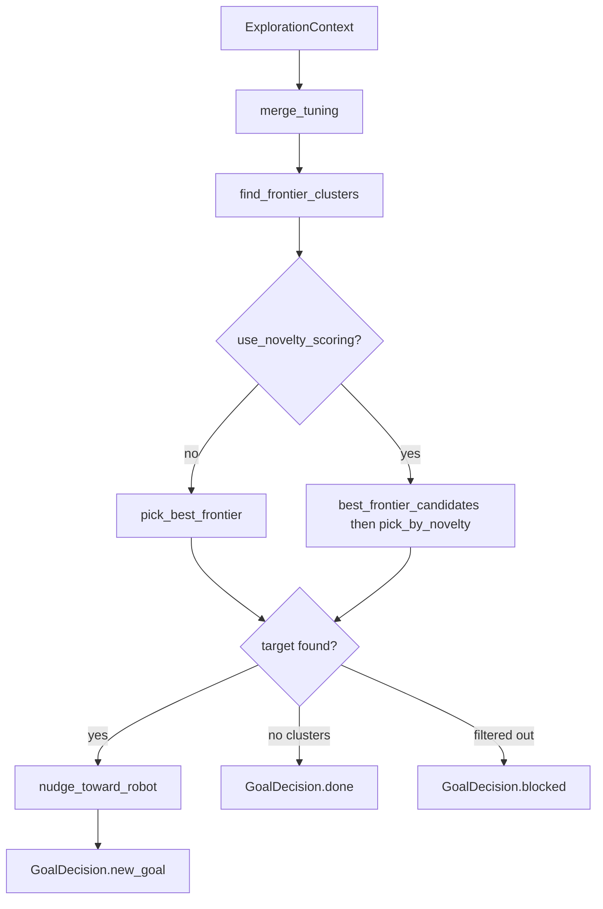

# The Frontier Algorithm

`frontier_algorithm.py` is the default exploration strategy for `dome_nav`. It
wraps the pure, ROS-free functions in `frontier_explorer.py` behind the
`ExplorationAlgorithm` protocol, and it owns all frontier-specific tuning and
state.

## What frontier exploration means here

A frontier is the boundary between known free space and unknown space in the
SLAM map. The robot drives to the frontier, observes what is beyond it, and the
map grows. Repeating this process covers the environment.

The algorithm is deliberately simple:

1. Find clusters of frontier cells.
2. Filter out clusters that are too small, too close, too far, or blacklisted.
3. Pick the best remaining cell, nudge it slightly toward the robot, and return
   it as the next goal.

## Separation of concerns

The module keeps three things distinct:

- **Frontier detection math** lives in `frontier_explorer.py` and has no ROS or
  algorithm state.
- **Frontier tuning** lives in `frontier_params.py` and is declared/read as ROS
  parameters.
- **Protocol adaptation** lives here: state, `next_goal`, and optional hooks.

This separation makes the math testable in isolation and keeps the algorithm
module focused on wiring.

## State owned by the algorithm

```python
class FrontierAlgorithm:
    def __init__(self, frontier_params: FrontierParams | None = None):
        self.latest_clusters: list[list[int]] = []
        self.latest_diag: dict | None = None
        self.latest_novelty: int | None = None
        self.frontier_params = frontier_params or FrontierParams()
```

- `latest_clusters` stores the most recent frontier cell clusters. It is used
  only by the optional visualization and diagnostics hooks, not by the protocol's
  `next_goal` method.
- `latest_diag` holds filter-stage counts when no frontier is chosen. It is
  merged into `no_frontier` telemetry via the `telemetry_extra` hook.
- `latest_novelty` holds the novelty score of the last chosen goal when path
  novelty scoring (F15) is on, else `None`. Surfaced through `telemetry_extra`.
- `frontier_params` is the algorithm's private tuning object.

These fields are no longer part of the `ExplorationAlgorithm` protocol. The node
never reads them directly.

## Parameter declaration

The algorithm declares its own ROS parameters so the node does not need to know
frontier parameter names:

```python
def declare_params(self, node):
    self.frontier_params = declare_frontier_params(node)
```

`declare_frontier_params` lives in `frontier_params.py` and registers each tuning
value in the node's namespace. Launch files and yaml configs can override them
with the same names as before, but the manager node has no hardcoded knowledge
of those names.

## The decision loop

```python
def next_goal(self, ctx: ExplorationContext) -> GoalDecision:
    tuning = merge_tuning(ctx.params, self.frontier_params)
    clusters = find_frontier_clusters(
        ctx.map_data, ctx.map_info, tuning.frontier_buffer_cells
    )
    self.latest_clusters = clusters
    target = self.select_target(clusters, ctx, tuning)
    if target is None:
        self.latest_diag = frontier_diag(...)
        if not clusters:
            return GoalDecision.done()
        return GoalDecision.blocked()
    self.latest_diag = None
    goal = nudge_toward_robot(target, ctx.robot_xy, tuning.goal_inset_m)
    return GoalDecision.new_goal(goal)
```

The logic encodes the three outcomes the manager understands:

- `NEW_GOAL`: a candidate survived all filters.
- `NO_TARGETS_BLOCKED`: clusters exist but none are usable this tick.
- `EXPLORED_DONE`: there are no frontier cells at all, so exploration is
  complete.

`nudge_toward_robot` pulls the goal slightly inward from the unknown edge. This
is frontier-specific goal shaping, so it belongs in the algorithm rather than
in the node.

## Selecting the target: distance, or distance-then-novelty

`next_goal` delegates the actual choice to `select_target`, which keeps the
default fast path untouched and adds the F15 novelty branch behind a flag:

```python
def select_target(self, clusters, ctx, tuning):
    if not tuning.use_novelty_scoring:
        self.latest_novelty = None
        return pick_best_frontier(
            clusters, ctx.map_info, ctx.robot_xy, tuning,
            blacklist=ctx.blacklist, start_xy=ctx.start_xy,
        )
    candidates = best_frontier_candidates(
        clusters, ctx.map_info, ctx.robot_xy, tuning,
        blacklist=ctx.blacklist, start_xy=ctx.start_xy,
        top_n=tuning.novelty_top_n,
    )
    target, score = pick_by_novelty(
        candidates, ctx.robot_xy, ctx.map_data, ctx.map_info
    )
    self.latest_novelty = score if target is not None else None
    return target
```

With scoring off, this is exactly the old `pick_best_frontier` call. With it on,
the algorithm asks for the top-`novelty_top_n` distance candidates and re-ranks
them by how much unknown space each straight-line path crosses (see
`frontier_explorer`). The chosen goal's score is stashed in `latest_novelty` for
telemetry. Because the branch only re-orders an already-filtered short-list, all
the filtering guarantees of the default path still hold.

## Optional hooks

The algorithm implements all the optional hooks so the node can render markers,
log exhaustion reports, and append diagnostics on failure:

```python
def render_markers(self, rc: RenderContext) -> MarkerArray:
    return build_explore_markers(...)

def exhaustion_report(self, rc: RenderContext) -> str:
    tuning = merge_tuning(rc.params, self.frontier_params)
    return format_frontier_exhaustion(...)

def failure_report(self, rc: RenderContext) -> str:
    return format_cluster_summary(self.latest_clusters, rc.map_info)

def telemetry_extra(self) -> dict:
    diag = self.latest_diag or {}
    extra = {"raw_clusters": len(self.latest_clusters), **diag}
    if self.latest_novelty is not None:
        extra["novelty_score"] = self.latest_novelty
    return extra

def session_params(self) -> dict:
    fp = self.frontier_params
    return {
        "min_frontier_dist": fp.min_frontier_dist,
        "max_frontier_dist": fp.max_frontier_dist,
        "goal_inset": fp.goal_inset_m,
        "min_frontier_size": fp.min_frontier_size,
    }
```

The node treats each return value as opaque. It does not know what a cluster is;
it only knows that the algorithm handed back a `MarkerArray`, a string, or a
 dictionary.

## Data flow



## Observations for improvement

- `render_markers` uses `self.frontier_params.min_frontier_size` directly instead
  of the merged `tuning`. That is usually fine, but it means a shared override of
  `min_frontier_size` would affect goal selection without affecting marker
  filtering. Using the merged value would be more consistent.
- `session_params` omits `frontier_buffer_cells` and `prefer_farthest`. Adding them
  would make telemetry more complete.
- `prefer_farthest` is deprecated but currently remapped silently. A visible
  deprecation warning would help users migrate to `preferred_goal_distance`.
