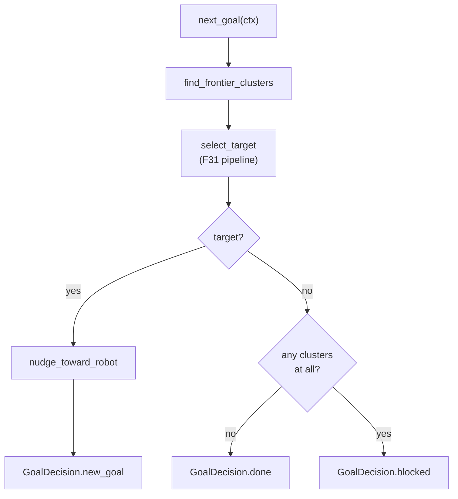

# The Frontier Algorithm — wrapping the pure core in a protocol

`frontier_algorithm.py` is the adapter that makes the pure functions of
`frontier_explorer.py` usable by the exploration node. It satisfies the
`ExplorationAlgorithm` protocol from `explore_context.py`: given an
`ExplorationContext`, return a `GoalDecision`. Everything the node knows about
"frontier exploration" it knows *only* through this one small class — the node
itself never mentions frontiers, clusters, or novelty.

This file also owns the frontier-specific tuning defined in `frontier_params.py`,
so we cover both here: the algorithm, and the parameter plumbing that feeds it.

## Two kinds of state, and who owns them

The class holds a `FrontierParams` (its tuning) and some *latest-tick* state used
only by the optional viz/diagnostic hooks — `latest_clusters`, `latest_diag`,
`latest_novelty`. None of that state is protocol surface; the node never touches
it directly. It exists so that `render_markers` and `telemetry_extra` can report
on the decision `next_goal` just made.

```python
class FrontierAlgorithm:
    def __init__(self, frontier_params: FrontierParams | None = None):
        self.latest_clusters: list[list[int]] = []
        self.latest_diag: dict | None = None
        self.latest_novelty: int | None = None
        self.frontier_params = frontier_params or FrontierParams()
```

## The one required method

`next_goal` is the whole contract. It merges the node's shared params with the
frontier tuning, detects clusters, picks a target, and translates the result into
the node's vocabulary of `GoalDecision`s:

```python
def next_goal(self, ctx: ExplorationContext) -> GoalDecision:
    tuning = merge_tuning(ctx.params, self.frontier_params)
    clusters = find_frontier_clusters(
        ctx.map_data, ctx.map_info, tuning.frontier_buffer_cells
    )
    self.latest_clusters = clusters
    target = self.select_target(clusters, ctx, tuning)
    if target is None:
        self.latest_diag = frontier_diag(
            clusters,
            ctx.map_info,
            ctx.robot_xy,
            tuning.min_frontier_size,
            tuning.min_frontier_dist,
            tuning.max_frontier_dist,
        )
        # No clusters -> done; clusters but all filtered -> blocked, not done.
        if not clusters:
            return GoalDecision.done()
        return GoalDecision.blocked()
    self.latest_diag = None
    goal = nudge_toward_robot(target, ctx.robot_xy, tuning.goal_inset_m)
    return GoalDecision.new_goal(goal)
```

The most important line is the distinction the node depends on:

- **No clusters at all** → `GoalDecision.done()`. The map genuinely has no
  frontiers left; the session is complete.
- **Clusters exist but none survived filtering** → `GoalDecision.blocked()`. This
  is transient — the map is still growing, the blacklist may clear — so the node
  debounces rather than declaring victory.

Collapsing these two into one "no goal" would rob the node of the ability to tell
"finished" from "temporarily stuck." This is exactly why `GoalOutcome` is an enum
and not a nullable coordinate.



`select_target` is a thin call into `pick_best_frontier`, plus one side effect:
it stashes the winning goal's raw novelty count for telemetry, so per-goal
algorithm state rides along with the goal itself.

```python
def select_target(
    self, clusters: list[list[int]], ctx: ExplorationContext,
    tuning: "FrontierTuning",
) -> tuple[float, float] | None:
    target = pick_best_frontier(
        clusters, ctx.map_info, ctx.robot_xy, tuning,
        blacklist=ctx.blacklist, start_xy=ctx.start_xy, data=ctx.map_data,
    )
    if tuning.use_novelty_scoring and target is not None:
        self.latest_novelty = path_novelty_score(
            ctx.robot_xy, target, ctx.map_data, ctx.map_info
        )
    else:
        self.latest_novelty = None
    return target
```

> **F15 migration note:** The old two-stage short-list-then-re-rank branch is
> gone. Novelty is now just another scorer registered by `build_registry`; the
> only special handling left above is the telemetry stash.

## The optional hooks

The remaining methods are the opaque hooks the node calls *if present* (via
`getattr`). Each delegates to a formatting or marker-building helper and returns
something the node treats as a black box:

```python
def render_markers(self, rc: RenderContext) -> MarkerArray:        # -> RViz
    return build_explore_markers(...)

def exhaustion_report(self, rc: RenderContext) -> str:             # why ended
    tuning = merge_tuning(rc.params, self.frontier_params)
    return format_frontier_exhaustion(...)

def failure_report(self, rc: RenderContext) -> str:                # cluster summary
    return format_cluster_summary(self.latest_clusters, rc.map_info)

def telemetry_extra(self) -> dict:                                 # merged into rows
    diag = self.latest_diag or {}
    extra = {"raw_clusters": len(self.latest_clusters), **diag}
    if self.latest_novelty is not None:
        extra["novelty_score"] = self.latest_novelty
    return extra

def session_params(self) -> dict:                                  # logged at start
    fp = self.frontier_params
    return {
        "min_frontier_dist": fp.min_frontier_dist,
        "max_frontier_dist": fp.max_frontier_dist,
        "goal_inset": fp.goal_inset_m,
        "min_frontier_size": fp.min_frontier_size,
        "use_novelty_scoring": fp.use_novelty_scoring,
        "novelty_top_n": fp.novelty_top_n,
    }
```

`telemetry_extra` is a good illustration of the pattern — it publishes the
algorithm's private latest-tick state as an opaque dict the node merges blindly.

## The parameter plumbing (`frontier_params.py`)

Frontier tuning is split into three pieces, and the split is deliberate:

- **`FrontierParams`** — the algorithm's own defaults, self-declared as ROS
  parameters. Keeping these names out of the node means the node has no idea what
  `min_frontier_size` or `w_novelty` are.
- **`FrontierTuning`** — the *merged, per-tick* view combining shared
  (`ExploreParams`) and frontier fields, which is what the pure functions and
  diagnostics actually consume.
- **`merge_tuning`** — the function that combines them, and enforces one
  invariant at the boundary.

That invariant is subtle and worth understanding. Blacklist coordinates are
stored *post-nudge* (the goal after `nudge_toward_robot` pulled it `goal_inset_m`
inward), but the blacklist filter runs against *raw* frontier cells that are
`goal_inset_m` farther out. If the blacklist radius were smaller than the inset,
an excluded cell's raw counterpart would sit outside the exclusion radius and get
reselected every single tick — an infinite loop. So:

```python
def merge_tuning(shared: ExploreParams, frontier: FrontierParams) -> FrontierTuning:
    if shared.blacklist_radius <= frontier.goal_inset_m:
        raise ValueError(
            f"blacklist_radius ({shared.blacklist_radius}) must exceed "
            f"goal_inset_m ({frontier.goal_inset_m}); exclusion is stored "
            "post-nudge but filtered against raw cells.")
    preferred = shared.preferred_goal_distance
    if frontier.prefer_farthest:
        has_max = frontier.max_frontier_dist > 0.0
        preferred = frontier.max_frontier_dist if has_max else 1000.0
    return FrontierTuning(...)
```

### The F31 scoring weights and clearance params

The scoring pipeline introduced in F31 adds a small family of weights and
clearance tuning. All scorer outputs are normalized to `[0, 1]` per cycle, so the
weights are directly comparable:

```python
@dataclass
class FrontierParams:
    # ... existing fields ...
    use_novelty_scoring: bool = False  # opt-in: adds the novelty scorer
    novelty_top_n: int = 5             # deprecated no-op
    w_distance: float = 1.0            # distance-to-preferred scorer weight
    w_novelty: float = 1.0             # novelty weight (only when use_novelty_scoring)
    w_clearance: float = 1.0           # clearance scorer weight; 0 disables clearance
    robot_radius: float = 0.17         # R_inscribed for the clearance floor
    clearance_margin_m: float = 0.05   # floor = robot_radius + this; keep small
```

- `w_distance` weights the existing `preferred_goal_distance` preference.
- `w_novelty` is active only when `use_novelty_scoring` is true; setting the
  weight to 0 is equivalent to leaving the feature off.
- `w_clearance` controls obstacle-clearance scoring. Setting it to 0 disables
  both the clearance bonus scorer and the clearance floor filter, avoiding the
  cost of computing `clearance_field` entirely.
- `robot_radius` and `clearance_margin_m` set the floor: a candidate is rejected
  if its clearance is less than `robot_radius + clearance_margin_m`. The margin
  is deliberately small so corridors remain selectable.

### Declaring the params

Declaring the params keeps every frontier name in one place,
`declare_frontier_params`, which the node calls once at startup via the
protocol's `declare_params` hook:

```python
def declare_frontier_params(node) -> FrontierParams:
    defaults = FrontierParams()
    node.declare_parameter("min_frontier_size", defaults.min_frontier_size)
    node.declare_parameter("min_frontier_dist", defaults.min_frontier_dist)
    node.declare_parameter("max_frontier_dist", defaults.max_frontier_dist)
    node.declare_parameter("goal_inset_m", defaults.goal_inset_m)
    node.declare_parameter("frontier_buffer_cells", defaults.frontier_buffer_cells)
    node.declare_parameter("prefer_farthest", defaults.prefer_farthest)
    node.declare_parameter("use_novelty_scoring", defaults.use_novelty_scoring)
    node.declare_parameter("novelty_top_n", defaults.novelty_top_n)
    node.declare_parameter("w_distance", defaults.w_distance)
    node.declare_parameter("w_novelty", defaults.w_novelty)
    node.declare_parameter("w_clearance", defaults.w_clearance)
    node.declare_parameter("robot_radius", defaults.robot_radius)
    node.declare_parameter("clearance_margin_m", defaults.clearance_margin_m)
    return FrontierParams(
        min_frontier_size=node.get_parameter("min_frontier_size").value,
        ...
    )
```

## Observations and possible improvements

- **Several params are deprecated but still declared.** `prefer_farthest` (mapped
  to a `preferred_goal_distance` sentinel inside `merge_tuning`) and
  `novelty_top_n` (a retired no-op) linger for backward compatibility. A cleanup
  pass could drop them, or at least route their declarations through a
  `_DEPRECATED` list so they are obviously legacy.
- **`merge_tuning` restates every field by hand.** The `FrontierParams` →
  `FrontierTuning` copy is fifteen lines of `field=frontier.field`. If the two
  dataclasses stay in lockstep, a `dataclasses.asdict` merge would remove the
  transcription risk.
- **`declare_frontier_params` lists each param name three times** (declare, get,
  construct). A table of `(name, default)` tuples driving all three would make
  adding a param a one-line change and eliminate the copy-paste.
- **`latest_novelty`/`latest_diag`/`latest_clusters` are mutable per-tick state**
  on a shared object. Fine single-threaded, but if the node ever ran ticks
  concurrently these would race; the state properly belongs to the decision, not
  the algorithm instance.
