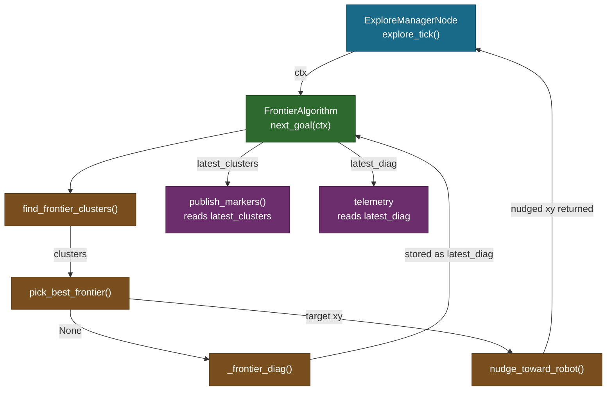

# FrontierAlgorithm — The ExplorationAlgorithm Protocol Adapter

## Overview

`frontier_algorithm.py` is a thin adapter class. Its job is to connect the
exploration loop in `ExploreManagerNode` to the pure-Python frontier functions
in `frontier_explorer.py`, while also acting as a memory cell that holds the
most recent frontier state for inspection by the RViz marker publisher and the
telemetry system.

The module contains exactly one class and zero standalone functions. The class
owns no map data, no ROS publishers, and no timer. It only orchestrates calls
and stores the results.

## Why a Separate Class?

The pure functions in `frontier_explorer.py` are stateless — given the same
inputs they produce the same outputs, which makes them easy to unit-test. But
the exploration node needs to interrogate the last frontier scan _after_ the
function returns: the marker publisher reads `latest_clusters` to draw frontier
points in RViz2, and the telemetry writer reads `latest_diag` to explain why no
goal was found.

One option was to store these values directly on `ExploreManagerNode`. That
would couple the node's attribute namespace to the internals of the exploration
algorithm and make swapping algorithms harder. A second option was to return
them as additional return values from `next_goal`. That would burden every
future algorithm with fields it does not care about.

The chosen design keeps inspector state inside the algorithm object. The node
reads `self.algorithm.latest_clusters` and `self.algorithm.latest_diag` by
convention — no formal accessor needed.

## The ExplorationAlgorithm Protocol (F12)

`FrontierAlgorithm` participates in a structural subtyping protocol defined for
feature F12. The protocol requires one method:

```python
def next_goal(self, ctx: ExplorationContext) -> tuple[float, float] | None:
    ...
```

There is no base class and no `ABC` registration. Python's `Protocol` mechanism
uses duck typing: any object that has a `next_goal` method with this signature
satisfies the protocol. This keeps the contract lightweight — a research
prototype or a mocked test double does not need to import any dome_nav symbol to
comply.

The implication is that the class header carries no inheritance:

```python
class FrontierAlgorithm:
    # Default exploration algorithm. Wraps the pure functions in
    # frontier_explorer.py behind the ExplorationAlgorithm protocol.
```

The comment is the only documentation of intent at the class level.

## Instance State

The constructor initializes two inspector attributes:

```python
def __init__(self):
    self.latest_clusters: list[list[int]] = []
    self.latest_diag: dict | None = None
```

`latest_clusters` is a list of clusters, where each cluster is itself a list of
flat cell indices into the OccupancyGrid data array. The outer list is always
present — it may be empty if the map has no frontier cells at all, but it is
never `None`. Callers can safely iterate it without a guard.

`latest_diag` is either `None` (a frontier was found) or a diagnostic dict
explaining why `pick_best_frontier` returned nothing. The two values are
mutually exclusive: when a goal is returned the diag is cleared, when no goal
is returned the diag is populated. This lets callers test `latest_diag is not
None` as a fast check for the "no frontier" condition.

The `None` initial value for `latest_diag` is correct: before the first call to
`next_goal` there is no failure to explain.

## The next_goal Method

The single public method does three things in sequence: scan the map, try to
pick a goal, and return the (possibly nudged) goal coordinate.

### Step 1 — Cluster Detection

```python
clusters = find_frontier_clusters(ctx.map_data, ctx.map_info)
self.latest_clusters = clusters
```

`find_frontier_clusters` does a full scan of the OccupancyGrid and returns
clusters immediately. The result is stored in `latest_clusters` before
`pick_best_frontier` is called. This is deliberate: even when no valid goal
exists, the marker publisher should still be able to display all raw frontier
clusters so the operator can see _what_ was found and _why_ it was rejected.
Storing clusters only on success would black out the RViz2 frontier layer on
every failed tick.

### Step 2 — Goal Selection

```python
target = pick_best_frontier(
    clusters,
    ctx.map_info,
    ctx.robot_xy,
    min_size=ctx.params.min_frontier_size,
    blacklist=ctx.blacklist,
    blacklist_radius=ctx.params.blacklist_radius,
    max_radius=ctx.params.max_explore_radius,
    start_xy=ctx.start_xy,
    min_dist=ctx.params.min_frontier_dist,
    max_dist=ctx.params.max_frontier_dist,
    prefer_farthest=ctx.params.prefer_farthest,
)
```

`max_dist` was added for the Gazebo sim work (see `06-frontier_explorer.md`): it
caps exploration hops to a maximum distance from the robot, in addition to the
existing `min_dist` floor. `prefer_farthest` (added 2026-07-04) is a further
refinement of the same idea: once a cell passes every filter, it decides
whether the *nearest* or *farthest* surviving candidate wins. Both are the
same forwarding pattern as every other filter — `FrontierAlgorithm` does not
interpret the value, just passes it through.

All filtering parameters are forwarded from `ctx.params` and `ctx.blacklist`
rather than stored on the algorithm object. This keeps `FrontierAlgorithm`
stateless with respect to policy — the node controls the parameters, the
algorithm just applies them. A caller that wants to experiment with a smaller
`min_frontier_size` can change the param without touching this class.

`pick_best_frontier` returns the world coordinates of the nearest
non-blacklisted frontier cell that passes all filters (or the farthest, if
`prefer_farthest` is set), or `None` if no such cell exists.

### Step 3 — Diag or Nudge

```python
if target is None:
    self.latest_diag = _frontier_diag(
        clusters,
        ctx.map_info,
        ctx.robot_xy,
        ctx.params.min_frontier_size,
        ctx.params.min_frontier_dist,
        ctx.params.max_frontier_dist,
    )
    return None
self.latest_diag = None
return nudge_toward_robot(target, ctx.robot_xy, ctx.params.goal_inset_m)
```

Two branches:

- **No target.** `_frontier_diag` is called to produce an explanation dict.
  This dict is stored as `latest_diag` and later written into the telemetry
  event stream by `ExploreManagerNode`. Calling `_frontier_diag` only on failure
  avoids a redundant second pass over the clusters on every successful tick.

- **Target found.** `latest_diag` is set to `None` (clearing any stale failure
  from the previous tick) and `nudge_toward_robot` shifts the goal 0.3 m toward
  the robot. The nudge prevents the Nav2 goal from landing on or past the
  costmap boundary, which causes a `worldToMap` out-of-bounds planner error.
  The nudged coordinate, not the raw frontier cell, is what `ExploreManagerNode`
  sends to the Nav2 action server.

## Data Flow and Inspection

The diagram below shows how `FrontierAlgorithm` sits between the node and the
pure-function layer, and how its inspector attributes are consumed after each
call:



The arrow from `A` to `M` and `T` represents attribute reads, not method calls.
The node reads `self.algorithm.latest_clusters` and `self.algorithm.latest_diag`
directly after `next_goal` returns.

## Non-Obvious Choices

**`_frontier_diag` is only called on failure.** Generating the diagnostic dict
requires a second pass over every cluster, counting rejections at each filter
stage. On a successful tick this would be wasted work. By deferring it to the
failure branch the common path (frontier found, goal sent) stays to three
function calls.

**`latest_clusters` is set before `pick_best_frontier`.** If it were set only
on success, a tick that found no valid target would leave the marker publisher
reading stale clusters from the previous tick. The operator would see frontier
markers that no longer match the current map. By storing immediately after
detection, the markers always reflect the current scan regardless of whether a
goal was produced.

**All parameters forwarded by name.** The `pick_best_frontier` call uses
keyword arguments even though positional would also work. This is defensive
readability: `frontier_explorer.py` has a long parameter list and its order
could change as the algorithm evolves. Named arguments make mismatches a
loud error rather than a silent behavior difference.

**`_frontier_diag` is imported directly.** The leading underscore marks the
function as internal to `frontier_explorer.py`. Importing it across module
boundaries is a mild encapsulation breach, but the alternative — re-exposing it
through a public wrapper — would obscure its diagnostic-only purpose. The import
is kept explicit to signal that this is a deliberate coupling for a specific use
case.

## Observations

- `FrontierAlgorithm` has no parameters of its own. If a future algorithm needs
  tuning knobs (weights, learning rate, etc.) the constructor would need to
  accept them. The current design does not anticipate this, so adding params
  would require a small API change.

- The protocol method is named `next_goal`, which implies "give me the next
  place to go". A richer protocol might include a `reset()` method called on
  `exploration_start`, allowing algorithms to clear internal state without being
  recreated. Currently the node recreates the algorithm object on each start,
  which works but loses any accumulated per-session state an advanced algorithm
  might want to keep.

- `latest_diag` stores only the most recent failure. If the node runs several
  failed ticks in a row, only the last diagnostic is visible. For multi-tick
  no-frontier situations, a short ring buffer would give the operator more
  context about whether the condition is stable or oscillating.

- The class is tested in isolation in `test_frontier_algorithm.py` (13 tests as
  of 2026-07-04) — because it has no ROS imports and accepts a plain
  `ExplorationContext` dataclass, tests inject a synthetic context with a small
  map array and verify `latest_clusters`, `latest_diag`, and the returned goal
  (including the `prefer_farthest` plumbing) without a running ROS graph.
