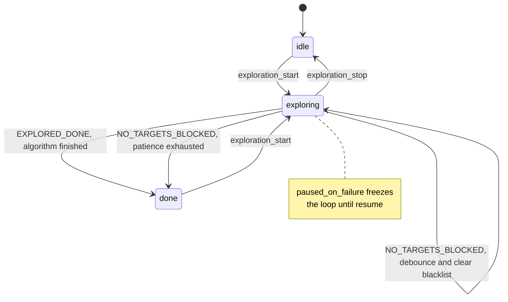
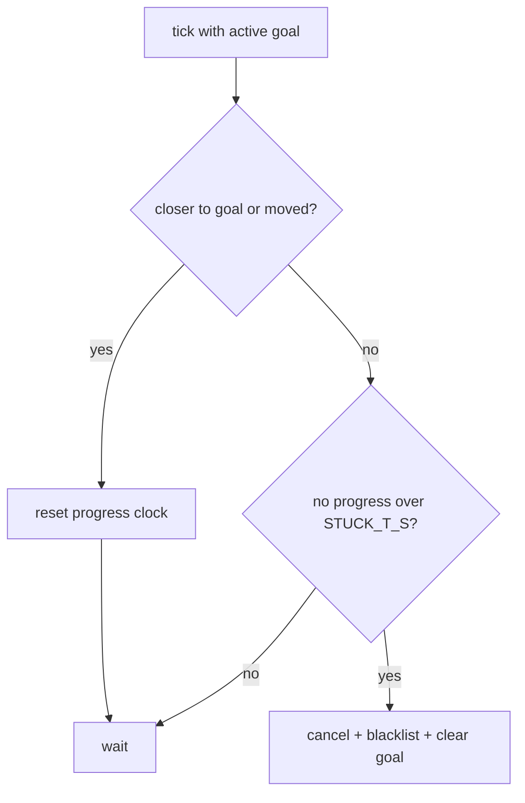
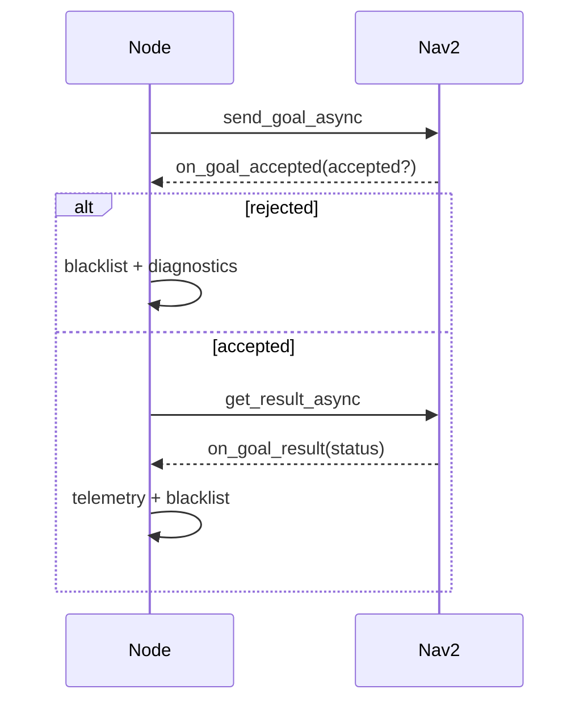

# The Explorer Manager

`explorer_manager_node.py` is the ROS node that turns "go explore the
building" into a stream of concrete navigation goals. It watches a growing
SLAM map, repeatedly asks a pluggable *algorithm* "where should I go next?",
hands each answer to Nav2 as a `NavigateToPose` goal, and watches how that goal
plays out — reached, aborted, timed out, or wedged with no progress. When the
algorithm reports there is nothing left worth visiting, the node declares
exploration done.

The design's organizing idea is a clean seam: **the node owns everything about
ROS, Nav2, and the exploration *session*; the algorithm owns only where to go,
when it is finished, its own tuning, and its own visualization.** The node is
deliberately reusable across different exploration strategies (frontier
detection today; random-walk or scan-based tomorrow) by injecting a different
algorithm object. This document explains how the node is built around that seam.
An earlier version of the code leaked frontier concepts across the seam; the F23
work (T01–T03) closed those leaks, and this document describes the result.

## The exploration loop as a state machine

At heart the node is a 1 Hz timer (`EXPLORE_HZ = 1.0`) driving a small state
machine. The states are strings: `idle`, `exploring`, `done`. Transitions are
triggered by JSON *intents* arriving on `/intent` (`exploration_start`,
`exploration_stop`, `exploration_resume`) and by the outcome of navigation —
including a typed decision the algorithm returns each time it is asked for a
goal.



The whole loop lives in `explore_tick`. It is written defensively: every tick
first publishes status and markers (so RViz and the UI stay live even when
idle), then returns early unless the node is actively exploring and not paused.

```python
def explore_tick(self):
    self.publish_status(self.state)
    self.publish_markers()
    if self.state != "exploring":
        return
    if self.paused_on_failure:
        return
    if self.start_xy is None:
        self.start_xy = self.robot_xy_in_map()
    if self.has_active_goal:
        self.check_stuck()
        if self.has_active_goal:
            self.check_goal_timeout()
        return
    self.latest_map = self.fetch_grid("/map")
    self.latest_global_costmap = self.fetch_grid("/global_costmap/costmap")
    self.find_and_send_frontier()
```

The critical branch is `if self.has_active_goal`. The node only reconsiders
*where to go* when it has no goal in flight. While a goal is active it does
nothing but police that goal — checking for a wedged robot (`check_stuck`) and
for a hard timeout (`check_goal_timeout`). Only once the goal finishes does the
tick fall through to fetch fresh grids and pick a new frontier. This keeps the
algorithm from thrashing: one goal is pursued to a definite conclusion before
the next is chosen.

## The pluggable seam

The node never imports frontier logic into its decision path. Instead it
constructs an `ExplorationContext` — a plain data bundle — and calls
`self.algorithm.next_goal(ctx)`. The algorithm is injected at construction and
defaults to `FrontierAlgorithm`, the only place the node names a concrete
strategy:

```python
def __init__(self, algorithm: ExplorationAlgorithm | None = None):
    ...
    self.algorithm = algorithm or FrontierAlgorithm()
    # The algorithm declares and reads its own ROS params in this node's
    # namespace (frontier tuning for FrontierAlgorithm; a no-op otherwise).
    self.algorithm.declare_params(self)
```

The context carries exactly what a decision needs and nothing about ROS: the
occupancy grid as a flat `list[int]`, its `MapInfo` geometry, the robot's
`(x, y)` in the map frame, the current blacklist, the exploration start point,
and the shared tuning `ExploreParams`. Because the input is pure Python data, an
algorithm is testable with no robot, no `rclpy`, no Nav2 — the payoff of the
seam.

### An intent-carrying result

The key to a clean seam is what `next_goal` *returns*. It does not return a bare
`(x, y)` or `None`; it returns a `GoalDecision` that names the outcome, so the
node never has to guess what "no goal" means:

- `NEW_GOAL(xy)` — go here.
- `NO_TARGETS_BLOCKED` — targets exist but none are usable this tick.
- `EXPLORED_DONE` — the algorithm is finished; end the session.

```mermaid
flowchart LR
    subgraph Node["ExplorerManagerNode (ROS + session)"]
        tick["explore_tick"] --> ctx["build ExplorationContext"]
        ctx --> call["algorithm.next_goal(ctx)"]
        call --> branch{"GoalDecision"}
        branch -->|"NEW_GOAL (xy)"| send["send_nav_goal to Nav2"]
        branch -->|"NO_TARGETS_BLOCKED"| debounce["patience / blacklist policy"]
        branch -->|"EXPLORED_DONE"| fin["stop_exploring(done)"]
    end
    subgraph Algo["ExplorationAlgorithm (decision only)"]
        call -.-> decide["return GoalDecision"]
    end
    decide -.-> call
```

The payoff is that **the done-condition belongs to the algorithm, not the node.**
"When am I finished exploring?" is strategy-specific — a frontier algorithm is
done when no frontier cells remain; a coverage algorithm is done when its lawn is
mowed. The node keeps only the *mechanical* session policy that is genuinely
strategy-agnostic: debouncing a transient block, clearing the blacklist, timing
out a goal, detecting a wedged robot.

## Choosing a goal, and rejecting infeasible ones

`find_and_send_frontier` is where the node consults the algorithm. It does not
blindly trust the first answer. A goal is chosen against the *SLAM map*, which
can extend past the *global costmap* Nav2 plans in; a goal outside the costmap
would be rejected by the planner with a `worldToMap` failure. So the node loops,
asking for the next-best goal and locally excluding any `NEW_GOAL` that falls
outside the costmap, up to `MAX_GOAL_ATTEMPTS`:

```python
rejected: set[XY] = set()
goal_xy = None
decision = None
for _ in range(self.MAX_GOAL_ATTEMPTS):
    ctx = ExplorationContext(
        map_data=map_data, map_info=info, robot_xy=robot_xy,
        blacklist=self.blacklist | rejected,
        start_xy=self.start_xy, params=self.params,
    )
    decision = self.algorithm.next_goal(ctx)
    if decision.outcome is not GoalOutcome.NEW_GOAL:
        break
    candidate = decision.xy
    if self.goal_in_global_costmap(candidate):
        goal_xy = candidate
        break
    rejected.add(candidate)
```

Note the trick: rejected candidates are folded into the blacklist passed *back*
into the next `ExplorationContext` (`self.blacklist | rejected`), so the
algorithm naturally returns a *different* goal each iteration. The `rejected`
set is local to this tick — next tick starts fresh, in case the costmap has
grown to include a previously-out-of-bounds frontier.

The loop exits three ways, and the tail of the method branches on which:

```python
if goal_xy is not None:
    self.no_frontier_count = 0
    self.send_nav_goal(goal_xy)
    return
if decision is not None and decision.outcome is GoalOutcome.EXPLORED_DONE:
    self.dump_frontier_exhaustion(robot_xy)
    self.stop_exploring("done")
    return
self.handle_no_frontier(robot_xy)
```

A usable `NEW_GOAL` is sent and the patience counter resets. `EXPLORED_DONE`
ends the session immediately — no waiting. Everything else (a `NO_TARGETS_BLOCKED`
decision, or a run of `NEW_GOAL`s that all mapped outside the costmap) is treated
as a *transient* block and handed to the debounce path.

## Blacklist: the session's memory of failure

The blacklist is a `set[XY]` of world points the node has learned to avoid. It is
owned and mutated exclusively by the node — the algorithm only ever *reads* it
through the context. The node adds a point whenever a goal ends badly: rejected
at acceptance (`on_goal_accepted`), aborted or failed (`on_goal_result`), timed
out (`check_goal_timeout`), or abandoned for lack of progress (`check_stuck`).
Because `ExploreParams.blacklist_radius` suppresses a whole *neighborhood* around
each blacklisted point downstream in the algorithm, one failure poisons a region,
not just an exact coordinate.

This split — failure memory in the node, pure decision in the algorithm — is one
of the cleaner boundaries in the design.

## Two ways to give up on a goal

A wedged robot is the recurring hazard (see the start-in-inflation deadlock in
`experiments.md`). The node guards against it with two independent timers while a
goal is active. Both are *navigation* concerns — they react to how motion is
going, not to what the exploration strategy is — so they correctly live in the
node.

The blunt one is `check_goal_timeout`: cancel any goal older than
`GOAL_TIMEOUT_S = 25s`, to break Nav2's internal behavior-tree recovery loops.

The sharper one is `check_stuck`, which abandons a goal after only
`STUCK_T_S = 7s` of *no progress* — roughly 4x faster. "Progress" is defined
generously so that legitimate slow motion and final in-place rotation are not
mistaken for wedging:

```python
if (self.best_dist_to_goal is None
        or d < self.best_dist_to_goal - self.STUCK_PROGRESS_EPS
        or moved > self.STUCK_MOVE_EPS):
    self.best_dist_to_goal = d if self.best_dist_to_goal is None \
        else min(self.best_dist_to_goal, d)
    self.last_progress_xy = robot_xy
    self.last_progress_time = time.monotonic()
    return
```

A tick counts as progress if the robot got meaningfully closer to the goal
(`d` dropped by `STUCK_PROGRESS_EPS = 0.10 m`) *or* simply moved at all
(`moved > STUCK_MOVE_EPS = 0.05 m`). Either resets the no-progress clock. Only
when neither has happened for `STUCK_T_S` does the node cancel, blacklist, and
clear the goal so a fresh frontier is chosen next tick.



The two-timer arrangement is layered on purpose: `check_stuck` catches the common
wedge fast, while `GOAL_TIMEOUT_S` remains a hard cap for the slow-but-not-stuck
edge case.

## The asynchronous goal lifecycle

Nav2's action interface is asynchronous, so a single goal fans out across three
callbacks chained by futures:



`send_nav_goal` builds the `PoseStamped`, seeds the no-progress trackers, writes
a `goal_sent` telemetry record, and attaches `on_goal_accepted`. Acceptance
either blacklists a rejected goal or wires up `on_goal_result`, which records the
final status, dumps failure diagnostics on an `ABORTED` (capturing Nav2's
`error_code` / `error_msg`), and — win or lose — blacklists the point so the same
target is not re-chosen.

## Knowing when exploration is finished

There are two distinct ways the session ends, and the node now keeps them cleanly
apart because the algorithm labels each one.

The first is `EXPLORED_DONE`, handled inline in `find_and_send_frontier` (above):
the algorithm says it is finished, and the node stops at once. The node makes no
judgement of its own about completeness — it trusts the label.

The second is `NO_TARGETS_BLOCKED`, routed to `handle_no_frontier`, which is a
pure *debounce* mechanism. A single blocked tick means little (the map is still
filling in), so the node counts consecutive blocked ticks and acts only when the
count reaches `NO_FRONTIER_PATIENCE = 14` — a threshold chosen to exceed SLAM's
5-second `map_update_interval` so the map has had a chance to grow:

```python
if self.no_frontier_count >= self.NO_FRONTIER_PATIENCE:
    # We only reach here for a *block* (targets exist but none usable) —
    # the algorithm owns "fully explored" via EXPLORED_DONE.
    if not self.blacklist_cleared_once:
        self.blacklist.clear()
        self.blacklist_cleared_once = True
        self.no_frontier_count = 0
        return
    self.get_logger().info("Frontier patience exhausted — exploration done.")
```

The policy: when patience runs out on a persistent block, clear the blacklist
*once* (stale entries may have become reachable as the map grew) and try again;
give up only if a clear already didn't help. Crucially, the node no longer peeks
at any algorithm-internal state to make this call — the old version inspected
`self.algorithm.latest_clusters`, a frontier-specific attribute, to distinguish
"done" from "blocked." That distinction now arrives as the decision's outcome, so
the debounce path is entirely strategy-agnostic.

## Visualization and diagnostics as opaque hooks

Markers and diagnostics were the other place frontier concepts used to leak. A
strategy-agnostic node cannot know how to *draw* frontier clusters — that is
frontier knowledge. The resolution is that the `ExplorationAlgorithm` protocol
requires only `next_goal` (and a `declare_params` hook); everything visual or
diagnostic is an **optional** method the node calls via `getattr` and treats as
opaque. An algorithm implements any subset:

- `render_markers(rc) -> MarkerArray | None` — the node publishes it verbatim.
- `exhaustion_report(rc) -> str | None` and `failure_report(rc) -> str | None` —
  logged blindly.
- `telemetry_extra() -> dict` and `session_params() -> dict` — merged into
  telemetry blindly.

The node hands each hook a `RenderContext` carrying only node-general session
state (timestamp, `is_exploring`, map info, robot pose, blacklist, current goal,
shared params) — no frontier concepts. Publishing markers, for instance, is
reduced to: if the algorithm offers a renderer, publish whatever it returns.

```python
def publish_markers(self):
    render = getattr(self.algorithm, "render_markers", None)
    if render is None:
        return
    markers = render(self.render_context())
    if markers is not None:
        self.marker_pub.publish(markers)
```

`FrontierAlgorithm` implements all of these and keeps its own `latest_clusters` /
`latest_diag` state privately, for its own rendering. A minimal "hello world"
plugin implements none of them and holds no faked state — it is just `next_goal`
plus a no-op `declare_params`.

## Parameters: shared vs. algorithm-owned

The node declares only the small set of *session* parameters that mean something
to any strategy — `max_explore_radius`, `preferred_goal_distance`,
`blacklist_radius` — and packs them into `ExploreParams`. Frontier-specific
tuning (`min_frontier_size`, `min/max_frontier_dist`, `frontier_buffer_cells`,
`goal_inset_m`) lives in `FrontierParams`, which the algorithm declares in the
node's namespace through the `declare_params` hook:

```python
self.declare_parameter("max_explore_radius", 0.0)
self.declare_parameter("preferred_goal_distance", 1.0)
...
self.algorithm = algorithm or FrontierAlgorithm()
self.algorithm.declare_params(self)   # frontier params, or a no-op
```

The ROS parameter *names* are unchanged, so existing YAML and launch overrides
still work — but no frontier parameter name appears anywhere in the node. A
plugin that needs only the shared params declares nothing extra and runs clean.

## The CPU discipline: nothing runs while idle

A quiet but important theme is that the node refuses to burn CPU when it is not
exploring — a hard-won lesson on the Raspberry Pi (see the CPU campaign in
`experiments.md`). Two expensive data sources are held *lazily*:

- **Grids** (`/map`, both costmaps) are never standing subscriptions. rclpy
  deserializes every message before the callback runs, so subscribing to large
  latched grids burned 10–20% CPU even when idle. Instead `fetch_grid` uses
  `wait_for_message` with a QoS matched to the latched publishers, pulling the
  last grid on demand only when a frontier is about to be chosen.
- **TF** is subscribed only between `start_tf` and `stop_tf`. The `/tf` stream
  runs ~40 Hz and the Python `TransformListener` deserializes all of it (~8% CPU)
  for a pose the node needs at 1 Hz. `stop_tf` explicitly destroys the
  subscriptions the listener registered, so an idle node deserializes no TF at
  all.

The guiding rule discovered here: an *active* ROS subscription always pays full
deserialization cost — there is no "throttle by time" QoS — so the only way to
not pay is to not subscribe.

## Observations and further improvements

The seam is now clean: the protocol requires only `next_goal`, the algorithm owns
its done-condition, tuning, and visualization, and the node reaches into no
algorithm internals. A few smaller rough edges remain.

- **Naming is not parallel, and still carries "frontier."** The node mixes
  `Explore*` (`ExploreParams`, `ExplorerManagerNode`, `explore_tick`) with
  `Exploration*` (`ExplorationContext`, `ExplorationAlgorithm`), and several
  general concepts keep frontier-flavored names: `NO_FRONTIER_PATIENCE`,
  `no_frontier_count`, the `no_frontier` telemetry key, and
  `find_and_send_frontier` are really *no-target* / *pick-a-goal* concepts.
  Renaming them (an Explore-vs-Exploration chore) would finish the decoupling in
  spirit as well as in structure.
- **The rejected-goal loop reuses the blacklist channel.** Folding this tick's
  `rejected` set into `ctx.blacklist` conflates "permanently failed" with
  "infeasible right now." It works, but a dedicated exclusion field would express
  intent more honestly.
- **`goal_in_global_costmap` returns `True` when no costmap is known yet.** A
  reasonable startup convenience, but it means the very first goals bypass the
  feasibility check entirely.
- **The status/telemetry surface is broad.** `publish_status` and the many
  `telemetry.write` calls are valuable for field debugging, but they are also a
  large share of the node's line count; extracting a small status-builder helper
  would thin the node toward its actual control logic.
