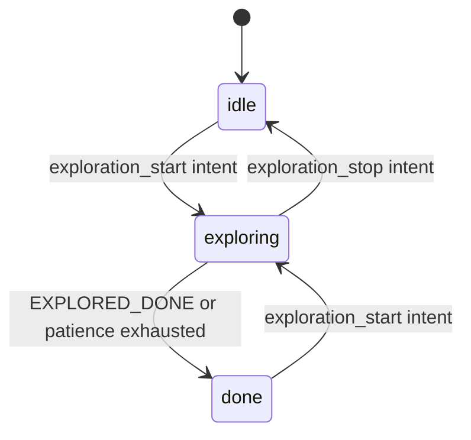

# The Explorer Manager Node

`explorer_manager_node.py` is the ROS2 node that hosts an exploration algorithm
and turns its decisions into robot motion. It is deliberately agnostic about
*how* the algorithm chooses goals; it only cares about the lifecycle of an
exploration session.

## Responsibilities

The node owns everything that is generic to an exploration session:

- Subscribing to `/intent` to start, stop, and resume exploration.
- Fetching the latest map and costmap on demand.
- Calling the injected algorithm's `next_goal`.
- Sending goals to Nav2's `NavigateToPose` action server.
- Detecting stuck robots and timing out unreachable goals.
- Maintaining a blacklist of failed goals.
- Publishing `/explore/status` and `/explore/markers`.
- Writing telemetry.

What it does *not* own is any frontier-specific logic. That lives in the
algorithm plugin.

## Lazy resource lifecycle

One of the node's most important design choices is that expensive subscriptions
are created and destroyed on demand rather than held for the lifetime of the
node.

```python
# TF listener: created in exploration_start, destroyed in stop_exploring.
self.tf_buffer: tf2_ros.Buffer | None = None
self.tf_listener: tf2_ros.TransformListener | None = None
```

The same pattern applies to map and costmap fetching. Instead of standing
subscriptions, the node uses `wait_for_message` each tick it needs a grid:

```python
def fetch_grid(self, topic: str) -> OccupancyGrid | None:
    ok, msg = wait_for_message(
        OccupancyGrid, self, topic,
        qos_profile=self.map_qos, time_to_wait=1.0,
    )
    return msg if ok else None
```

This keeps CPU usage low when the node is idle, which matters on the Raspberry
Pi that runs the physical robot.

## The exploration tick

The node runs a 1 Hz timer. Each tick it:

1. Publishes status and markers.
2. If not exploring, returns early.
3. If a goal is active, checks for stuck/timeout conditions.
4. Otherwise, fetches the latest map and costmap and asks the algorithm for a
   new goal.

```python
def explore_tick(self):
    self.publish_status(self.state)
    self.publish_markers()
    if self.state != "exploring":
        return
    if self.has_active_goal:
        self.check_stuck()
        if self.has_active_goal:
            self.check_goal_timeout()
        return
    self.latest_map = self.fetch_grid("/map")
    self.latest_global_costmap = self.fetch_grid("/global_costmap/costmap")
    self.find_and_send_goal()
```

The slow tick rate is intentional. Exploration is a high-level decision: the
robot needs a new direction only after it has reached or abandoned the current
one. The low-level obstacle avoidance and path tracking are handled by Nav2 at a
much higher rate.

## Goal selection and the costmap guard

When the algorithm returns a `NEW_GOAL`, the node verifies that the goal maps
inside the global costmap before sending it to Nav2. The SLAM `/map` can extend
beyond the planner's costmap, and goals outside the costmap cause Nav2's
`worldToMap` to fail with `PLAN/NO_VALID_PATH`.

```python
for _ in range(self.MAX_GOAL_ATTEMPTS):
    decision = self.algorithm.next_goal(ctx)
    if decision.outcome is not GoalOutcome.NEW_GOAL:
        break
    candidate = decision.xy
    if self.goal_in_global_costmap(candidate):
        goal_xy = candidate
        break
    rejected.add(candidate)
```

If a candidate is outside the costmap, it is added to a local `rejected` set and
the algorithm is asked again. This rejection is not persisted to the blacklist;
the costmap may grow and make the same candidate feasible later.

## Handling no usable goal

When the algorithm returns `NO_TARGETS_BLOCKED` or `EXPLORED_DONE`, the node
takes different actions:

- `EXPLORED_DONE`: end the session immediately.
- `NO_TARGETS_BLOCKED`: increment a patience counter. After enough consecutive
  blocked ticks, clear the blacklist once and retry; if still blocked, declare
  the session done.

This patience logic is a node-level safety net, not an algorithm decision. The
algorithm only reports whether targets exist and are usable.

## Stuck and timeout detection

The node monitors active Nav2 goals with two independent timers:

- **Stuck detection**: if the robot makes no meaningful progress for
  `STUCK_T_S`, cancel the goal and blacklist it.
- **Goal timeout**: if the goal has been active for `GOAL_TIMEOUT_S`, cancel and
  blacklist.

Both are navigation/session concerns, so they correctly live in the manager
rather than in the algorithm.

## Opaque algorithm hooks

The node calls optional algorithm hooks via `getattr` and treats the results as
opaque:

```python
def publish_markers(self):
    render = getattr(self.algorithm, "render_markers", None)
    if render is None:
        return
    markers = render(self.render_context())
    if markers is not None:
        self.marker_pub.publish(markers)
```

This keeps the node free of frontier knowledge. A plugin with nothing to render
simply omits the method.

## Session state machine



## Observations for improvement

- The optional hooks are called by magic string names. Adding them to a typed
  Protocol or a mixin would give plugin authors better tooling.
- `on_goal_result` clears active-goal state unconditionally. A stale result
  callback from a canceled goal could wipe the state of the next active goal.
  Guarding by goal serial or `current_goal_xy` would remove that race.
- `blacklist_radius` is part of `ExploreParams` but is not declared as a ROS
  parameter, so it cannot be tuned from launch/yaml.
- `wait_for_message` blocks the executor for up to 1 s. On latched topics this is
  normally fast, but a slow costmap publisher could stall the 1 Hz tick.
