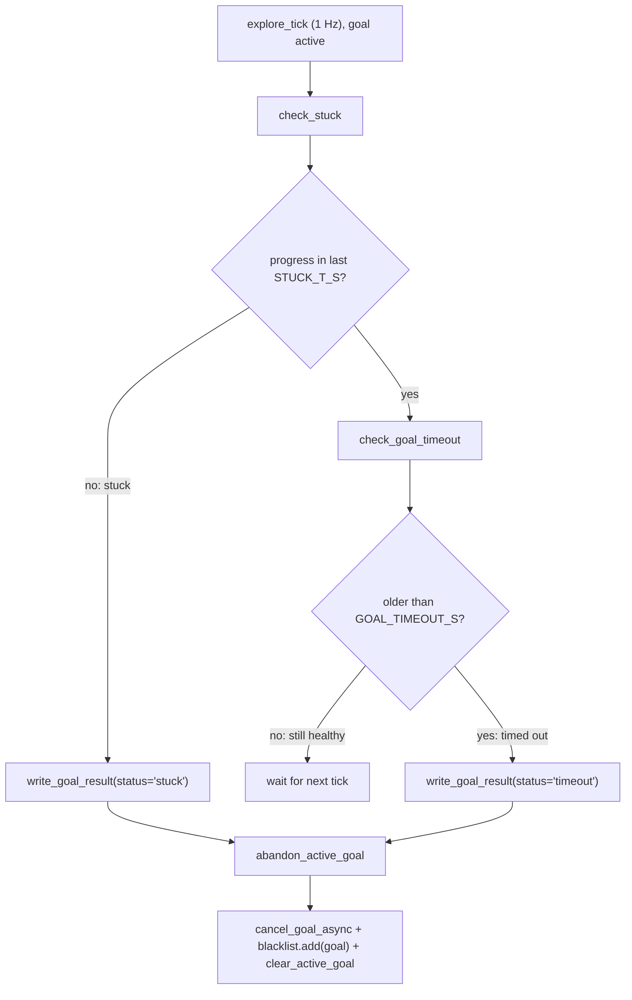
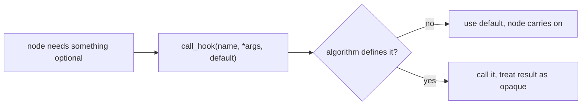
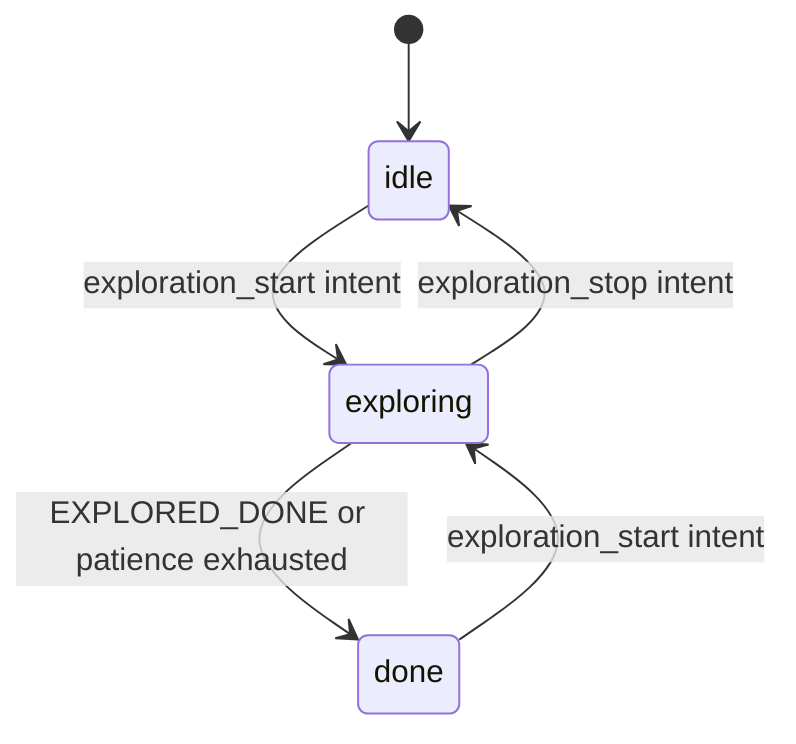

# The Explorer Manager Node

`explorer_manager_node.py` is the ROS2 node that hosts an exploration algorithm
and turns its decisions into robot motion. It is deliberately agnostic about
*how* the algorithm chooses goals; it only cares about the lifecycle of an
exploration session.

## Responsibilities

The node owns everything that is generic to an exploration session:

- Subscribing to `/intent` to start, stop, and resume exploration.
- Fetching the latest map and costmap on demand.
- Calling the injected algorithm's `next_goal`.
- Sending goals to Nav2's `NavigateToPose` action server.
- Detecting stuck robots and timing out unreachable goals.
- Maintaining a blacklist of failed goals.
- Publishing `/explore/status` and `/explore/markers`.
- Writing telemetry.

What it does *not* own is any frontier-specific logic. That lives in the
algorithm plugin.

## Lazy resource lifecycle

One of the node's most important design choices is that expensive subscriptions
are created and destroyed on demand rather than held for the lifetime of the
node.

```python
# TF listener: created in exploration_start, destroyed in stop_exploring.
self.tf_buffer: tf2_ros.Buffer | None = None
self.tf_listener: tf2_ros.TransformListener | None = None
```

The same pattern applies to map and costmap fetching. Instead of standing
subscriptions, the node uses `wait_for_message` each tick it needs a grid:

```python
def fetch_grid(self, topic: str) -> OccupancyGrid | None:
    ok, msg = wait_for_message(
        OccupancyGrid, self, topic,
        qos_profile=self.map_qos, time_to_wait=1.0,
    )
    return msg if ok else None
```

This keeps CPU usage low when the node is idle, which matters on the Raspberry
Pi that runs the physical robot. All three grid publishers are RELIABLE +
TRANSIENT_LOCAL (latched), so a matching-QoS reader gets the last sample
immediately instead of waiting for the next publish.

## Two small module-level helpers

Before the class begins, the file defines two free functions that the rest of
the node leans on everywhere:

```python
def dist(a: XY, b: XY) -> float:
    return math.sqrt((a[0] - b[0]) ** 2 + (a[1] - b[1]) ** 2)


def rounded(xy: XY | None) -> list[float] | None:
    # Telemetry wire format: 3-decimal coordinate list, None when pose unknown.
    return [round(xy[0], 3), round(xy[1], 3)] if xy is not None else None
```

`dist` is plain Euclidean distance between `(x, y)` tuples — the node measures
progress, stuck-ness, and goal distance with it. `rounded` is more interesting:
it encodes a *telemetry wire contract*. Every coordinate that goes into a
telemetry event is a 3-decimal list, and an unknown pose is `None` rather than a
sentinel like `(-1, -1)`. Centralizing that format in one helper means the
consumers of the telemetry stream can rely on it.

## The exploration tick

The node runs a 1 Hz timer. Each tick it:

1. Publishes status and markers.
2. If not exploring — or if the session is paused after a failure — returns
   early.
3. Captures the session start pose if TF has resolved since the start intent.
4. If a goal is active, checks for stuck/timeout conditions.
5. Otherwise, fetches the latest map and costmap and asks the algorithm for a
   new goal.

```python
def explore_tick(self):
    self.publish_status(self.state)
    self.publish_markers()
    if self.state != "exploring":
        return
    if self.paused_on_failure:
        return
    if self.start_xy is None:
        # Deferred from exploration_start: TF buffer was empty then.
        self.start_xy = self.robot_xy_in_map()
    if self.has_active_goal:
        # The next goal is only reconsidered when the current goal finishes
        # (reached, aborted, timed out, or abandoned for no progress).
        self.check_stuck()
        if self.has_active_goal:
            self.check_goal_timeout()
        return
    # Fetch grids on demand only when about to pick a goal — keeps the idle
    # node free of standing grid subscriptions (the CPU sink).
    self.latest_map = self.fetch_grid("/map")
    self.latest_global_costmap = self.fetch_grid("/global_costmap/costmap")
    self.find_and_send_goal()
```

The slow tick rate is intentional. Exploration is a high-level decision: the
robot needs a new direction only after it has reached or abandoned the current
one. The low-level obstacle avoidance and path tracking are handled by Nav2 at a
much higher rate.

Note the ordering inside the active-goal branch: `check_stuck` may abandon the
goal, so `check_goal_timeout` runs only `if self.has_active_goal` still holds.
The watchdogs are re-entrant with each other through shared state, not through
return values.

## Starting a session without a pose

When an `exploration_start` intent arrives, the node deliberately does *not*
try to record where the robot is:

```python
if name == "exploration_start" and self.state in ("idle", "done"):
    self.reset_session()
    self.start_tf()
    # start_xy stays None here: the fresh TF buffer is still empty, so
    # it is captured on the first tick where map->base_footprint resolves
    # (see explore_tick).
    self.state = "exploring"
    self.publish_status("exploring")
    r = (
        f", max_radius={self.params.max_explore_radius}m"
        if self.params.max_explore_radius > 0 else ""
    )
    self.get_logger().info(f"Exploration started{r}.")
    self.telemetry.write(
        "session_start", map_name=self.map_name, start_xy=None,
        params=self.session_start_params(),
    )
```

The TF listener is created here (`start_tf`), so at this instant its buffer is
empty and any lookup would fail. Rather than capture a pose that is guaranteed
to be absent, the node writes the `session_start` telemetry event with
`start_xy=None` unconditionally and lets the 1 Hz tick fill in
`self.start_xy` on the first tick where `map→base_footprint` resolves (the
`if self.start_xy is None` block in `explore_tick` above). One owner, one
capture point — the intent handler never races a half-filled TF buffer.

## Goal selection and the costmap guard

When the algorithm returns a `NEW_GOAL`, the node verifies that the goal maps
inside the global costmap before sending it to Nav2. The SLAM `/map` can extend
beyond the planner's costmap, and goals outside the costmap cause Nav2's
`worldToMap` to fail with `PLAN/NO_VALID_PATH`.

```python
rejected: set[XY] = set()
goal_xy = None
decision = None
for _ in range(self.MAX_GOAL_ATTEMPTS):
    ctx = ExplorationContext(
        map_data=map_data,
        map_info=info,
        robot_xy=robot_xy,
        blacklist=self.blacklist | rejected,
        start_xy=self.start_xy,
        params=self.params,
    )
    decision = self.algorithm.next_goal(ctx)
    if decision.outcome is not GoalOutcome.NEW_GOAL:
        break
    candidate = decision.xy
    if self.goal_in_global_costmap(candidate):
        goal_xy = candidate
        break
    self.get_logger().warning(
        f"Goal candidate ({candidate[0]:.3f}, {candidate[1]:.3f}) is "
        "outside the global costmap — skipping to next candidate."
    )
    rejected.add(candidate)
```

If a candidate is outside the costmap, it is added to a local `rejected` set
that is unioned into the blacklist *for this tick only*, and the algorithm is
asked again. The rejection is not persisted: the costmap may grow and make the
same candidate feasible later, so the next tick re-evaluates with a fresh set.

## Handling no usable goal

When the algorithm returns `NO_TARGETS_BLOCKED` or `EXPLORED_DONE`, the node
takes different actions:

- `EXPLORED_DONE`: end the session immediately, after giving the algorithm a
  chance to log an exhaustion report.
- `NO_TARGETS_BLOCKED`: increment a patience counter. After
  `NO_TARGET_PATIENCE` (14) consecutive blocked ticks, clear the blacklist once
  and retry; if still blocked, declare the session done.

This patience logic is a node-level safety net, not an algorithm decision. The
algorithm only reports whether targets exist and are usable. The blocked-tick
telemetry event is also where the algorithm gets to smuggle in its own
per-tick fields:

```python
# "no_frontier" kept as a telemetry wire contract; rename is a migration.
self.telemetry.write(
    "no_frontier", reason="filtered",
    tick=self.no_target_count,
    patience=self.NO_TARGET_PATIENCE,
    blacklisted=len(self.blacklist),
    **self.call_hook("telemetry_extra", default={}),
)
```

(`call_hook` is the node's single optional-hook dispatcher — see below.) The
event name stays `no_frontier` even though the frontier algorithm is now just
one plugin: renaming a telemetry event is a migration for every downstream
consumer, so the old name is kept deliberately.

## Watchdogs: stuck and timeout detection

The node monitors an active Nav2 goal with two independent watchdogs, and both
converge on the same teardown helper:



`check_stuck` is the fail-fast path: a goal that shows no progress for
`STUCK_T_S` (7 s) is abandoned long before the 25 s timeout, to break Nav2 BT
recovery loops. "Progress" is defined generously — either the distance-to-goal
dropped by `STUCK_PROGRESS_EPS`, or the robot simply moved `STUCK_MOVE_EPS`:

```python
robot_xy = self.robot_xy_in_map()
if robot_xy is None or self.current_goal_xy is None:
    return
d = dist(robot_xy, self.current_goal_xy)
moved = (
    dist(robot_xy, self.last_progress_xy)
    if self.last_progress_xy is not None else 0.0
)
if (self.best_dist_to_goal is None
        or d < self.best_dist_to_goal - self.STUCK_PROGRESS_EPS
        or moved > self.STUCK_MOVE_EPS):
    self.best_dist_to_goal = (
        d if self.best_dist_to_goal is None
        else min(self.best_dist_to_goal, d)
    )
    self.last_progress_xy = robot_xy
    self.last_progress_time = time.monotonic()
    return
if (time.monotonic() - self.last_progress_time) <= self.STUCK_T_S:
    return
elapsed = round(time.monotonic() - self.goal_start_time, 1)
self.get_logger().warning(
    f"No progress for {self.STUCK_T_S}s — abandoning goal, blacklisting."
)
self.write_goal_result(self.current_goal_xy, robot_xy, "stuck", elapsed)
self.abandon_active_goal()
```

`check_goal_timeout` is the simpler sibling — the caller has already
guaranteed an active goal, so it needs no defensive checks at all:

```python
def check_goal_timeout(self):
    # Caller guarantees an active goal (goal_start_time seeded in send_nav_goal).
    if (time.monotonic() - self.goal_start_time) <= self.GOAL_TIMEOUT_S:
        return
    elapsed = round(time.monotonic() - self.goal_start_time, 1)
    self.get_logger().warning(
        f"Goal timed out after {elapsed}s — cancelling and blacklisting."
    )
    self.write_goal_result(self.current_goal_xy, None, "timeout", elapsed)
    self.abandon_active_goal()
```

The reason these guards can be so lean is that `send_nav_goal` seeds every
tracking field unconditionally at dispatch time:

```python
self.has_active_goal = True
self.goal_start_time = time.monotonic()
self.current_goal_xy = xy
self.goal_count += 1
robot_xy = self.robot_xy_in_map()
goal_dist = dist(xy, robot_xy) if robot_xy is not None else -1.0
# Seed no-progress tracking for check_stuck.
self.best_dist_to_goal = goal_dist if goal_dist >= 0.0 else None
self.last_progress_xy = robot_xy
self.last_progress_time = time.monotonic()
```

Because any goal that exists was seeded, the watchdogs can trust
`goal_start_time` and the progress fields instead of re-defending against
their absence. (One honest exception remains, and the code says so:
`best_dist_to_goal` is `None` when the goal was sent before TF resolved, and
`check_stuck` treats that first reading as progress by definition.)

Both watchdogs end in the same three-step teardown, factored into one helper:

```python
def abandon_active_goal(self):
    # Cancel + blacklist the active goal; shared by the stuck/timeout paths.
    if self.goal_handle is not None:
        self.goal_handle.cancel_goal_async()
    if self.current_goal_xy is not None:
        self.blacklist.add(self.current_goal_xy)
    self.clear_active_goal()
```

Blacklisting the target also suppresses its neighborhood (the algorithm
respects `blacklist_radius`), so reselection avoids the same wall.

## Goal results and the single telemetry writer

The asynchronous counterpart to the watchdogs is `on_goal_result`, the action
result callback. Every way a goal can end — reached, canceled, aborted — flows
through the same telemetry writer as the watchdog paths:

```python
def write_goal_result(self, xy: XY | None, robot_xy: XY | None,
                      status: str, elapsed: float):
    self.telemetry.write(
        "goal_result", goal_num=self.goal_count, goal_xy=rounded(xy),
        status=status, elapsed_s=elapsed, robot_xy=rounded(robot_xy),
        blacklisted=len(self.blacklist),
    )
```

There is exactly one `goal_result` event shape in the system because there is
exactly one function that writes it; the "stuck" and "timeout" statuses above
and the Nav2-reported statuses here are indistinguishable downstream except
for the `status` string.

On the Nav2 side, the callback maps result codes to names. Succeeded is
checked directly against `GoalStatus.STATUS_SUCCEEDED`, so the lookup table
only needs the failure codes it actually looks up:

```python
GOAL_STATUS_NAMES = {5: "canceled", 6: "aborted"}
```

```python
else:
    self.goals_failed += 1
    status_name = GOAL_STATUS_NAMES.get(result.status, str(result.status))
    self.get_logger().warning(
        f"Goal #{self.goal_count} FAILED ({xy[0]:.2f},{xy[1]:.2f})"
        f" status={status_name} after {elapsed}s — blacklisting."
    )
    if result.status == GoalStatus.STATUS_ABORTED:
        self.dump_failure_diagnostics(
            xy, robot_xy, status_name, elapsed,
            nav2_error_code=result.result.error_code,
            nav2_error_msg=result.result.error_msg,
        )
self.write_goal_result(xy, robot_xy, status_name, elapsed)
self.blacklist.add(xy)
```

Note that even a *reached* goal is blacklisted — the robot has already been
there, so there is no reason to select it again.

## Opaque algorithm hooks, one dispatcher

The node supports five optional algorithm hooks, and since the refactor they
all go through a single dispatch function:

```python
def call_hook(self, hook: str, *args, default=None):
    # Optional algorithm hook: absent -> default, present -> called opaquely.
    fn = getattr(self.algorithm, hook, None)
    return fn(*args) if fn is not None else default
```



The five hooks and where they are used:

- `render_markers(rc)` — every tick in `publish_markers`; the returned
  `MarkerArray` is published verbatim.
- `exhaustion_report(rc)` — logged when exploration completes, in
  `dump_exhaustion`.
- `failure_report(rc)` — merged into the failure diagnostics dump.
- `telemetry_extra()` — extra fields on the `no_frontier` event.
- `session_params()` — extra fields on the `session_start` event.

That last one shows the pattern well — the node merges its own shared params
with whatever the algorithm volunteers:

```python
def session_start_params(self) -> dict:
    # Node's own shared params plus the algorithm's opaque session_params.
    params: dict = {
        "timeout_s": self.GOAL_TIMEOUT_S,
        "max_radius": self.params.max_explore_radius,
        "preferred_goal_distance": self.params.preferred_goal_distance,
    }
    params.update(self.call_hook("session_params", default={}))
    return params
```

This keeps the node free of frontier knowledge. A plugin with nothing to
render, report, or annotate simply omits the method; previously each hook had
its own tiny wrapper, and collapsing them into `call_hook` removed that
duplication without changing the contract.

## Runtime algorithm selection

The node does not hardcode `FrontierAlgorithm` as the only strategy. A small
registry maps short names to algorithm classes, and the `explore_algorithm`
ROS param selects which one to instantiate:

```python
ALGORITHM_REGISTRY: dict[str, type[ExplorationAlgorithm]] = {
    "frontier": FrontierAlgorithm,
    "hello": HelloWorldAlgorithm,
}
```

Validation happens once, inline in `__init__` — there is no separate resolver
function, because there was only ever one call site:

```python
if algorithm is not None:
    self.algorithm = algorithm
else:
    chosen = self.get_parameter("explore_algorithm").value
    if chosen not in ALGORITHM_REGISTRY:
        self.get_logger().warning(
            f"Unknown explore_algorithm '{chosen}'; "
            f"falling back to '{DEFAULT_ALGORITHM}'."
        )
        chosen = DEFAULT_ALGORITHM
    self.algorithm = ALGORITHM_REGISTRY[chosen]()
self.algorithm.declare_params(self)  # algorithm declares its own ROS params
```

This makes the plugin seam reachable from launch, not only from unit tests
(which inject an algorithm via the constructor's first branch). An unknown
name logs a warning and falls back to the default frontier algorithm rather
than failing to launch. The `declare_params` call afterwards lets the chosen
algorithm declare its own tuning knobs in the node's namespace, so they become
settable from yaml/launch.

## Session state machine and how sessions end



Both exit transitions funnel through `stop_exploring`, which cancels any
active goal, tears down TF, and writes the `session_end` telemetry event with
`reason` equal to the new state. That makes `stop_exploring` the single owner
of the normal-end record — which is why `main()` must be careful not to
double-write it:

```python
finally:
    # stop_exploring owns session_end for normally-ended sessions; only an
    # interrupted active session needs the shutdown record here.
    if node.state == "exploring":
        node.telemetry.write(
            "session_end", reason="shutdown", goals_sent=node.goal_count,
            reached=node.goals_reached, failed=node.goals_failed,
        )
```

A Ctrl-C in the middle of exploration never passes through `stop_exploring`,
so `main()` writes `session_end reason="shutdown"` itself — but only when the
node is still in the `exploring` state. If the session already ended
normally, the event is on disk and `main()` stays silent. One event per
session end, exactly one owner per path.

## Observations for improvement

- At ~625 lines the file is still well over the project's 300-line style
  target for a node module. The big future move remains a pure session-core
  extraction following the `nav_manager.py` pattern: a ROS-free
  `ExploreSession` class owning the tick decision tree, blacklist, patience
  counter, and watchdog bookkeeping, with this node reduced to a thin adapter.
  The refactor's helpers (`call_hook`, `abandon_active_goal`,
  `write_goal_result`) drew the seams for that split but did not make it.
- `call_hook` centralizes dispatch, but the hook names are still magic
  strings documented only in a comment on the `ExplorationAlgorithm` Protocol.
  Declaring them as optional Protocol members would give plugin authors real
  type checking.
- `on_goal_result` still clears active-goal state unconditionally. A stale
  result callback from a canceled goal could wipe the state of the next active
  goal. Guarding by goal serial or `current_goal_xy` would remove that race.
- `blacklist_radius` is part of `ExploreParams` but is not declared as a ROS
  parameter, so it cannot be tuned from launch/yaml.
- `session_start` now always carries `start_xy=None`; the real start pose only
  exists implicitly in later events once the tick captures it. Telemetry
  consumers that want it must join events rather than read one record — a
  deliberate trade, but worth documenting on the consumer side.
- `wait_for_message` blocks the executor for up to 1 s. On latched topics this
  is normally fast, but a slow costmap publisher could stall the 1 Hz tick.
