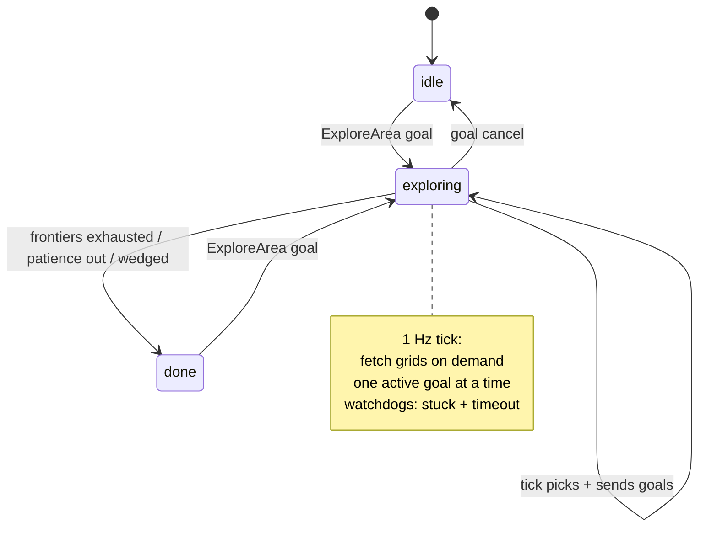
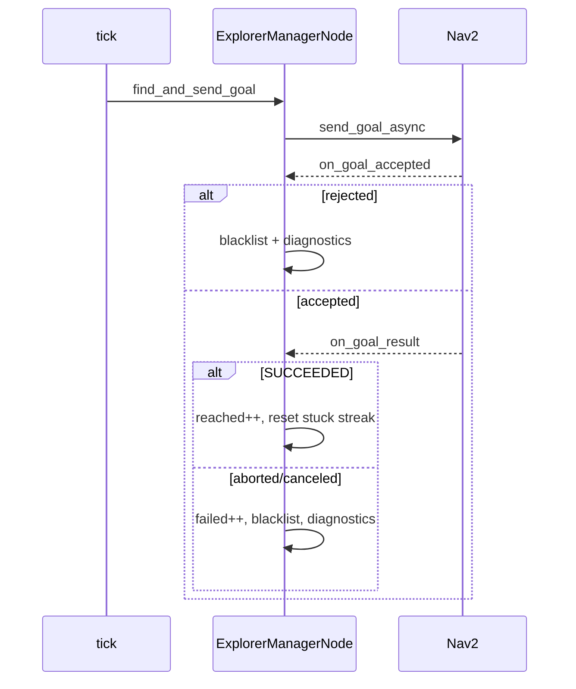

# The Exploration Session Manager — `explorer_manager_node.py`

This is the orchestrator: the ROS node that runs an autonomous exploration
session from "start" to "done." It does not detect frontiers or score goals —
that is the pluggable algorithm's job (`frontier_algorithm.py`, via the
`ExplorationAlgorithm` protocol). What this node owns is *everything around* the
decision: the tick loop, sending goals to Nav2, watching for stuck or timed-out
goals, blacklisting bad goals, knowing when to give up, writing telemetry, and —
a recurring theme — being frugal with the Raspberry Pi's CPU.

It is the largest file in the package because it is where all the messy real-world
concerns live. The reward for concentrating them here is that the algorithm and
the pure functions stay clean.

## The big picture



The node is a small state machine (`idle` / `exploring` / `done`) driven by a
1 Hz timer and by the **`ExploreArea` action** (F35). It used to subscribe
`/intent` directly; now dome_mission owns `/intent` and calls this action, so the
explorer is a reusable navigation primitive that knows nothing about intents.

## Triggering a session — the `ExploreArea` action

A session is one action goal. The goal's `map_name` names the SLAM map (empty
keeps the current one); the result `outcome` mirrors the internal
`GoalDecision` (`EXPLORED_DONE` / `STOPPED` / `NO_TARGETS_BLOCKED`); feedback
carries `frontiers_remaining`, `explored_area_m2`, and the `current_goal`.

The subtlety is that exploration is *timer-driven*, not a blocking loop, yet an
action `execute_callback` must block until the result is ready. The node
reconciles this with a `MultiThreadedExecutor` and a single
`ReentrantCallbackGroup` shared by the timer and the action server: the execute
callback blocks in its own thread — publishing feedback and watching for a
cancel — while the 1 Hz `explore_tick` runs concurrently and advances the state
machine. When the tick declares the session over it sets `session_outcome` and
flips the state; the execute loop observes `state != "EXPL"`, calls
`goal_handle.succeed()`, and returns the outcome. A cancel request maps to
`STOPPED`.

```python
def execute_explore(self, goal_handle):
    self.active_goal_handle = goal_handle
    self.start_session(goal_handle.request.map_name)
    while rclpy.ok():
        if goal_handle.is_cancel_requested:
            self.stop_exploring("IDLE")
            goal_handle.canceled()
            return ExploreArea.Result(outcome=ExploreArea.Result.STOPPED)
        if self.state != "EXPL":            # the tick declared DONE
            goal_handle.succeed()
            return ExploreArea.Result(outcome=self.session_outcome)
        goal_handle.publish_feedback(self.explore_feedback())
        time.sleep(0.5)
```

Session *start* is factored into `start_session(map_name)` — reset counters,
spin up TF, flip to `EXPL` — so the same logic serves the action and unit tests
without a live graph.

## The CPU-frugality theme

Three design decisions in `__init__` exist purely to keep an idle node from
burning the Pi's CPU, and they are worth understanding because they shape the
whole control flow:

1. **Grids are fetched on demand, not subscribed.** A standing subscription to
   `/map` and the costmaps deserializes every update even while idle — that alone
   cost 10–20% CPU. Instead, `fetch_grid` pulls the latest latched grid only when
   the node is about to pick a goal.
2. **The TF listener runs only while exploring.** `/tf` at ~40 Hz costs ~8% CPU to
   deserialize for a pose we only need at 1 Hz. `start_tf`/`stop_tf` create and
   tear it down around a session.
3. **The map array is passed uncopied.** A per-tick `list()` of the whole grid is
   pure waste when every consumer only reads it.

```python
def fetch_grid(self, topic: str) -> OccupancyGrid | None:
    """On-demand latest grid from the latched publisher, or None if none arrives."""
    ok, msg = wait_for_message(OccupancyGrid, self, topic,
                               qos_profile=self.map_qos, time_to_wait=1.0)
    return msg if ok else None
```

The `map_qos` deliberately matches the latched publishers (`KEEP_LAST`,
`RELIABLE`, `TRANSIENT_LOCAL`) — otherwise `wait_for_message` would never receive
the last grid.

## Choosing an algorithm at runtime

The node is algorithm-agnostic. A registry maps a param string to a class, and
tests can inject any `ExplorationAlgorithm` directly through the constructor:

```python
ALGORITHM_REGISTRY = {"frontier": FrontierAlgorithm, "hello": HelloWorldAlgorithm}

if algorithm is not None:
    self.algorithm = algorithm
else:
    chosen = self.get_parameter("explore_algorithm").value
    if chosen not in ALGORITHM_REGISTRY:
        chosen = DEFAULT_ALGORITHM      # warn + fall back
    self.algorithm = ALGORITHM_REGISTRY[chosen]()
self.algorithm.declare_params(self)     # algorithm declares its own ROS params
```

The node declares only *shared* params; the algorithm declares its own via the
protocol hook. That is how `min_frontier_size` gets to be settable from YAML
without the node ever naming it.

## The tick loop

`explore_tick` fires at 1 Hz and is the spine of the whole node. Its structure
encodes an important rule: **only one goal is active at a time, and the next goal
is only chosen when the current one finishes** (reached, aborted, timed out, or
abandoned).

```python
def explore_tick(self):
    self.publish_status(self.state)
    self.publish_markers()
    if self.state != "exploring":
        return
    if self.paused_on_failure:
        return
    if self.start_xy is None:
        self.start_xy = self.robot_xy_in_map()   # deferred capture, see below
    if self.has_active_goal:
        self.check_stuck()
        if self.has_active_goal:
            self.check_goal_timeout()
        return
    # No active goal → fetch grids on demand and pick one.
    self.latest_map = self.fetch_grid("/map")
    self.latest_global_costmap = self.fetch_grid("/global_costmap/costmap")
    self.find_and_send_goal()
```

Two details reward a second look. `start_xy` is captured on the first tick where
TF resolves, *not* when the session starts — at start time the freshly created TF
buffer is still empty. And grids are fetched only in the no-active-goal branch,
honoring the on-demand principle.

## Picking a goal, defensively

`find_and_send_goal` asks the algorithm for a goal but does not trust it blindly.
A candidate can be geometrically valid yet still be a goal Nav2 will reject — the
SLAM `/map` can extend past the global costmap (`worldToMap` failure), or the
candidate can land on a lethal/inscribed costmap cell. So the node loops up to
`MAX_GOAL_ATTEMPTS`, re-asking with rejected candidates folded into a per-tick
`rejected` set so the algorithm offers a different one next:

```python
for _ in range(self.MAX_GOAL_ATTEMPTS):
    ctx = ExplorationContext(map_data=map_data, map_info=info, robot_xy=robot_xy,
        blacklist=self.blacklist | rejected, start_xy=self.start_xy, params=self.params)
    decision = self.algorithm.next_goal(ctx)
    if decision.outcome is not GoalOutcome.NEW_GOAL:
        break
    candidate = decision.xy
    if not self.goal_within_costmap_bounds(candidate):
        rejected.add(candidate); continue
    if self.goal_is_lethal(candidate):
        rejected.add(candidate); continue
    goal_xy = candidate
    break
```

The `rejected` set is per-tick on purpose: a costmap that grows or clears between
ticks should re-evaluate those candidates fresh rather than permanently condemn
them (that is what the persistent `blacklist` is for). If the loop yields a goal,
send it. Otherwise the outcome decides: `EXPLORED_DONE` ends the session;
anything else debounces through `handle_no_target`.

## Knowing when to stop

Three independent mechanisms decide the session is over, each guarding a
different failure mode:

**Patience (blocked, not done).** If the algorithm keeps returning "blocked" for
`NO_TARGET_PATIENCE` (14) consecutive ticks, the node gives up — but first it
clears the blacklist *once*, in case the growing map reopened stale entries, and
retries:

```python
if self.no_target_count >= self.NO_TARGET_PATIENCE:
    if not self.blacklist_cleared_once:
        self.blacklist.clear()
        self.blacklist_cleared_once = True
        self.no_target_count = 0
        return
    self.stop_exploring("done")
```

**Wedge detection.** If the robot suffers `WEDGED_STUCK_LIMIT` (3) consecutive
"stuck" failures *from the same pose*, no amount of goal reselection will help —
the robot physically cannot move — so it stops cleanly rather than thrashing:

```python
def note_stuck(self, robot_xy):
    same_pose = (self.stuck_streak_xy is not None
                 and dist(robot_xy, self.stuck_streak_xy) <= self.STUCK_MOVE_EPS)
    self.stuck_streak = self.stuck_streak + 1 if same_pose else 1
    self.stuck_streak_xy = robot_xy
    if self.stuck_streak >= self.WEDGED_STUCK_LIMIT:
        self.stop_exploring("idle")
```

**Genuine exhaustion.** `EXPLORED_DONE` from the algorithm — no frontiers remain.

## The two watchdogs

While a goal is active, two timers guard against Nav2 getting stuck. Their
thresholds are tuned *relative to Nav2's own behavior*:

- **`check_stuck`** abandons a goal after `STUCK_T_S` (20s) of no progress, where
  "progress" means the distance-to-goal dropped by `STUCK_PROGRESS_EPS` or the
  robot moved `STUCK_MOVE_EPS`. It is set *above* Nav2's 10s progress_checker so
  Nav2's own behavior-tree recovery runs first.
- **`check_goal_timeout`** cancels a goal after `GOAL_TIMEOUT_S` (25s) outright,
  to break Nav2 BT recovery loops that would otherwise spin forever.

Both funnel into `abandon_active_goal`, which cancels the goal *and* blacklists
it — and blacklisting suppresses the whole `blacklist_radius` neighborhood, so
reselection avoids the wall the robot got stuck against.

```python
def abandon_active_goal(self):
    if self.goal_handle is not None:
        self.goal_handle.cancel_goal_async()
    if self.current_goal_xy is not None:
        self.blacklist.add(self.current_goal_xy)
    self.clear_active_goal()
```

## The goal lifecycle and stale callbacks

Sending a goal is async, so results arrive via callbacks. The critical
correctness concern is **stale callbacks**: a goal the watchdog already canceled
can still deliver a late result, which must not run against `None` state or
against a superseding goal. `on_goal_result` guards against exactly that:

```python
def on_goal_result(self, future, xy):
    if (not self.has_active_goal or xy != self.current_goal_xy
            or self.goal_start_time is None):
        return   # stale — this goal was already superseded/canceled
    ...
```

The success/failure branching also encodes a hard-won lesson: **only failures are
blacklisted, never reached goals.** Blacklisting a reached goal killed the live
frontier cells around each success and ended sessions early.



## Telemetry and diagnostics

Throughout, the node writes JSONL telemetry (`TelemetryWriter`, see
`X05-explore_telemetry.md`) at every meaningful event — session start/end, goal
sent/result, no-frontier ticks, wedged — and merges the algorithm's opaque
`telemetry_extra()` so per-goal strategy state (e.g. novelty score) lands on the
goals themselves. On an aborted goal it dumps rich failure diagnostics including
costmap costs and the algorithm's own `failure_report`. The `call_hook` helper is
the uniform way it invokes any optional algorithm hook:

```python
def call_hook(self, hook, *args, default=None):
    fn = getattr(self.algorithm, hook, None)
    return fn(*args) if fn is not None else default
```

## Observations and possible improvements

- **Two overlapping "stop" vocabularies.** `stop_exploring("idle")` (wedged, or
  stop intent) vs `stop_exploring("done")` (exhausted, patience). A wedged robot
  ending in `idle` rather than `done` is a subtle choice; a reader has to trace
  every caller to learn the convention. Naming the reason explicitly in telemetry
  helps, but the state names alone under-describe it.
- **On-demand fetch blocks the executor briefly.** `fetch_grid` waits up to 1s;
  three fetches per goal-picking tick can stall other callbacks for a beat. A
  short-lived subscription primed just before picking, torn down after, would
  bound the stall — at the cost of more complexity.
- **`MAX_GOAL_ATTEMPTS` re-runs the full algorithm** (including cluster detection)
  each attempt. For an algorithm as heavy as frontier detection, eight attempts is
  eight full detections in one tick. Returning a *ranked list* of candidates from
  `next_goal` would let the node try alternates without recomputing.
- **Wire-contract cruft.** `no_frontier` / `no_frontier_ticks` are kept as
  telemetry/status keys even though the concept generalized to "no target." The
  comments flag these as pending renames — a migration worth scheduling so the
  wire vocabulary matches the code.
- **Watchdog thresholds are constants tuned to Nav2's defaults.** If Nav2's
  `progress_checker` is reconfigured, `STUCK_T_S`/`GOAL_TIMEOUT_S` silently fall
  out of their intended ordering. Deriving them from the Nav2 params (or at least
  asserting the ordering) would keep them coupled on purpose rather than by
  coincidence.
