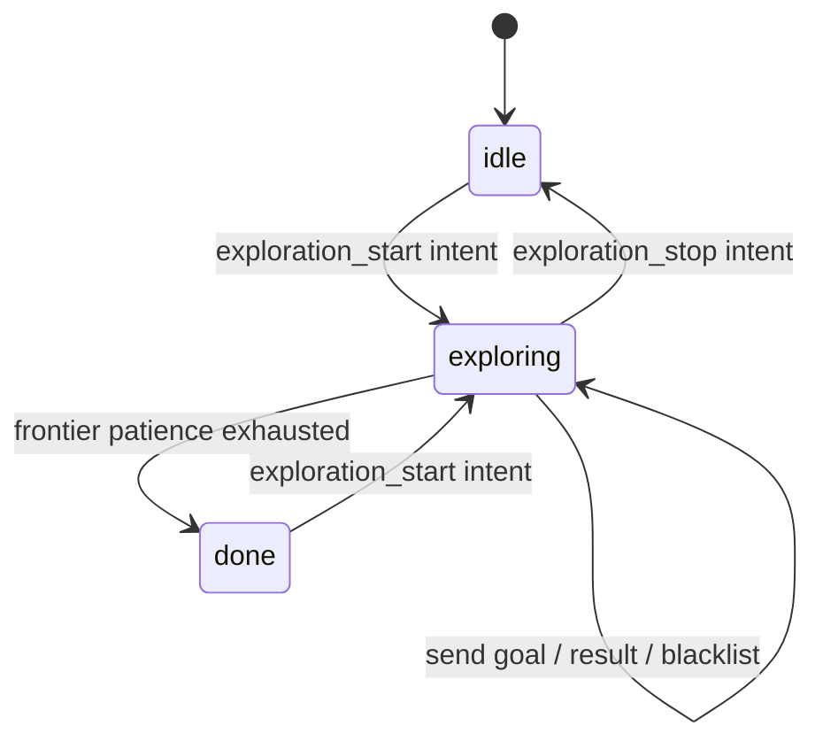
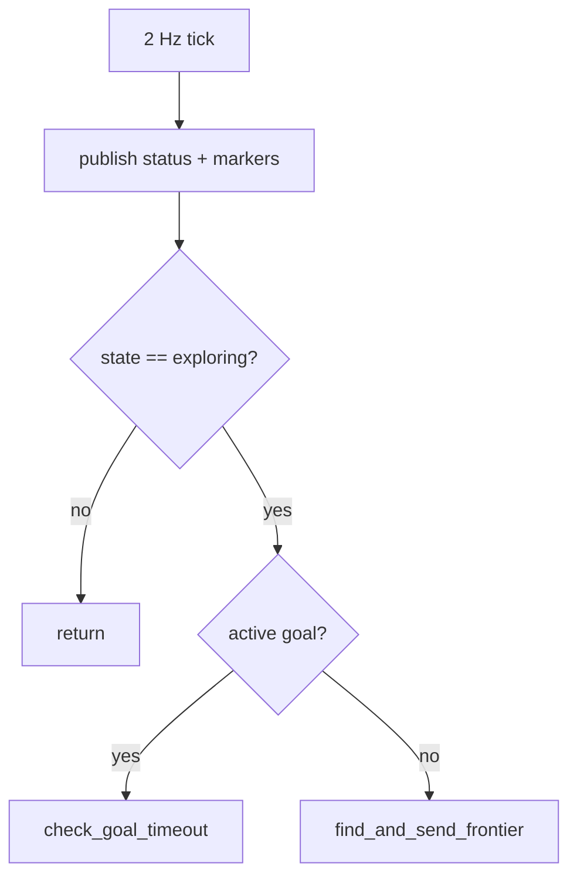

# PluggableExploreManagerNode — Autonomous Frontier Exploration over Nav2

This node is the orchestrator that turns "explore this space" into a stream of
Nav2 navigation goals. It owns none of the frontier math itself — that is
injected as an `ExplorationAlgorithm` — and none of the path planning, which is
Nav2's job. Its entire responsibility is the *loop*: watch the map, ask the
algorithm for a goal, send it, watch how it turns out, blacklist what fails, and
know when to stop.

As of 2026-07-08 this is the explorer for **both simulation and the real robot**
— `robot_explore.launch.py` and the sim launch files all run this same node,
differing only by parameter values. The older standalone `explore_manager_node`
was retired.

## The pluggable seam

The node accepts an algorithm object and falls back to the default
`FrontierAlgorithm` when none is supplied. Everything downstream talks to it
through the `ExplorationAlgorithm` protocol (`next_goal(ctx) -> XY | None`), so a
different exploration strategy is a constructor argument, not a fork of this
file.

```python
def __init__(self, algorithm: ExplorationAlgorithm | None = None):
    super().__init__("explore_manager_node")
    ...
    self.algorithm = algorithm or FrontierAlgorithm()
```

The node feeds the algorithm an `ExplorationContext` (map data, robot pose,
blacklist, session start pose, tuning params) and gets back a single goal point
in the `map` frame, or `None` when nothing qualifies. That clean boundary is
what makes the algorithm unit-testable without ROS and lets the tests inject a
`MockAlgorithm`.

## Parameters: one code path, many robots

All tuning is exposed as ROS parameters, defaulting to the **real-robot** values
so that a plain launch behaves conservatively; the sim launch files override
them. This is the mechanism that lets sim and real share one node.

```python
self.declare_parameter("max_explore_radius", 0.0)      # 0 = unlimited
self.declare_parameter("max_frontier_dist", 15.0)
self.declare_parameter("min_frontier_dist", 1.3)       # sim lowers to 0.9
self.declare_parameter("prefer_farthest", False)       # sim uses True
self.declare_parameter("min_frontier_size", 10)        # sim uses 5
self.declare_parameter("map_name", "unknown")
```

`min_frontier_dist` became a parameter on 2026-07-08: the real robot keeps the
1.3 m floor ("never send a goal closer than ~1 m," since `goal_inset` later pulls
the sent goal 0.3 m back toward the robot), while sim uses 0.9 m. That fix
resolved a startup deadlock where the only adequately sized frontier sat inside
the 1.3 m floor, so no goal was ever sent and exploration gave up immediately.
The values are bundled into an `ExploreParams` and handed to the algorithm via
the context.

## The state machine

Exploration is a tiny three-state machine. (An earlier design added a
`spinning` startup state that commanded a 360° in-place rotation before seeking
frontiers; it was removed on 2026-07-08 as unwanted.)



Intents arrive as JSON on `/intent`. `exploration_start` (only honored from
`idle`/`done`) resets the session, captures the robot's start pose, flips to
`exploring`, and logs a `session_start` telemetry record. `exploration_stop`
cancels any active goal and returns to `idle`. Malformed JSON is warned about and
ignored — a boundary that never crashes the node.

```python
name = intent.get("name", "")
if name == "exploration_start" and self.state in ("idle", "done"):
    self.reset_session()
    self.start_xy = self.robot_xy_in_map()
    self.state = "exploring"
    ...
elif name == "exploration_stop":
    self.stop_exploring("idle")
```

## The tick loop

A 2 Hz timer drives everything. 2 Hz is responsive without flooding the async
action server. Each tick republishes status and RViz markers, then does exactly
one of two things depending on whether a goal is already in flight:

```python
def explore_tick(self):
    self.publish_status(self.state)
    self.publish_markers()
    if self.state != "exploring":
        return
    if self.has_active_goal:
        # The frontier choice is only reconsidered when the current goal
        # finishes (reached, aborted, or timed out), not mid-flight.
        self.check_goal_timeout()
        return
    self.find_and_send_frontier()
```

The comment marks a deliberate design decision. An earlier version re-evaluated
the frontier every tick and could *redirect* mid-flight to a newly-revealed
frontier; that machinery was removed (it was unstable under farthest-first
selection, and the project settled on "commit to a goal until it finishes"). So
the rule now is simple: **while a goal is active, only watch for timeout;
otherwise pick and send the next frontier.**



## Finding and sending a goal

`find_and_send_frontier()` guards on the two things that can be missing early:
a `/map` and a valid `map→base_footprint` TF (robot pose). Either absence is
recorded as a `no_frontier` telemetry event with a reason, and the tick simply
retries next time.

With both present it builds the context and asks the algorithm:

```python
ctx = ExplorationContext(
    map_data=list(m.data), map_info=info, robot_xy=robot_xy,
    blacklist=self.blacklist, start_xy=self.start_xy, params=self.params,
)
goal_xy = self.algorithm.next_goal(ctx)
```

### When nothing qualifies: patience

If the algorithm returns `None`, that is not immediately "done" — the map is
still growing. The node counts consecutive empty ticks and only declares the
session complete after `NO_FRONTIER_PATIENCE` of them:

```python
NO_FRONTIER_PATIENCE = 14   # 7 s at 2 Hz
```

The value is chosen to **exceed slam_toolbox's `map_update_interval` (5 s)**: an
earlier 4 s patience could expire before `/map` had refreshed even once after new
area was revealed, ending exploration prematurely. Each empty tick also emits
rich diagnostics (`raw_clusters`, `too_small`, `large_clusters`,
`all_cells_out_of_range`) pulled from the algorithm's `latest_diag`, so a
"no frontier found" report can explain *why* — too small, all blacklisted, or all
outside the distance band.

### Sending the goal

A qualifying goal becomes a `NavigateToPose` action goal in the `map` frame:

```python
goal.pose.header.frame_id = "map"
goal.pose.pose.position.x = xy[0]
goal.pose.pose.position.y = xy[1]
goal.pose.pose.orientation.w = 1.0
```

Note the **fixed identity orientation** (yaw 0). Exploration doesn't care what
heading the robot ends up facing, so the goal checker's `yaw_goal_tolerance` is
relaxed (near-π in sim) to avoid a wasteful end-of-goal spin to satisfy a
heading the caller never meant to constrain.

## The async result chain and blacklisting

Nav2 actions are asynchronous, so the outcome arrives through a chain of
callbacks rather than a blocking wait:

```mermaid
sequenceDiagram
    participant N as Node
    participant Nav2
    N->>Nav2: send_goal_async
    Nav2-->>N: on_goal_accepted (accepted?)
    Note over N: rejected → blacklist, free the slot
    Nav2-->>N: on_goal_result (SUCCEEDED / aborted / canceled)
    Note over N: reached → count; else → blacklist
```

The **blacklist** is the memory that keeps exploration from banging its head on
the same unreachable spot. A frontier point is added to it on every non-success:
goal rejected at accept time, goal failed at result time, or goal timed out. On
success the counters advance and the node moves on. Because the blacklist is a
`set` of points and the algorithm filters candidates against it, a failed region
is naturally avoided on subsequent picks.

The **timeout** is the other guard. Nav2's behavior tree runs its own
spin/backup/retry recoveries that can burn 60+ seconds before it gives up. Rather
than wait that out, the node cancels a goal after `GOAL_TIMEOUT_S = 25 s`,
blacklists it, and frees the slot for the next frontier:

```python
if (time.monotonic() - self.goal_start_time) <= self.GOAL_TIMEOUT_S:
    return
... cancel_goal_async(); self.blacklist.add(self.current_goal_centroid); clear_active_goal()
```

## Observability: status, markers, telemetry

Three output streams make the node debuggable without attaching a debugger:

- **`/explore/status`** (JSON on a `String`): state plus `reached`/`failed`
  counts, and while exploring the current goal, distance, elapsed time, blacklist
  size, and no-frontier tick count.
- **`/explore/markers`** (`MarkerArray`): frontier cells, blacklist points, and
  the current goal, built by the pure `build_explore_markers` helper.
- **Telemetry** (`TelemetryWriter`, JSONL): `session_start`, `goal_sent`,
  `goal_result`, `no_frontier`, `session_end` — the record used to reconstruct
  exactly what happened in a run after the fact. `main()` guarantees a final
  `session_end` even on shutdown/Ctrl-C.

## Robot pose from TF

The robot's position comes from a `map→base_footprint` TF lookup, which returns
`None` (rather than raising) on the expected transient failures so the loop can
just retry:

```python
def robot_xy_in_map(self) -> XY | None:
    try:
        tf = self.tf_buffer.lookup_transform("map", "base_footprint", rclpy.time.Time())
        return (tf.transform.translation.x, tf.transform.translation.y)
    except (LookupException, ExtrapolationException, ConnectivityException):
        return None
```

## Observations / possible improvements

- **`centroid == goal_xy` is a compromise, and its explaining comment is now
  stale.** The comment in `find_and_send_frontier` still refers to "the original
  node" (deleted) passing a separate pre-nudge centroid. Today both arguments are
  the nudged goal, so the blacklist stores the nudged point rather than the raw
  frontier cell. That's self-consistent but worth cleaning the comment up, and
  worth revisiting whether blacklisting the *raw* cell would generalize better.
- **The blacklist is exact-point.** Two nearby failures create two entries; the
  algorithm's `blacklist_radius` provides the fuzz. Fine, but it means the
  blacklist set can grow large over a long session with no decay.
- **No goal-orientation intent.** Since every goal is sent with yaw 0, the node
  leans entirely on a loose `yaw_goal_tolerance`. If a future mode wanted the
  robot to face the frontier it was heading toward, computing
  `yaw = atan2(dy, dx)` here would be cheap and avoid depending on the goal
  checker being relaxed.
- **`min_frontier_dist`/`max_frontier_dist`/`prefer_farthest` interact
  subtly.** They are independent knobs today; a short "profiles" abstraction
  (near-first-small-room vs far-first-large-space) might make the sim-vs-real
  intent clearer than five separate parameters.
