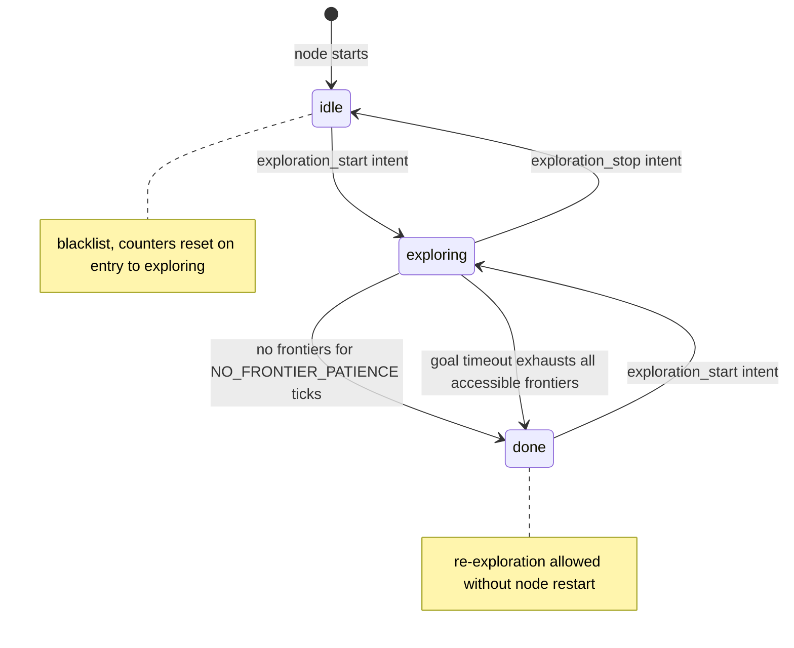

# PluggableExploreManagerNode — Autonomous Exploration with Injected Algorithms

## Why This Node Exists

`explore_manager_node.py` (documented in `07-explore_manager_node.md`) was the first
working implementation of frontier-based autonomous exploration for the DOME robot. It
worked well, but it embedded a single exploration strategy — the `FrontierAlgorithm` —
directly into the node. Testing an alternative strategy meant either modifying the node
(risky) or duplicating it wholesale.

Feature F12 introduced `pluggable_explore_manager_node.py` to solve this: the same node
with the algorithm dependency inverted. The strategy is now injected at construction time
rather than hard-coded. The original node is left completely untouched; this file is
purely additive. In production the node defaults to `FrontierAlgorithm()`, so behaviour
is identical for normal operation. In tests or experiments, any object satisfying the
`ExplorationAlgorithm` protocol can be passed in instead.

This approach — "the same node, but open at the algorithm seam" — is a deliberate
tradeoff against alternatives such as a strategy registry or ROS parameter-driven
algorithm selection. Those would require more infrastructure and would still not give
unit tests clean access to inject a mock.

---

## The Algorithm Protocol

The protocol surface is intentionally minimal. An exploration algorithm only needs to
implement one method and expose two read-only attributes:

```python
class ExplorationAlgorithm(Protocol):
    latest_clusters: list[list[int]]
    latest_diag: dict | None

    def next_goal(self, ctx: ExplorationContext) -> tuple[float, float] | None: ...
```

`next_goal` receives a fully-assembled `ExplorationContext` — map data, map geometry,
the robot's current world position, the current blacklist, the session start position,
and all tuning parameters — and returns either a world-coordinate `(x, y)` goal or
`None` if no valid frontier was found.

The two attributes, `latest_clusters` and `latest_diag`, are a deliberate side-channel
for observability. They exist because the node needs frontier cluster data for marker
publishing and diagnostic telemetry _after_ the algorithm runs, without requiring
`next_goal` to return anything beyond the goal point. Reading them after every call is a
pattern the node imposes on all algorithms; any algorithm that chooses not to populate
them can set them to `[]` and `None` respectively.

The `ExplorationContext` passed to the algorithm is assembled in the node and bundles
everything the algorithm could need:

```python
ctx = ExplorationContext(
    map_data=list(m.data),
    map_info=info,
    robot_xy=robot_xy,
    blacklist=self.blacklist,
    start_xy=self.start_xy,
    params=self.params,
)
```

Copying `m.data` into a plain list (`list(m.data)`) detaches the context from the live
ROS message. This prevents the algorithm from holding a reference to mutable message
memory that may be overwritten on the next map callback.

---

## Dependency Injection at Construction

The node accepts the algorithm as an optional constructor argument. If none is provided,
it falls back to the production default:

```python
def __init__(self, algorithm: ExplorationAlgorithm | None = None):
    ...
    self.params = ExploreParams(
        max_explore_radius=self.max_explore_radius,
        max_frontier_dist=self.max_frontier_dist,
        prefer_farthest=self.prefer_farthest,
    )
    self.algorithm = algorithm or FrontierAlgorithm()
```

`max_frontier_dist` (added 2026-07-03, for the Gazebo sim work) follows the same
declared-ROS-parameter pattern as `max_explore_radius`, but with a non-zero
operational default (`15.0` m as of 2026-07-05 — see below) rather than
"unlimited" — the `ExploreParams` dataclass default stays `0.0` (see
`04-explore_context.md`), so this node is the one place that actually opts
into capping exploration hop distance.

**Empty-range bug, 2026-07-04**: the operational default started at `1.0` m,
which is *below* `ExploreParams.min_frontier_dist`'s default of `1.3` m. Since
`pick_best_frontier()` rejects any cell closer than `min_frontier_dist` *and*
any cell farther than `max_frontier_dist`, a `[1.3, 1.0]` band admits no
distance at all — every exploration session ended immediately with zero goals
sent, for any map, with no error anywhere in the stack to point at the cause.
Found via live telemetry showing `session_end` events with `goals_sent: 0`
seconds after `session_start`. Fixed by raising the operational default to
`3.0`; a regression test now asserts this node's default exceeds
`ExploreParams().min_frontier_dist` directly, rather than relying on someone
noticing the numbers by eye during a future change.

**Silent cap on `prefer_farthest`, 2026-07-05**: `3.0` m was tuned for the
original, smaller `simple_room.world` (8×8 m) and never revisited once
`multi_room.world` (10×10 m, ~14.1 m diagonal) came into use. Live telemetry
(`explore-toy6-20260705.jsonl`) showed a `no_frontier` event with
`large_clusters: 10, all_cells_out_of_range: 10` — ten properly-sized frontier
clusters existed on the map, and every one of them was rejected by the
distance band, not because none existed. `prefer_farthest`'s entire purpose is
to reach distant frontiers instead of retrying a locally-stuck area, so a `3.0`
m cap was directly undermining it once the blacklist grew large enough to push
every reachable frontier past that radius. Raised to `15.0` (larger than
`multi_room.world`'s diagonal, so effectively unbounded there) rather than to
`ExploreParams`' `0.0` "unlimited" sentinel, so the existing regression test
(`default exceeds min_frontier_dist`) stays meaningful without a special case
for the sentinel value.

`prefer_farthest` (added 2026-07-04) follows the same pattern again: a ROS
parameter with its own operational default, separate from the `ExploreParams`
dataclass default. Here the dataclass default (`False`) and this node's own
declared-parameter default are actually the same value — it's the *launch
files* that override it to `True` for sim use, not this node's constructor.
See `06-frontier_explorer.md` for what the flag does and why nearest-first
selection turned out to be self-defeating near the doorway.

**`min_frontier_size` (added 2026-07-05)** follows the same "node default
matches `ExploreParams`, launch files override" pattern — this node's own
declared-parameter default is `10`, identical to `ExploreParams`, so
real-robot behavior is unaffected. It exists as a ROS parameter specifically
so sim launch files could experiment with lowering it without touching this
node's code. That experiment (briefly setting it to `1` in the sim launch
files, then back to `5` after it caused a 100% goal failure rate — Nav2's
planner choking on isolated single-cell frontier slivers at the ragged edge
of known space — see `02-doc/current.md` and `TF13-gazebo-simulation.md` for
the full incident) is a cautionary example of how far a "just tweak one
launch default" change can reach into planner-level failure modes.

The `or` idiom works here because `None` is the only falsy value that should ever be
passed. An explicitly constructed algorithm object is always truthy. This is simpler than
`algorithm if algorithm is not None else FrontierAlgorithm()` and conveys the intent
clearly: "use whatever was given, or make the default."

`ExploreParams` is constructed before the algorithm is resolved so the algorithm could,
in principle, be initialized with those same params if needed — though the current design
passes params per-tick via `ExplorationContext` rather than at construction.

---

## State Machine

The node has exactly three states. Transitions are either intent-driven (external signal
on `/intent`) or map-driven (patience counter exhausted or explicit stop).



The key design choice is that `done` is not a terminal state. Receiving
`exploration_start` from `done` calls `reset_session()` and begins again. This supports
the use case of running multiple exploration passes in one DOME session without restarting
the ROS node.

The `exploration_start` guard `self.state in ("idle", "done")` prevents accidentally
re-triggering mid-exploration if the intent is replayed.

---

## The Exploration Tick

Everything is driven by a 2 Hz timer. Each tick is short and non-blocking:

```python
def explore_tick(self):
    self.publish_status(self.state)
    self.publish_markers()
    if self.state != "exploring":
        return
    if self.has_active_goal:
        self.check_goal_timeout()
        self.check_goal_redirect()
        return
    self.find_and_send_frontier()
```

Status and markers are published unconditionally every tick, even in `idle` and `done`.
This keeps RViz2 and any monitoring dashboard alive with fresh data regardless of whether
exploration is running. The early return on `state != "exploring"` then prevents any goal
logic from running.

The `has_active_goal` guard ensures only one Nav2 goal is in flight at a time. Nav2's
`NavigateToPose` action is not designed to queue multiple goals simultaneously; a second
`send_goal_async` while one is accepted would confuse the goal handle tracking. The timer
approach — send a goal, wait for the result callback, then send the next — is simpler
and more debuggable than managing a queue.

When `has_active_goal` is `True`, the tick calls both `check_goal_timeout()` and
`check_goal_redirect()` before returning. These are independent checks: a goal can be
stale in time, stale in space (the map changed under it), or both. Running them on every
tick means the worst-case detection latency is one tick period (500 ms at 2 Hz), which
is acceptable.

**Why 2 Hz?** Nav2 goal dispatch and result callbacks are asynchronous. There is no
benefit to ticking faster — a new goal cannot be sent until the current one completes,
and marker/status publishing at higher frequency would be wasteful. 1 Hz adds unnecessary
latency between goals; 5 Hz offers nothing extra.

---

## Finding and Dispatching a Frontier Goal

When no goal is active during exploration, the node assembles an `ExplorationContext` and
delegates entirely to the algorithm:

```python
def find_and_send_frontier(self):
    if self.latest_map is None:
        self.telemetry.write("no_frontier", reason="no_map")
        return
    robot_xy = self.robot_xy_in_map()
    if robot_xy is None:
        self.get_logger().warning("TF map→base_footprint unavailable — waiting.")
        self.telemetry.write("no_frontier", reason="no_tf")
        return
    ...
    goal_xy = self.algorithm.next_goal(ctx)
    if goal_xy is None:
        self.no_frontier_count += 1
        ...
        if self.no_frontier_count >= self.NO_FRONTIER_PATIENCE:
            self.stop_exploring("done")
        return
    self.no_frontier_count = 0
    self.send_nav_goal(goal_xy, centroid=goal_xy)
```

Two preconditions must hold before the algorithm is even called: a map must exist, and a
TF transform from `map` to `base_footprint` must be available. Both are checked
explicitly with early returns and telemetry events. Failing silently here would cause
confusing downstream behaviour — the algorithm receiving a stale or zero robot position.

**The `no_frontier_count` patience counter** is the mechanism for distinguishing "no
frontiers right now" from "exploration is genuinely complete." The occupancy grid updates
asynchronously: a single tick with no valid frontier might simply reflect a map update
lag. Eight consecutive empty ticks at 2 Hz equals 4 seconds of sustained
empty-frontier state, which is enough to rule out transient lags. Too low a patience value
causes premature termination; too high a value means the robot sits idle at the end of a
complete run longer than necessary.

A successful frontier resets `no_frontier_count` to zero. The counter therefore measures
_consecutive_ empty ticks, not a running total.

**The centroid note:** in the pluggable node, `goal_xy` is passed as both `xy` and
`centroid` to `send_nav_goal`. This differs slightly from the original node, where the
raw `pick_best_frontier` result (before nudging) was passed as `centroid` and the nudged
coordinate as `xy`. In the pluggable design the algorithm handles all nudging internally,
so the node receives only one coordinate. Using that coordinate for both goal and
blacklist is consistent; the blacklist radius (0.5 m) absorbs any sub-0.5 m drift.

---

## Goal Timeout and Blacklisting

Nav2's Behavior Tree executor can enter recovery loops — spinning in place, clearing
costmaps, retrying — that can extend a single goal to 60 seconds or more. Without a
hard timeout, one stuck goal blocks the entire exploration loop.

```python
def check_goal_timeout(self):
    if self.goal_start_time is None:
        return
    if (time.monotonic() - self.goal_start_time) <= self.GOAL_TIMEOUT_S:
        return
    elapsed = round(time.monotonic() - self.goal_start_time, 1)
    self.get_logger().warning(
        f"Goal timed out after {elapsed}s — cancelling and blacklisting."
    )
    ...
    if self.goal_handle is not None:
        self.goal_handle.cancel_goal_async()
    if self.current_goal_centroid is not None:
        self.blacklist.add(self.current_goal_centroid)
    self.clear_active_goal()
```

`GOAL_TIMEOUT_S = 25.0` was chosen to be comfortably above the time needed for Nav2 to
reach most normal goals (typically 5–15 seconds in the DOME environment) while being well
below the 60-second BT loop upper bound. Shorter values (10 s) produce false timeouts
when traversal is long; longer values (40 s) unnecessarily extend a stuck session.

The timed-out goal's centroid is blacklisted immediately on timeout, before the cancel
future completes. This is intentional: the cancel is fire-and-forget. If the result
callback eventually fires after a cancel, `clear_active_goal()` has already run and the
result is harmlessly processed (the centroid was already blacklisted). Crucially, if the
cancel was issued by `check_goal_redirect` rather than `check_goal_timeout`, the
`is_redirecting` flag guards against double-blacklisting — see the next section.

---

## Mid-Navigation Redirect: Staying on the Best Frontier

### The Problem

When the node sends a goal, the robot begins navigating toward that frontier. But the
robot carries a lidar that is scanning the environment continuously during transit. By the
time the robot arrives, the map has changed: previously-unknown cells along the path have
been classified as free or occupied. The frontier that was best at goal-send time may have
already been fully explored by incidental scanning, while a completely different — and
better — frontier has emerged on the freshly-revealed side of the map.

The original design had no mechanism to catch this. The robot would arrive at a now-stale
goal, discover the frontier was already explored (or missing), then pick a new one. The
missed-opportunity window was the entire traversal time, sometimes 10–20 seconds.

### REDIRECT_THRESHOLD = 1.5 m

```python
# If the best frontier moves more than this many metres from the current goal,
# cancel mid-flight and redirect. Accounts for the map updating during transit
# (lidar reveals new cells along the path). Too small → constant churn; too
# large → stale goals persist after the map changes significantly.
REDIRECT_THRESHOLD = 1.5
```

The 1.5 m value is a deliberate midpoint in a tradeoff:

- **Too small (e.g., 0.3 m):** Any map update — even a single newly-revealed free cell
  nudging the best frontier slightly — triggers a redirect. The robot churns: it cancels
  and re-sends goals constantly, never completing traversal. Nav2 cancels have a
  non-trivial cost (decelerate, replan, re-accelerate), so frequent redirects degrade
  overall coverage speed.

- **Too large (e.g., 5.0 m):** Significant map changes are ignored. The robot travels to
  a frontier that is 4 m away from where the real best frontier now is, wasting
  traversal time and possibly missing the better target entirely before the map update
  is acted upon.

1.5 m was validated empirically in the DOME environment: it is larger than the noise
floor of frontier centroid drift from minor map updates, and smaller than the typical
gap between meaningfully distinct frontier clusters. At this threshold, redirects
happen when the map has changed enough to matter, not on every minor scan update.

### frontier_goal_for_current_map() — Memoized Frontier Recompute

**Changed 2026-07-02.** The algorithm re-invocation used to happen inline inside
`check_goal_redirect()` on every tick, unconditionally. Instrumentation during the
Gazebo sim work showed this was mostly wasted: slam_toolbox only republishes
`/map` on its own `map_update_interval` (5 s by default), far slower than this
node's 2 Hz tick — so ~90% of those recomputes ran the full frontier-clustering
pass against a map that hadn't changed since the last tick. The fix extracts the
assembly-and-recompute logic into its own method, memoized by the map's own
header timestamp:

```python
def frontier_goal_for_current_map(self, robot_xy: XY) -> XY | None:
    m = self.latest_map
    stamp = (m.header.stamp.sec, m.header.stamp.nanosec)
    if stamp == self.redirect_map_stamp:
        return self.redirect_cached_goal
    info = MapInfo(
        width=m.info.width, height=m.info.height, resolution=m.info.resolution,
        origin_x=m.info.origin.position.x, origin_y=m.info.origin.position.y,
    )
    ctx = ExplorationContext(
        map_data=list(m.data),
        map_info=info,
        robot_xy=robot_xy,
        blacklist=self.blacklist,
        start_xy=self.start_xy,
        params=self.params,
    )
    self.redirect_map_stamp = stamp
    self.redirect_cached_goal = self.algorithm.next_goal(ctx)
    return self.redirect_cached_goal
```

`redirect_map_stamp` and `redirect_cached_goal` are initialized to `None` in
`__init__`. The cache key is the map's `(sec, nanosec)` header stamp, not a
content hash — cheap to compare, and correct because slam_toolbox only bumps
the stamp when it actually republishes a (possibly) updated map. Confirmed via
the same `time.perf_counter()` instrumentation used elsewhere in this
investigation: recompute cost dropped from ~4 ms (fresh clustering pass) to
~0.1 ms (cache hit) on every tick but the first one after a genuinely new map.

### check_goal_redirect()

**Disabled under `prefer_farthest`, added 2026-07-05.** The very first line of
the method now short-circuits:

```python
if self.prefer_farthest:
    return
```

Live testing found this redirect mechanism actively fighting
`prefer_farthest`: "best frontier from here" under farthest-first means "the
side of the map farthest from wherever the robot currently is" — which flips
to the *opposite* side the moment the robot makes progress toward its current
goal. Every tick, the redirect logic would see a >1.5m shift (because the
robot moved, not because the map changed) and cancel, sending the robot back
the way it came, which would then flip again next tick. Telemetry confirmed
this exactly: 17 `goal_sent`/`redirect` pairs alternating between the same
two points roughly 1.7m apart, zero goals ever reached. Nearest-first doesn't
have this failure mode — moving toward the nearest frontier either keeps it
nearest, or the map updates and a new nearby one legitimately takes over,
which is the genuine map-change signal this method was built to react to.
Farthest-first's answer depends on the robot's own position as much as on the
map, so the two features are fundamentally incompatible without the guard.

```python
def check_goal_redirect(self):
    no_active_redirect_target = (
        self.is_redirecting or self.latest_map is None
        or self.current_goal_xy is None
    )
    if no_active_redirect_target:
        return
    robot_xy = self.robot_xy_in_map()
    if robot_xy is None:
        return
    new_goal = self.frontier_goal_for_current_map(robot_xy)
    if new_goal is None:
        return
    dist = math.sqrt(
        (new_goal[0] - self.current_goal_xy[0]) ** 2
        + (new_goal[1] - self.current_goal_xy[1]) ** 2
    )
    if dist < self.REDIRECT_THRESHOLD:
        return
    self.get_logger().info(
        f"Redirect: best frontier moved {dist:.2f}m from current goal "
        f"— cancelling #{self.goal_count} and redirecting."
    )
    self.telemetry.write(
        "redirect", goal_num=self.goal_count,
        old_goal_xy=[round(self.current_goal_xy[0], 3),
                     round(self.current_goal_xy[1], 3)],
        new_goal_xy=[round(new_goal[0], 3), round(new_goal[1], 3)],
        shift_m=round(dist, 3),
    )
    self.is_redirecting = True
    if self.goal_handle is not None:
        self.goal_handle.cancel_goal_async()
```

This method runs every tick while `has_active_goal` is `True`. It calls
`frontier_goal_for_current_map()` (cheap on a cache hit, a full recompute only
when the map has genuinely changed) and computes the Euclidean distance between
the new best goal and the goal currently being navigated to. If the shift
exceeds `REDIRECT_THRESHOLD`, it sets `is_redirecting = True` and cancels the
active goal asynchronously.

Several design choices here are worth noting:

- **The memoized recompute partially resolves the duplication noted in earlier
  versions of this document.** `find_and_send_frontier` and
  `check_goal_redirect`/`frontier_goal_for_current_map` still assemble their own
  `ExplorationContext` independently — that duplication remains, per the
  original reasoning (initial selection vs. mid-transit re-evaluation have
  different call sites and slightly different surrounding logic) — but the
  *expensive* part (the actual clustering pass) is no longer needlessly
  repeated across ticks.

- **Early return if `is_redirecting`** prevents the method from triggering a second
  cancel while a cancel is already in flight. Once set, `is_redirecting` remains `True`
  until `clear_active_goal()` is called in the result callback.

- **The cancelled goal is not blacklisted.** The existing goal was valid when sent;
  the redirect is because something better appeared, not because this goal is
  unreachable. Blacklisting it would permanently exclude a reachable frontier.

### is_redirecting and the Result Callback

The `is_redirecting` flag is the critical bridge between the cancel-and-redirect
initiation and the eventual arrival of the cancel result in `on_goal_result`:

```python
def on_goal_result(self, future, xy: XY, centroid: XY):
    elapsed = (
        round(time.monotonic() - self.goal_start_time, 1)
        if self.goal_start_time else 0.0
    )
    if self.is_redirecting:
        # Cancelled for a better frontier — not a failure, do not blacklist.
        self.clear_active_goal()
        return
    self.clear_active_goal()
    result = future.result()
    ...
    if result.status == GoalStatus.STATUS_SUCCEEDED:
        self.goals_reached += 1
        ...
    else:
        self.goals_failed += 1
        ...
    self.blacklist.add(centroid)
```

When `is_redirecting` is `True`, the result callback skips all the status-checking,
failure-counting, and blacklisting logic and just clears the active goal. This is
important for two reasons:

1. **Suppresses false failure counts.** A redirect-cancelled goal did not fail; counting
   it as `goals_failed` would corrupt session statistics and affect any logic gated on
   failure rates.

2. **Prevents spurious blacklisting.** If the cancelled goal's centroid were blacklisted,
   that frontier would be permanently excluded for the rest of the session, even though
   it may still be the best available target for the new goal that is about to be sent.

`is_redirecting` is reset to `False` inside `clear_active_goal()`, not in the result
callback directly. This ensures the flag is always cleared as part of the same atomic
state reset that clears `has_active_goal`, `goal_handle`, and `current_goal_xy`.

```python
def clear_active_goal(self):
    self.goal_handle = None
    self.has_active_goal = False
    self.goal_start_time = None
    self.current_goal_centroid = None
    self.current_goal_xy = None
    self.is_redirecting = False
```

After `clear_active_goal()` returns in the redirect path, the next `explore_tick` will
find `has_active_goal = False` and call `find_and_send_frontier()`, which re-runs the
algorithm and sends the (now-fresh) best frontier as the next goal.

---

## Goal Dispatch and the Async Callback Chain

Nav2 goal dispatch is a three-step async chain:

1. `send_nav_goal` calls `send_goal_async`, registering `on_goal_accepted`.
2. `on_goal_accepted` checks if Nav2 accepted the goal; if yes, chains `on_goal_result`.
3. `on_goal_result` fires when Nav2 reports a final status (succeeded, cancelled,
   aborted).

```python
def send_nav_goal(self, xy: XY, centroid: XY):
    if not self.nav_client.server_is_ready():
        self.get_logger().warning("NavigateToPose server not ready — will retry.")
        return
    goal = NavigateToPose.Goal()
    goal.pose = PoseStamped()
    goal.pose.header.frame_id = "map"
    goal.pose.header.stamp = self.get_clock().now().to_msg()
    goal.pose.pose.position.x = xy[0]
    goal.pose.pose.position.y = xy[1]
    goal.pose.pose.orientation.w = 1.0
    self.has_active_goal = True
    self.goal_start_time = time.monotonic()
    self.current_goal_centroid = centroid
    self.current_goal_xy = xy
    self.goal_count += 1
    ...
    future = self.nav_client.send_goal_async(goal)
    future.add_done_callback(
        functools.partial(self.on_goal_accepted, xy=xy, centroid=centroid)
    )
```

`functools.partial` captures `xy` and `centroid` into the callbacks so they are available
when the futures complete, even though by that time the node's mutable goal state may
have been cleared. This is the standard ROS2 pattern for threading context through async
action callbacks.

The orientation is set to `w=1.0` (identity quaternion — facing "forward" in the map
frame). Nav2's navigator rotates the robot to face the goal before beginning traversal, so
the orientation at the goal point does not matter for exploration purposes.

**All genuine failures blacklist.** On goal completion — success, failure, timeout, or
rejection — the centroid is added to the blacklist. Redirected cancels are the only
exception, guarded by `is_redirecting`. Blacklisting on success prevents the robot from
re-selecting a frontier whose occupancy cells have not yet been updated by `slam_toolbox`
— a common race condition at 2 Hz. Blacklisting on failure and timeout prevents
re-attempting a spot where Nav2 already struggled. The blacklist grows monotonically
within a session and is never pruned; it resets only when `reset_session()` is called at
the start of a new `exploration_start`.

---

## Observability: Telemetry and Markers

### Telemetry

Every significant event is written to a JSONL file via `TelemetryWriter`:

```python
self.telemetry = TelemetryWriter(self.map_name, self.get_logger().info)
```

`TelemetryWriter` appends one JSON object per line to
`~/.dome/telemetry/explore-<map>-<date>.jsonl`. Each record has an `event` field and a
monotonic `ts` timestamp. Event types include `session_start`, `session_end`,
`goal_sent`, `goal_result`, `no_frontier`, `redirect`, and `shutdown`. The `redirect`
event is new in this version and records `old_goal_xy`, `new_goal_xy`, and `shift_m`,
making it possible to reconstruct exactly when and how far the best frontier moved during
a transit.

This file is the primary post-hoc analysis tool — it captures the full sequence of
decisions, durations, and outcomes for every exploration session without requiring a
rosbag.

The `no_frontier` record is particularly diagnostic: it includes the raw cluster count
from the algorithm's `latest_clusters` and any diagnostic fields from `latest_diag`. When
filtering eliminates all clusters (blacklist, minimum size, minimum distance, max radius),
the `latest_diag` dict explains which filter was the last to reject, enabling tuning
without instrumented replay.

### Markers

```python
def publish_markers(self):
    markers = build_explore_markers(
        now=self.get_clock().now().to_msg(),
        is_exploring=self.state == "exploring",
        clusters=self.algorithm.latest_clusters,
        min_frontier_size=self.params.min_frontier_size,
        map_info=self.latest_map_info,
        blacklist=self.blacklist,
        goal_xy=self.current_goal_xy,
    )
    self.marker_pub.publish(markers)
```

`build_explore_markers` (from `explore_markers.py`) produces a `MarkerArray` on
`/explore/markers` with three namespaces: frontier cell points (yellow), blacklisted
points (red), and the current goal sphere (cyan). Passing `self.algorithm.latest_clusters`
directly here is the reason the protocol requires algorithms to maintain `latest_clusters`
as a public attribute: the node reads it after every `next_goal` call without asking the
algorithm to recompute anything.

When `is_exploring=False`, frontier and goal markers are published with
`action=DELETE` to clear stale RViz2 display state. Blacklist markers always publish
because the blacklist survives the end of exploration and remains diagnostically useful.

---

## Session Reset

`reset_session` zeroes all session-scoped counters and, crucially, clears the blacklist:

```python
def reset_session(self):
    self.state = "idle"
    self.blacklist: set[XY] = set()
    self.start_xy: XY | None = None
    self.no_frontier_count = 0
    self.goal_count = 0
    self.goals_reached = 0
    self.goals_failed = 0
```

`start_xy` is set just after `reset_session` in `on_intent` — not inside `reset_session`
itself — because it requires a live TF lookup at the moment `exploration_start` is
received, not at node startup. A robot that starts the node at origin but drives before
triggering exploration would get the wrong `start_xy` if it were captured in `__init__`.

`clear_active_goal` is called once at startup (not in `reset_session`) to initialize the
goal-tracking fields, including `is_redirecting`. If `exploration_stop` arrives mid-goal,
`stop_exploring` cancels the goal handle and sets `has_active_goal = False` without
calling `clear_active_goal`, which avoids a double-cancel.

---

## How It Differs from `explore_manager_node.py`

| Concern | `explore_manager_node.py` | `pluggable_explore_manager_node.py` |
|---|---|---|
| Algorithm source | Hard-coded; calls `find_frontier_clusters`, `pick_best_frontier`, `nudge_toward_robot` directly | Injected via constructor; defaults to `FrontierAlgorithm()` |
| Centroid tracking | Passes raw `pick_best_frontier` result as `centroid`, nudged point as `xy` | Passes `goal_xy` as both; algorithm owns nudging |
| Mid-transit redirect | None; robot always completes traversal before re-evaluating | `check_goal_redirect()` re-evaluates every tick; cancels and redirects if best frontier shifted > 1.5 m |
| Redirect guard | N/A | `is_redirecting` flag in `clear_active_goal`; suppresses blacklisting and failure count on cancel-for-redirect |
| Testability | Algorithm cannot be mocked without patching module-level functions | Any `ExplorationAlgorithm`-protocol object can be injected |
| Production behaviour | Identical frontier exploration | Identical when using default `FrontierAlgorithm`, plus dynamic redirect |

The original node was deliberately left untouched so that a regression in the pluggable
node does not affect a known-working deployment path.

**Direction changed 2026-07-04**: per explicit user decision, this arrangement is no
longer intended to be permanent. `explore_manager_node.py` was kept as a rollback-safe
original in case the pluggable approach failed — it didn't, and the stated goal now is
for sim and real-robot code to converge on this file for both, differing only by
parameter values (e.g. `prefer_farthest`, speed caps) rather than by which node runs.
`robot_explore.launch.py` (the real-robot entry point) has not yet been switched over —
that is a distinct, explicitly-confirmed follow-up, not something to fold in silently
alongside unrelated changes. See `02-doc/current.md`'s Likely Next Steps.

---

## Observations

**Context assembly duplication (narrowed, not eliminated, 2026-07-02).**
`find_and_send_frontier` and `frontier_goal_for_current_map` (called from
`check_goal_redirect`) both build an `ExplorationContext` from `self.latest_map`
using near-identical code — still a DRY violation. The memoization added for
performance (see above) means this duplicated assembly no longer runs on every
tick, only on a cache miss, which reduces how often the duplication actually
costs anything at runtime, but the source-level duplication itself is
unchanged. A shared `build_context(robot_xy)` helper method would still
eliminate it.

**Redirect storms on noisy maps.** If `slam_toolbox` produces a rapidly oscillating best
frontier — due to scan noise at the boundary of a large open space — `check_goal_redirect`
may trigger repeatedly in quick succession. `is_redirecting` prevents double-cancellation
within one cancel cycle, but after the redirect completes and a new goal is sent, the
next tick could immediately redirect again. A minimum time-between-redirects guard (e.g.,
do not redirect within 2 seconds of the last redirect) would bound this in pathological
environments.

**Centroid drift.** Using `goal_xy` (the nudged coordinate) as the blacklist centroid
rather than the pre-nudge frontier cell creates a small geometric inconsistency. The
blacklist radius of 0.5 m absorbs this in practice (`goal_inset_m` is 0.3 m), but a
cleaner design would have the algorithm expose the raw frontier cell separately so the
node can blacklist the true frontier center. The `ExplorationAlgorithm` protocol could
gain an optional `latest_goal_centroid` attribute for this.

**Single-algorithm at a time.** The protocol supports only one algorithm object per node
instance. There is no mechanism for switching algorithms mid-session (e.g., switching
from frontier-based to spiral coverage when the frontier count drops below a threshold).
A composite algorithm object could implement this internally without changing the node.

**TF polling.** `robot_xy_in_map()` calls `lookup_transform` on every tick with
`rclpy.time.Time()` (latest available). In `check_goal_redirect` this means the robot
position is re-queried on every tick in addition to the `explore_tick` calls already
making the same query. If the TF tree is slow to update, consecutive ticks may get the
same stale position. A cached TF with a staleness guard would be more robust but adds
complexity that is not warranted for the current DOME deployment where TF runs reliably.

**Blacklist never pruned.** The blacklist grows throughout a session. In a large
environment with many failed frontiers, a very large blacklist imposes an O(B) check per
frontier cell in the algorithm. For the maps DOME currently operates on, B stays well
below 100 and this is not a performance concern. If the robot ever operates in
environments where hundreds of frontiers fail per session, a time-decaying or
distance-bounded blacklist would be worthwhile.

**No re-entry protection on `stop_exploring`.** If `exploration_stop` is received twice
rapidly, `stop_exploring` could cancel a `None` goal handle (guarded by
`if self.goal_handle is not None`) and log a redundant `session_end` telemetry event. A
`self.state != "exploring"` guard at the top of `stop_exploring` would make this fully
idempotent.

**Algorithm `latest_diag` contract is implicit.** The protocol declares `latest_diag:
dict | None` but does not specify which keys are expected. The telemetry write does
`**diag` to spread all keys into the record, which means algorithm-specific diagnostics
appear as top-level fields with no namespace. A nested `diag: {...}` key in the telemetry
record would be cleaner and would avoid field name collisions between algorithms.
