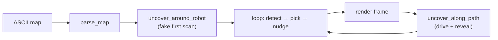

# `algo_demo.py` — watching the frontier algorithm think

`tools/algo_demo.py` is a standalone teaching and debugging tool: it runs the
real `FrontierAlgorithm` against tiny hand-drawn ASCII maps and animates the
exploration in a color-coded terminal, step by step. No ROS, no simulator, no
robot — just the pure detection and scoring functions from
`frontier_explorer.py` driven by a fake sensor model. It is the fastest way to
build intuition for *why* the algorithm picks the goals it does, and to reproduce
a selection bug in seconds rather than minutes of Gazebo.

```
python3 tools/algo_demo.py --map compound --inset 0.3 --min-size 5 --auto
```

## The idea: a robot in a text file

A map is just rows of characters — `#` wall, `0` free, `?` unknown, `R` robot
start. `parse_map` converts them to the same `-1/0/100` occupancy encoding the
real grid uses, so the algorithm sees exactly what it would on the robot:

```python
CELL_FREE, CELL_OCC, CELL_UNK = 0, 100, -1

def parse_map(rows):
    height, width = len(rows), max(len(r) for r in rows)
    data = []
    for row in rows:
        for ch in row.ljust(width):
            data.append(CELL_FREE if ch in ("0", "R")
                        else CELL_OCC if ch == "#" else CELL_UNK)
    info = MapInfo(width=width, height=height, resolution=1.0,
                   origin_x=0.0, origin_y=0.0)
    return data, info
```

`resolution=1.0` makes one cell equal one world meter, so grid and world
coordinates coincide and the printout is easy to reason about. Several maps ship
built in — `room`, `corridor`, `ring`, `maze`, `large`, `compound` — each chosen
to stress a different behavior (the `ring` map exists specifically to exercise the
"hollow centroid" case that motivated per-cell selection).

## Faking a sensor

On a real robot, driving to a goal reveals new cells as the lidar sweeps. The
demo simulates that with a **line-of-sight reveal**: any unknown cell within a
radius of the robot, *and* not occluded by a wall, becomes free.

```python
def uncover_around_robot(data, info, robot_xy, radius):
    data = list(data)
    for idx in range(info.width * info.height):
        if data[idx] != CELL_UNK:
            continue
        wx, wy = cell_to_world(idx, info)
        if math.sqrt((wx - rx)**2 + (wy - ry)**2) <= radius:
            if has_line_of_sight(data, info, robot_xy, (wx, wy)):
                data[idx] = CELL_FREE
    return data
```

`has_line_of_sight` walks a Bresenham line between the two cells and returns false
if any *intermediate* cell is a wall — so the robot cannot see through walls, and
a room is revealed only as far as its doorway allows. `uncover_along_path` sweeps
this reveal in steps of `radius/2` along the whole travel path, not just the
destination, mimicking a robot uncovering cells as it drives.

Notably, this line-of-sight logic is exactly the wall-awareness the real
`path_novelty_score` lacks (it counts unknown cells through walls). The demo is
where that better model was prototyped.

## The main loop

Each step mirrors one exploration tick: detect clusters, pick a target, nudge it
to a goal, then either drive there (revealing new space) or blacklist it if the
path is blocked.

```python
while True:
    algo.latest_clusters = find_frontier_clusters(data, info)
    target_xy = pick_best_frontier(algo.latest_clusters, info, robot_xy, ...)
    if target_xy is None:
        goal_xy = None
    elif args.nudge_mode == "unknown":
        goal_xy = nudge_away_from_unknown(target_xy, data, info, args.inset)
    else:
        goal_xy = nudge_toward_robot(target_xy, robot_xy, args.inset)

    print(render(...))                      # color-coded frame
    if goal_xy is None:
        no_frontier_count += 1              # patience countdown
        if no_frontier_count >= PATIENCE:
            break                           # exploration complete
    elif not has_line_of_sight(data, info, robot_xy, goal_xy):
        blacklist.add(goal_xy)              # blocked path
    else:
        data = uncover_along_path(data, info, robot_xy, goal_xy, radius)
        robot_xy = goal_xy                  # "drive" there
        blacklist.add(goal_xy)
```

## Rendering

`render` walks the grid and colors each cell: robot (`R`), target (`T`, the raw
`pick_best_frontier` pick), goal (`G`, after nudging), blacklisted (`B`),
frontier clusters (`A`–`Z`, each a distinct 256-color), free/wall/unknown. Seeing
`T` and `G` in different cells makes the nudge visible; seeing distinct cluster
letters makes the min-size filter and per-cell selection concrete.



## A `--nudge-mode` experiment

The tool carries a second, prototype nudge strategy, `nudge_away_from_unknown`,
selectable with `--nudge-mode unknown`. Rather than pulling the goal toward the
robot, it computes a vector *away from* nearby unknown cells and steps the goal
along it. The rationale (worth reading in the source comment): a frontier cell is
by definition on the known/unknown boundary, and the robot is not necessarily on
that boundary's normal, so pulling toward the robot does not reliably move the
goal off the boundary. This is exactly the kind of idea the demo exists to try
cheaply before committing it to the real pipeline.

## Observations and possible improvements

- **The demo is out of sync with the current pipeline.** Its call to
  `pick_best_frontier` uses the *pre-F31* keyword signature
  (`min_size=`, `blacklist_radius=`, `prefer_farthest=`), and it constructs
  `ExploreParams(min_frontier_size=..., goal_inset_m=...)` with fields that moved
  to `FrontierParams`. As written it would raise a `TypeError` against the current
  `frontier_explorer.py`/`explore_context.py`. Bringing it up to the F31 API
  (build a `FrontierTuning`, pass `data=`) is the highest-value fix here — a demo
  that does not run cannot teach.
- **No scoring introspection.** It shows the *winning* cell but not the
  per-scorer normalized costs. Printing the weighted breakdown for the winner (and
  runners-up) would make the F31 weighting visible, which is the whole point of
  the tool now.
- **Its own `bresenham_cells`/`world_to_cell` duplicate the library versions**
  (with a different argument order, `(c, r)` vs `(r, c)`). Reusing the
  `frontier_explorer` functions would remove a subtle divergence and a source of
  off-by-one confusion.
- **`--auto` aside, it is single-threaded and synchronous**, which is ideal for a
  teaching tool — but a `--export-gif` or frame-dump option would turn a run into
  documentation.
