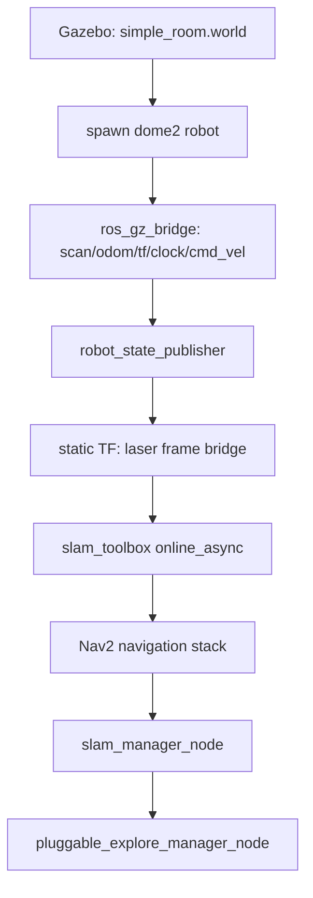

# sim_explore.launch.py — Autonomous Exploration in Gazebo

## What It Is and Why It Exists

`launch/sim_explore.launch.py` brings up the entire Mode E exploration stack — Gazebo
physics, sensor bridging, SLAM, Nav2, and the pluggable frontier explorer — on a
development machine with no robot hardware attached. It exists so that changes to
`pluggable_explore_manager_node.py`, `frontier_algorithm.py`, or the Nav2/slam_toolbox
parameter patches can be exercised end-to-end (drive a real diff-drive model, build a
real occupancy grid, hit real Nav2 recovery behaviors) without needing the physical DOME
robot.

It is a `better_launch` launch file, not a plain ROS2 one — `better_launch` lets a single
Python function assemble processes, ROS2 nodes, and *other* launch files (both its own and
standard `ros2launch` ones) imperatively, in the order they're written, rather than
building a declarative `LaunchDescription` tree. That imperative style is what makes this
file readable: each stage is a paragraph of code that does one thing and then hands off to
the next.

For debugging the individual pieces of this stack in isolation (one Gazebo/TF/Nav2/slam
piece per terminal, rather than the whole thing at once), see `X07-sim_debug_launch_files.md`
— four companion launch files built by decomposing this one and later recombining into a
more manageable set once the granular version had served its debugging purpose.



---

## Config Layering: Three Files, One Merged Params File

Nav2 and slam_toolbox both expect a single YAML params file per node. This launch file
builds that file by layering three sources, each overriding the last, using
`dome_nav.utils.yaml_override` / `yaml_patch_dict`:

1. **The package default** — `nav2_bringup`'s own `nav2_params.yaml`, located via
   `bl.find(...)`. This is the tested, working baseline; the launch file never edits it.
2. **`nav2_param_patch.yaml`** — dome-wide overrides (costmap sizing, controller
   tolerances) shared with the *real* robot's launch files.
3. **`explore_param_patch.yaml`** — exploration-specific overrides, deliberately
   conservative (`desired_linear_vel: 0.12`) because continuous motion at speed degrades
   slam_toolbox's scan-matching on real hardware.

```python
nav2_config = yaml_override(nav2_base, nav2_patch)
nav2_config = yaml_override(nav2_config, explore_patch)
nav2_config = yaml_patch_dict(nav2_config, {
    "docking_server": {"ros__parameters": {"dock_database": dock_db}}
})
```

Each `yaml_override`/`yaml_patch_dict` call returns a *new* file path — `write_config()`
content-hashes the merged YAML and writes it to `~/.dome/launch_cache/<hash>.yaml`, so
repeated launches with identical config reuse the same file instead of leaking a new temp
file every run.

### The sim-only fourth layer

Simulation has no scan-matching-degrades-at-speed concern, so a fourth merge restores
higher speed limits *only* for this launch file — it never touches the two shared patch
files, so real-hardware behavior is unaffected:

```python
nav2_config = yaml_patch_dict(nav2_config, {
    "controller_server": {"ros__parameters": {
        "FollowPath": {"desired_linear_vel": 0.3},
    }},
    "velocity_smoother": {"ros__parameters": {
        "max_velocity": [0.4, 0.0, 1.9],
        "min_velocity": [-0.4, 0.0, -1.9],
        "max_accel": [1.5, 0.0, 3.2],
        "max_decel": [-1.5, 0.0, -3.2],
    }},
})
```

This is a good example of a design principle worth naming: *simulation and hardware share
configuration by default, and diverge only where there's a specific, commented reason to.*
The comment in the code is the reason this override is safe to trust later — without it, a
future reader would have no way to tell "sim is faster on purpose" from "someone forgot to
apply the real speed cap."

---

## Bridging Two Worlds: Gazebo Transport and ROS2

Gazebo Harmonic's simulated sensors and actuators speak `gz-transport`, not ROS2. Every
topic the rest of the stack needs — the lidar scan, wheel odometry, TF, the simulated
clock, and the outgoing velocity command — has to cross that boundary through
`ros_gz_bridge`:

```python
gazebo.spawn_topic_bridge(
    GazeboBridge.clock_bridge(),
    GazeboBridge("/scan", "sensor_msgs/msg/LaserScan", "gz2ros"),
    GazeboBridge("/odom", "nav_msgs/msg/Odometry", "gz2ros"),
    GazeboBridge("/tf", "tf2_msgs/msg/TFMessage", "gz2ros"),
    GazeboBridge("/cmd_vel", "geometry_msgs/msg/Twist", "ros2gz"),
    GazeboBridge("/model/dome2/joint_state", "sensor_msgs/msg/JointState", "gz2ros",
                 remaps={"/model/dome2/joint_state": "/joint_states"}),
)
```

The direction matters: everything the robot *senses* flows `gz2ros` (Gazebo → ROS2);
`/cmd_vel` is the one exception, flowing `ros2gz`, because that's the only signal ROS2
sends *to* the simulated robot.

### The lidar frame naming quirk

`config/dome3_sim.urdf` names the lidar link `laser`, matching the real robot's TF tree so
that slam_toolbox's config (which hardcodes `"laser"` as the scan frame) works unchanged
between sim and hardware. But Gazebo's URDF→SDF conversion collapses fixed-jointed links
into their parent for physics purposes, and renames the resulting sensor frame to something
like `dome2/base_footprint/lidar`. Left alone, slam_toolbox would receive scans stamped
with a frame ID that doesn't exist anywhere in the published TF tree.

The fix is a static transform that's mathematically a no-op (identity translation and
rotation) but topologically essential — it gives the renamed gz frame a place in the TF
tree under the name slam_toolbox actually expects:

```python
bl.node(
    "tf2_ros",
    "static_transform_publisher",
    name="gz_laser_frame_bridge",
    params={"use_sim_time": True},
    cmd_args=["0", "0", "0", "0", "0", "0", "laser", "dome2/base_footprint/lidar"],
)
```

This is the kind of fix that looks unnecessary until you delete it and slam_toolbox starts
silently ignoring every scan.

---

## GUI Always On (headless mode removed 2026-07-02)

```python
gazebo.gazebo_launch("dome_nav", "simple_room.world", gz_args=["-r"])
```

`-r` starts the world unpaused. A `headless` launch arg (`-s`, server-only, no
GUI) existed briefly — added to free a development machine to run RViz2
against the same topics without GUI rendering competing for CPU — but was
removed once the doorway costmap-inflation stall investigation made it clear
the GUI is actually needed for this kind of work: watching the robot's actual
behavior near obstacles, and the local costmap's inflated cost region, is hard
to debug from topic echoes alone. See `02-doc/current.md`'s F13 T04 notes for
the finding that motivated this reversal.

---

## Two Kinds of `bl.include()`

The file includes two other launch files — `slam_toolbox`'s `online_async_launch.py` and
`nav2_bringup`'s `navigation_launch.py` — and both are ordinary `ros2launch`-style Python
launch files, not `better_launch` ones. `better_launch` supports including either kind, but
including a standard ROS2 launch file means starting a second, nested `LaunchService`
*inside* the process that's already running one for this file. That's a heavier-weight
operation than it looks, and it shows up as an occasional flake: with three such nested
launches active at once (Gazebo's own spawn helper uses the same mechanism internally,
plus slam_toolbox, plus Nav2), the launch has occasionally aborted with `cannot schedule
new futures after interpreter shutdown` — a race in the nested executors' teardown, not a
configuration problem. It doesn't reproduce reliably enough to bisect further yet; retrying
the launch has always succeeded so far.

---

## Observations for Future Improvement

- **The nested-`LaunchService` flakiness** is the most concerning rough edge in this file.
  If it becomes frequent rather than rare, the robust fix is to stop nesting Nav2's
  `navigation_launch.py` in-process and instead launch it as a genuine subprocess (e.g.
  via `ros2 launch` as an `ExecuteProcess`), trading tighter process integration for
  eliminating the shared-executor race entirely.
- **The sim-only speed override and the `explore_param_patch.yaml` values it overrides
  are easy to lose track of** since they live in two different files read in sequence.
  A comment at the top of `explore_param_patch.yaml` pointing at this override (and vice
  versa) would help a future reader avoid re-deriving this relationship from scratch.
- **The slow-motion behavior under load was eventually root-caused** (2026-07-02) to
  costmap inflation near the world's interior doorway, not GPU/CPU contention from GUI
  rendering — the `headless` hypothesis mentioned in earlier versions of this document
  turned out not to be the actual cause, which is part of why the option was removed
  rather than kept as a workaround.
- **The lidar frame bridge's identity transform** works, but its necessity is only
  documented in a comment; a short assertion or startup log line confirming the expected
  gz-renamed frame actually appears in `/tf` would turn a silent failure mode (scans
  quietly ignored) into a loud one.
