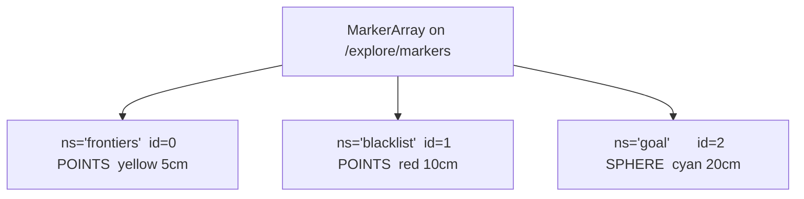
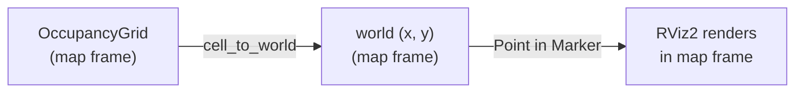

# explore_markers — RViz2 Visualization for Frontier Exploration

## Overview

`explore_markers.py` is a pure construction helper: given the current exploration
state, it builds a `MarkerArray` message ready to publish on `/explore/markers`.
RViz2 subscribes to that topic and renders the three visual layers that make
frontier exploration observable in real time — active frontier cells, blacklisted
goal positions, and the current navigation target.

The module has no ROS2 node, no timers, no subscribers, and no mutable state. Every
function takes data in and returns a message object out. That makes it trivially
testable with plain pytest and easy to reason about in isolation.

It was extracted from `pluggable_explore_manager_node.py` when that file approached
300 lines. The extraction involved no algorithmic change — only a separation of
concerns between "decide where to go" (frontier explorer) and "show what is
happening" (this module).

## The Three-Namespace Design

RViz2 identifies individual markers by the pair `(namespace, id)`. A single
`MarkerArray` message can carry markers from multiple namespaces in one publish
call. The exploration visualizer uses exactly three namespaces, each with a fixed
`id` of 0, 1, or 2:



Keeping `id` fixed per namespace means each publish replaces the previous marker
of the same `(ns, id)` in RViz2's internal state — there is never a stale duplicate
or an accumulation of old markers leaking through. If ids were allowed to vary (for
example one id per frontier cluster), cleanup would require tracking and explicitly
deleting every previously used id. The fixed-id design avoids that bookkeeping
entirely.

The top-level assembly function reflects this structure directly:

```python
def build_explore_markers(
    now: Time,
    is_exploring: bool,
    clusters: list[list[int]],
    min_frontier_size: int,
    map_info: MapInfo | None,
    blacklist: set[tuple[float, float]],
    goal_xy: tuple[float, float] | None,
) -> MarkerArray:
    markers = MarkerArray()
    markers.markers.append(
        build_frontier_marker(now, is_exploring, clusters, min_frontier_size, map_info)
    )
    markers.markers.append(build_blacklist_marker(now, blacklist))
    markers.markers.append(build_goal_marker(now, is_exploring, goal_xy))
    return markers
```

One function per namespace, one append per function. The caller publishes the
returned `MarkerArray` and never interacts with individual `Marker` objects.

## The DELETE Action Problem

RViz2 renders markers by maintaining a per-`(ns, id)` table. A marker published
with `action = ADD` (or `MODIFY`) enters that table and stays there indefinitely —
across map reloads, across topic reconnects, and across node restarts — until it is
explicitly replaced or removed. If the exploration node stops publishing frontiers
because exploration ended, the old yellow frontier cloud simply remains on screen.

The correct mechanism is `action = DELETE`. Publishing a `Marker` with `DELETE` and
the same `(ns, id)` tells RViz2 to remove that entry from its table. No geometry
data is needed in the DELETE message — the key `(ns, id)` is sufficient.

This module applies that mechanism to the two markers whose content is conditional
on `is_exploring`:

```python
marker.action = Marker.ADD if is_exploring else Marker.DELETE
```

When `is_exploring` becomes `False`, the next publish carries DELETE for frontiers
and DELETE for goal, clearing both from the screen. The blacklist marker always uses
ADD, which is discussed separately below.

## Frontier Marker — Yellow POINTS

The frontier marker visualizes every cell that belongs to a cluster large enough to
consider as a navigation target. Small clusters (below `min_frontier_size`) are
filtered out before adding points, matching the filtering applied during goal
selection. What the operator sees in RViz2 is the set of frontier cells the robot
actually treats as candidates — not the raw BFS output.

Each frontier cell is a flat integer index into the OccupancyGrid data array.
`cell_to_world` (imported from `frontier_explorer`) converts that index back to
world-frame `(x, y)` coordinates using the map's origin and resolution.

```python
def build_frontier_marker(now, is_exploring, clusters, min_frontier_size, map_info):
    marker = Marker()
    marker.header.frame_id = "map"
    marker.header.stamp = now
    marker.ns = "frontiers"
    marker.id = 0
    marker.type = Marker.POINTS
    marker.action = Marker.ADD if is_exploring else Marker.DELETE
    marker.scale.x = 0.05
    marker.scale.y = 0.05
    marker.color.r = 1.0
    marker.color.g = 1.0
    marker.color.b = 0.0
    marker.color.a = 1.0
    if is_exploring and map_info is not None:
        for cluster in clusters:
            if len(cluster) >= min_frontier_size:
                for idx in cluster:
                    wx, wy = cell_to_world(idx, map_info)
                    p = Point()
                    p.x = wx
                    p.y = wy
                    marker.points.append(p)
    return marker
```

The `POINTS` type renders each element of `marker.points` as an independent square
of size `scale.x` by `scale.y`. At 5 cm per point, individual frontier cells are
visible without flooding the display. The point color is set once on the marker and
applies uniformly to all points — there is no per-point color, which keeps the
message small.

The guard `if is_exploring and map_info is not None` before the loop is necessary:
if the action is DELETE, appending geometry would be wasted work, and if `map_info`
is `None` (the map has not arrived yet), `cell_to_world` cannot compute coordinates.

## Blacklist Marker — Red POINTS, Always ADD

The blacklist accumulates positions that the robot has tried and failed to reach.
These positions are kept for the entire session so the robot does not keep cycling
back to unreachable goals.

```python
def build_blacklist_marker(now, blacklist):
    marker = Marker()
    marker.header.frame_id = "map"
    marker.header.stamp = now
    marker.ns = "blacklist"
    marker.id = 1
    marker.type = Marker.POINTS
    marker.action = Marker.ADD
    marker.scale.x = 0.1
    marker.scale.y = 0.1
    marker.color.r = 1.0
    marker.color.g = 0.0
    marker.color.b = 0.0
    marker.color.a = 1.0
    for bx, by in blacklist:
        p = Point()
        p.x = bx
        p.y = by
        marker.points.append(p)
    return marker
```

The marker always uses `ADD`. This is intentional: blacklisted positions should
remain visible even when exploration is paused or finished, because they are
diagnostic information that helps the operator understand why the robot gave up on
certain areas. If the node restarts and the blacklist is cleared, the next publish
will naturally send an ADD with zero points, which RViz2 renders as nothing.

The blacklist points are stored in world coordinates as `(float, float)` tuples, so
no coordinate conversion is needed here — unlike frontier cells, which are stored as
grid indices.

The larger 10 cm scale (versus 5 cm for frontiers) makes blacklisted positions
visually distinct and easier to spot in a dense frontier cloud.

## Goal Marker — Cyan SPHERE

The goal marker shows where the robot is currently navigating. Unlike a cluster of
cells, the goal is a single world-frame position, so a `SPHERE` is more appropriate
than `POINTS`.

```python
def build_goal_marker(now, is_exploring, goal_xy):
    marker = Marker()
    marker.header.frame_id = "map"
    marker.header.stamp = now
    marker.ns = "goal"
    marker.id = 2
    marker.type = Marker.SPHERE
    if is_exploring and goal_xy is not None:
        marker.action = Marker.ADD
        marker.pose.position.x = goal_xy[0]
        marker.pose.position.y = goal_xy[1]
        marker.pose.orientation.w = 1.0
        marker.scale.x = 0.2
        marker.scale.y = 0.2
        marker.scale.z = 0.2
        marker.color.r = 0.0
        marker.color.g = 1.0
        marker.color.b = 1.0
        marker.color.a = 1.0
    else:
        marker.action = Marker.DELETE
    return marker
```

The `pose.orientation.w = 1.0` sets a valid unit quaternion (identity rotation).
Omitting it would leave the quaternion at the default `(0, 0, 0, 0)`, which is not
a valid rotation and produces a warning in some RViz2 versions. For a sphere the
orientation has no visual effect, but the field still needs to be valid.

At 20 cm diameter, the sphere is large enough to see clearly in a typical overhead
map view without obscuring nearby frontier points.

The DELETE branch fires when either `is_exploring` is `False` or `goal_xy` is
`None`. Both conditions mean there is no meaningful goal to display, and it is
better to remove the old marker than to leave a stale sphere at the previous target.

## Coordinate Systems and Frame ID

All three markers declare `frame_id = "map"`. This tells RViz2 which TF frame the
coordinates are expressed in. The `map` frame is the standard fixed frame in Nav2 —
the same frame in which the OccupancyGrid origin is expressed and in which the robot
pose is localized. Using any other frame would require RViz2 to look up a transform
before rendering, adding latency and a failure mode if TF is temporarily unavailable.



The `header.stamp` is passed in as a `Time` value from the caller (typically
`node.get_clock().now().to_msg()`). Stamping markers with the current time is
required for RViz2's "decay time" feature, which can automatically remove markers
older than a threshold. Even if decay is not configured, a missing or zero timestamp
produces a warning in RViz2.

## Observations

- **Duplicate marker header initialization.** All four functions set
  `header.frame_id`, `header.stamp`, and the `ns`/`id`/`type` fields with nearly
  identical boilerplate. A small private helper that initializes a `Marker` with
  these common fields and accepts `ns`, `id`, and `type` as arguments would reduce
  the repetition and make each builder function focus only on what is distinctive
  about that namespace.

- **No per-point color variation for frontiers.** All frontier cells are rendered
  in uniform yellow. It would be straightforward to color cells by cluster — for
  example, cycling through a palette — to visually distinguish separate frontier
  regions. RViz2's `POINTS` type supports per-point colors via `marker.colors`
  (plural). This is not required for basic debugging but would aid interpretation
  when many clusters are present.

- **Blacklist never deletes.** If a blacklisted position is later determined to be
  reachable (for instance after the map updates), there is no mechanism to remove it
  from the blacklist or from the RViz2 display. The current design treats blacklist
  as permanent within a session, which is conservative but may cause the robot to
  avoid navigable goals. A time-to-live or a manual-clear mechanism would improve
  long-session behavior.

- **`min_frontier_size` filter applied at render time.** The frontier marker filters
  clusters by `min_frontier_size` independently of whatever filtering the goal
  selection logic applies. If those two filtering steps ever diverge (for example if
  the goal selector uses a different threshold), the visualization would be
  misleading. A single canonical filtering step upstream, with the filtered clusters
  passed to both the goal selector and the marker builder, would eliminate this
  coupling risk.

- **Goal sphere size is fixed.** A 20 cm sphere is reasonable for indoor corridors
  but may be too small in large outdoor environments or too large in tight spaces.
  Making `scale` a parameter passed from the caller (or read from a ROS2 parameter)
  would make the visualization adaptable without code changes.
