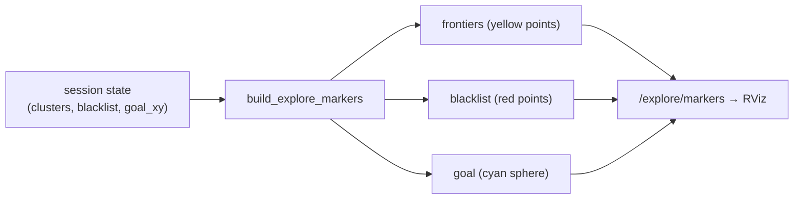

# Appendix — `explore_markers.py`

This module builds the RViz `MarkerArray` that visualizes an exploration session:
the yellow frontier points, the red blacklisted goals, and the cyan sphere at the
current goal. It is an appendix because it is pure presentation — no decisions,
no algorithm, just translating session state into `visualization_msgs` geometry.
`FrontierAlgorithm.render_markers` calls it; the node publishes the result
verbatim on `/explore/markers`.

## Three markers, one array

`build_explore_markers` assembles exactly three markers, each in its own
namespace so RViz can toggle them independently:

```python
def build_explore_markers(now, is_exploring, clusters, min_frontier_size,
                          map_info, blacklist, goal_xy) -> MarkerArray:
    markers = MarkerArray()
    markers.markers.append(build_frontier_marker(now, is_exploring, clusters,
                                                 min_frontier_size, map_info))
    markers.markers.append(build_blacklist_marker(now, blacklist))
    markers.markers.append(build_goal_marker(now, is_exploring, goal_xy))
    return markers
```

Two tiny helpers remove the boilerplate every marker needs — a stamped header in
the `map` frame, a namespace, an id, a type — and appending a point:

```python
def new_marker(now, ns, marker_id, marker_type) -> Marker:
    marker = Marker()
    marker.header.frame_id = "map"
    marker.header.stamp = now
    marker.ns, marker.id, marker.type = ns, marker_id, marker_type
    return marker
```

## The ADD/DELETE idiom

The interesting-enough-to-note detail is how markers are *cleared*. RViz markers
persist until explicitly removed, so a stale frontier cloud would linger after a
session ends. Each marker therefore chooses its `action` based on session state:
when exploring, `ADD` (with points); when not, `DELETE` (which removes the
previously published marker of the same namespace+id).

```python
marker.action = Marker.ADD if is_exploring else Marker.DELETE
```

The goal marker uses the same idea, keyed on whether a goal exists:

```python
def build_goal_marker(now, is_exploring, goal_xy) -> Marker:
    marker = new_marker(now, "goal", 2, Marker.SPHERE)
    if is_exploring and goal_xy is not None:
        marker.action = Marker.ADD
        marker.pose.position.x, marker.pose.position.y = goal_xy
        ...  # cyan, 0.2 m sphere
    else:
        marker.action = Marker.DELETE
    return marker
```

The frontier marker also re-applies the `min_frontier_size` filter when drawing,
so RViz shows only the clusters the algorithm would actually consider — the
visualization matches the decision, not the raw detection.



## Observations and possible improvements

- **Colors and scales are hard-coded magic numbers.** Yellow frontiers, 0.05 m
  points, a 0.2 m goal sphere — all inline. Pulling them into named constants (or
  params) would make the palette adjustable and self-documenting.
- **The blacklist marker never DELETEs.** It always `ADD`s, so if the node clears
  its blacklist mid-session the last-published red points remain until the next
  publish overwrites them. Harmless (the next tick republishes an empty set) but
  the asymmetry with the other two markers is worth a comment.
- **No per-cluster coloring.** Unlike the `algo_demo` tool, all frontier points
  share one color, so distinct clusters are indistinguishable in RViz. Coloring by
  cluster id (as the demo does) would make the min-size and selection behavior
  visible on the real robot.
