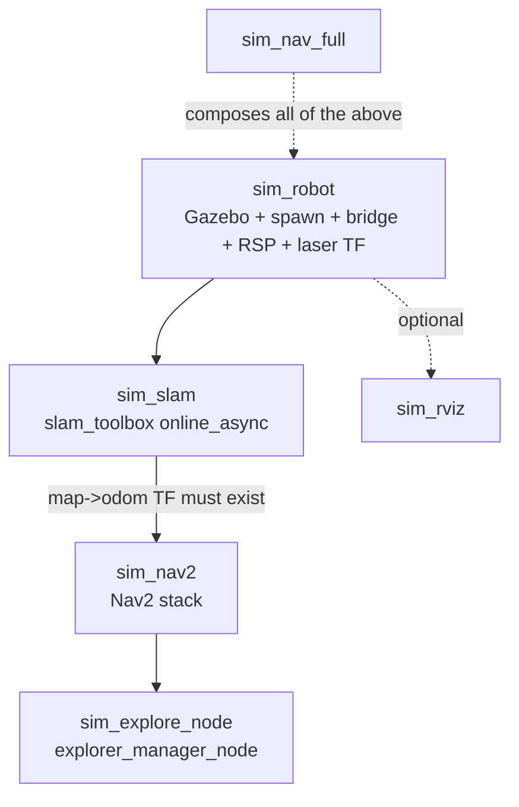

# Appendix — the split simulation launch files

The `sim_*.launch.py` files bring the whole navigation stack up in Gazebo. They
are an appendix because they contain little logic — they wire existing nodes
together with `better_launch` — but the *way* they are split, and the hard-won
comments explaining why, are genuinely instructive. Nearly every non-obvious line
in these files is a scar from the F13 T04t "robot does not appear / Nav2 aborts
bringup" debugging saga.

The guiding decision was to **split one monolithic launch into single-purpose
files** so each layer can be started and *confirmed working* before the next is
stacked on top. That staging is what made the startup-ordering bugs diagnosable.



## `sim_robot` — the foundation, and the anonymous-node trap

`sim_robot.launch.py` starts everything needed for a *visible, TF-correct*
simulated robot: Gazebo, the model spawn, the `ros_gz` topic bridge,
`robot_state_publisher`, and the static transform bridging the laser frame. Two
comments in it document bugs that cost real time.

First, `robot_state_publisher` **must be given an explicit `name=`**. Without one,
`better_launch` treats it as anonymous and calls `get_unique_name()`, which scans
*every process on the system* to avoid name collisions — and on a busy VM that
scan takes long enough that the node never appears to start. This, not Gazebo,
was the actual cause of the "robot model does not appear in RViz" hang.

Second, the URDF is passed via a **params file, not the `params=` dict**. `bl.node`
renders `params=` entries as individual `-p key:=<json>` CLI args, and a 300-line
URDF blown up into one giant command-line argument hangs the process spawn. The
`write_config` helper (see `01-utils.md`) writes the URDF to a cached YAML file
and hands over a path instead:

```python
rsp_params_path = write_config({
    "/**": {"ros__parameters": {
        "robot_description": robot_description,
        "use_sim_time": True,
    }}
})
bl.node("robot_state_publisher", "robot_state_publisher",
        name="robot_state_publisher", param_files=[rsp_params_path],
        remaps={"/joint_states": "/model/dome2/joint_state"})
```

The remap is on `robot_state_publisher`'s *subscription*, not on the bridge,
because `spawn_topic_bridge` starts the bridge raw and drops remaps — so the
remap has to happen on the consumer side.

## `sim_slam` and `sim_nav2` — the ordering dependency

These two are split precisely so slam can be confirmed publishing `/map` before
Nav2 starts. Each is a thin `bl.include` of an upstream launch with a config file:

```python
# sim_slam
bl.include("slam_toolbox", "online_async_launch.py",
    slam_params_file=slam_config, use_sim_time="true")

# sim_nav2
bl.include("nav2_bringup", "navigation_launch.py",
    params_file=nav2_config, use_sim_time="true")
```

The dependency is unforgiving: without a `map` TF frame, Nav2's
`planner_server` global_costmap blocks on activation and `lifecycle_manager`
aborts the *entire* bringup after ~60s. Starting them separately lets a human
verify `/map` is live before committing Nav2.

## `sim_nav_full` — composing, with a readiness gate

`sim_nav_full.launch.py` is the single-command convenience wrapper. Crucially it
does **not** duplicate the split files' logic — it `bl.include`s them in
dependency order. Its one piece of real code exists because *ordering is not
readiness*: `bl.include` guarantees launch order but not that slam has actually
published its `map->odom` transform yet, and Nav2's global_costmap waits only 0.5s
for it during activation before the whole bringup aborts.

```python
bl.include("dome_nav", "sim_robot.launch.py")
bl.include("dome_nav", "sim_slam.launch.py")
wait_for_map_odom_tf(bl)          # block until the transform actually exists
bl.include("dome_nav", "sim_nav2.launch.py")
bl.include("dome_nav", "sim_explore_node.launch.py")
```

`wait_for_map_odom_tf` polls a TF buffer until `map->odom` resolves. Its comment
documents another `better_launch` subtlety: it must use `bl.shared_node` (already
spun by better_launch's own executor) rather than `rclpy.create_node()`, because
better_launch runs `rclpy.init()` against its own private Context — a plain
`create_node()` would raise `NotInitializedException`.

## A recurring `better_launch` gotcha: literal defaults only

Both `sim_explore_node` and `sim_nav_full` carry an identical block of
sim-only exploration defaults in their function signatures, with a comment
explaining why they cannot be shared via an imported constant:

> bl's CLI statically parses launch function signatures via AST **without
> importing the module**, so a non-literal default like `= SOME_IMPORTED_NAME`
> fails with "not a valid float" — only literal constants written directly in the
> signature work.

That is the reason for the duplication — it is a framework constraint, not an
oversight.

## Observations and possible improvements

- **The duplicated defaults are a maintenance hazard.** `sim_explore_node` and
  `sim_nav_full` must be kept in lockstep by hand; they can silently drift. A test
  asserting the two signatures' defaults match would catch drift without fighting
  the AST-parsing constraint.
- **`wait_for_map_odom_tf` busy-polls at 0.2 s.** Fine for a 30 s startup budget,
  but a TF `Buffer` callback or condition variable would be cleaner than a
  `time.sleep` loop.
- **Magic frame/topic strings** like `"dome2/base_footprint/lidar"` are derived
  empirically and hard-coded with a comment. If the URDF root link ever changes,
  this silently breaks; deriving it from the model name would couple it correctly.
- **RViz is deliberately excluded** from `sim_nav_full`, which is the right call
  (it stays an optional window) but means a newcomer running the "full" stack sees
  nothing until they also launch `sim_rviz`. A one-line hint in the log would ease
  that.
