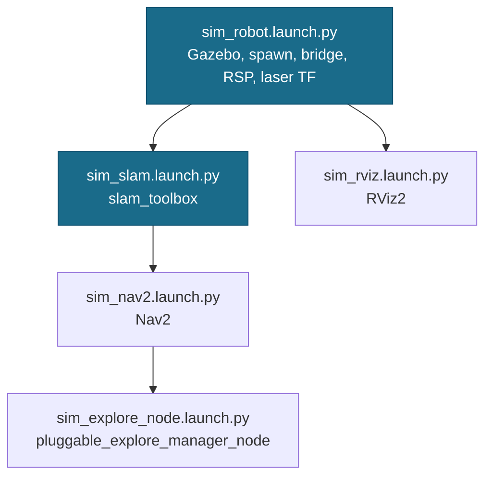
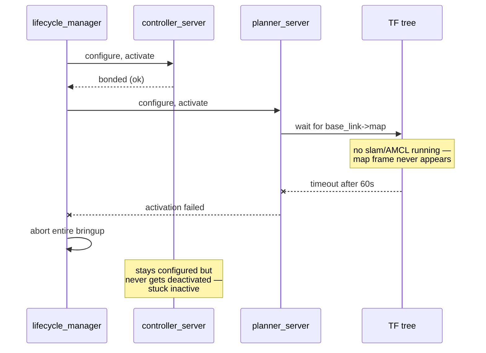
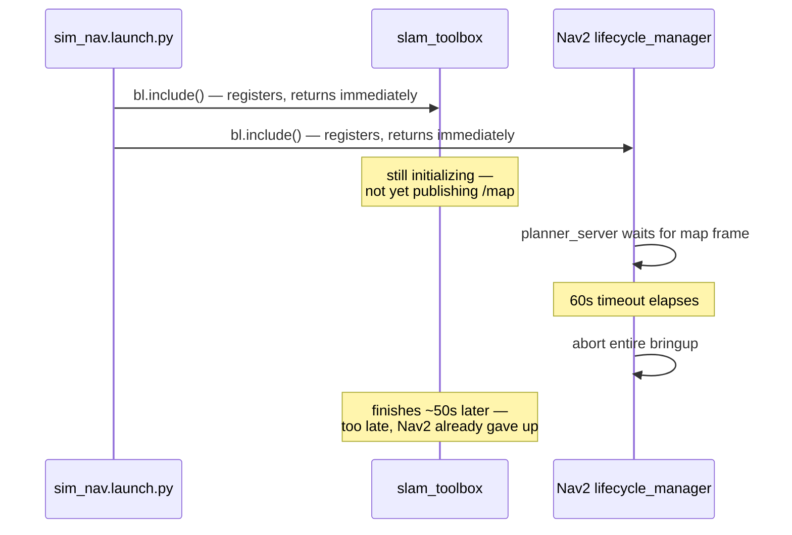

# sim_robot.launch.py, sim_slam.launch.py, sim_nav2.launch.py, sim_rviz.launch.py, sim_explore_node.launch.py — Piece-by-Piece Sim Debugging

## What These Are and Why They Exist

`sim_explore.launch.py` (see `11-sim_explore_launch.md`) brings up the entire
Mode E sim stack in one process. That's the right shape for day-to-day use,
but it's the wrong shape for debugging *which piece* of the stack is
misbehaving — when something goes wrong, the only signal is a combined log
stream from nine-plus nodes that all started within the same few seconds.

These files exist so the same stack can be brought up **one dependency
layer at a time**, in separate terminals, with time to inspect each layer
before starting the next. They were built and used live during three real
investigations this way:

1. Whether Nav2 could activate cleanly *without* anything else running (it
   could not — see below).
2. Why a fresh exploration session immediately reported "no frontiers found"
   (a bug in telemetry diagnostics, not in the stack itself — see
   `06-frontier_explorer.md`).
3. Why Nav2 occasionally failed to activate again even *after* combining slam
   and Nav2 into one `sim_nav.launch.py` file, in the right order (see "The
   Recurrence" below) — the fix from investigation #1 turned out to be
   necessary but not sufficient.

All three bugs were only visible because the stack could be paused
mid-assembly and inspected — something `sim_explore.launch.py`'s all-in-one
launch doesn't allow.

## From Nine Files Down to Four, Then Five

The first version of this idea was nine single-node files — one per
node/include in `sim_explore.launch.py` (Gazebo, spawn, bridge,
`robot_state_publisher`, the static laser-frame TF, RViz2, slam_toolbox, Nav2,
and the explore node). That granularity was exactly right for finding the two
bugs described below — each layer could be started and inspected in complete
isolation. Once the debugging was done, nine terminal windows for routine use
was needless overhead, so they were consolidated into four, grouped by what
actually depends on what — `sim_slam.launch.py` and `sim_nav2.launch.py`
combined into one `sim_nav.launch.py`. That consolidation caused a real
regression (see "The Recurrence" below) and was split back into two on
2026-07-04, giving the current five:



`sim_rviz.launch.py` only needs *something* publishing topics to be useful —
it doesn't have a hard dependency, though it's more useful once `sim_robot`
is up. `sim_explore_node.launch.py` genuinely needs `sim_nav2` (Nav2 to send
goals to) and, transitively, `sim_slam` and `sim_robot` (a `map` frame, valid
TF/scan/odom). A sixth file, `sim_nav_full.launch.py` (see
`11-sim_explore_launch.md`), now composes all of these via `bl.include()` for
single-command routine use, while these five remain available for
step-by-step debugging.

## sim_robot.launch.py — Everything Needed for a Visible, TF-Correct Robot

**Updated 2026-07-07**: this file no longer calls `gazebo.gazebo_launch()` at
all — Gazebo must now be started separately, by hand (`gz sim -r
<world>.world`), before running this file. The current shape is:

```python
gazebo.spawn_model(
    "dome2", urdf_path,
    spawn_args=gazebo.get_gazebo_axes_args(x=spawn_x, y=spawn_y, z=0.05),
)
gazebo.spawn_topic_bridge(
    GazeboBridge.clock_bridge(),
    GazeboBridge("/scan", "sensor_msgs/msg/LaserScan", "gz2ros"),
    GazeboBridge("/odom", "nav_msgs/msg/Odometry", "gz2ros"),
    GazeboBridge("/tf", "tf2_msgs/msg/TFMessage", "gz2ros"),
    GazeboBridge("/cmd_vel", "geometry_msgs/msg/Twist", "ros2gz"),
    GazeboBridge("/model/dome2/joint_state", "sensor_msgs/msg/JointState", "gz2ros"),
)
rsp_params_path = write_config({
    "/**": {"ros__parameters": {
        "robot_description": robot_description,
        "use_sim_time": True,
    }}
})
bl.node("robot_state_publisher", "robot_state_publisher",
        name="robot_state_publisher",
        param_files=[rsp_params_path],
        remaps={"/joint_states": "/model/dome2/joint_state"})
bl.node("tf2_ros", "static_transform_publisher", name="gz_laser_frame_bridge",
        params={"use_sim_time": True},
        cmd_args=["0", "0", "0", "0", "0", "0", "laser", "dome2/base_footprint/lidar"])
```

Two things changed from the original version, both found via live debugging
of a "robot model does not appear in RViz" report:

1. **`robot_state_publisher` now passes `name="robot_state_publisher"`
   explicitly.** Without it, `bl.node()` treats the node as anonymous and
   calls `get_unique_name()`, which scans *every process on the system*
   (`get_nodes(include_foreign=True)` → `find_foreign_nodes()`) to avoid a
   name collision — on a busy VM (hundreds of processes) this scan
   effectively never completed, so the node never started at all, even
   though `better_launch` had already logged its "Starting process..."
   message. `gazebo.spawn_model()`/`spawn_topic_bridge()` were never
   affected by this because they already pass explicit names and use
   `raw=True`, which skips the anonymous-naming path entirely.
2. **`robot_description` now goes through `param_files=[...]` (a real params
   file written via `write_config()`), not `params={...}`.** `bl.node()`
   renders `params=` dict entries as individual `-p key:=<json value>`
   command-line arguments — a 300-line URDF blown up into one giant CLI arg
   was suspected as a contributing factor (the same failure family as the
   multi-line-XML CLI-arg bug documented earlier in this same file, for
   `test5.bash`), though the name-collision scan above turned out to be the
   actual root cause. Kept anyway since it avoids the huge command line
   regardless. This also surfaced an independent, unrelated bug: the
   installed `better_launch`'s `elements/node.py` emitted `--param-file` for
   `param_files` entries, but ROS2's real `rcl` flag is `--params-file`
   (plural) — fixed directly in `src/better_launch`.

Gazebo's own process was investigated and ruled out as the cause (reproduced
the identical hang with Gazebo started completely externally, outside
`better_launch` entirely) — removing `gazebo.gazebo_launch()` from this file
did not fix the bug, but was kept anyway per user decision: running Gazebo as
a fully independent process simplifies debugging (native `gz topic -l` can
confirm the sim layer independent of ROS2/`better_launch`).

Nothing here needs a `map_name` argument, because none of these five pieces
know or care about a saved map — the robot is fully visible and drivable
(via `/cmd_vel`) with just this. Success is checkable directly:
`/robot_description` should have a publisher, and `tf2_echo odom base_link`
should resolve rather than reporting a missing frame.

**Bug found + fixed 2026-07-04**: the `remaps={...}` originally attached to
the `GazeboBridge` entry above looked correct but silently did nothing.
`spawn_topic_bridge()` (in the installed `better_launch` package) always
starts the bridge process with `raw=True`, which — per its own docstring —
drops any command-line arguments except those explicitly given, including
the remap flags a normal `bl.node()` call would add. Confirmed via
`/proc/<pid>/cmdline` on the running bridge: zero `-r` arguments present.
The practical effect: `/joint_states` had zero publishers, so
`robot_state_publisher` never received joint angles, and RViz2's RobotModel
display showed no transform for `left_wheel`/`right_wheel` (the two
`continuous` joints, whose TF depends on live angles rather than a fixed
offset). The fix remaps the *other* end of the connection instead —
`robot_state_publisher`'s own `bl.node()` call, which is not `raw`, honors
`remaps` normally, so its subscription is redirected to the bridge's actual
(un-remapped) topic name.

**A subtle `better_launch` gotcha found while writing the first, split-apart
version of this file**: `gazebo.gazebo_launch()`, `gazebo.spawn_model()`, and
`gazebo.spawn_topic_bridge()` all call `BetterLaunch.instance()` internally to
find the current launch context. That singleton is only populated once
`BetterLaunch()` has actually been *constructed* somewhere in the process —
`sim_explore.launch.py` does this implicitly because it needs a `bl` reference
for other calls anyway, but a file that only calls these `gazebo.*` helper
functions and never itself calls `BetterLaunch()` gets
`AttributeError: 'NoneType' object has no attribute 'find'`. The fix is one
line — `bl = BetterLaunch()` at the top of the function, even if `bl` is
otherwise unused in a particular file — but it's exactly the kind of implicit
dependency that only surfaces once you try to extract a subset of an existing
launch file's calls into a new one.

## sim_slam.launch.py and sim_nav2.launch.py — Split, Combined, Then Split Again

This is where the more interesting bugs were found — plural, because the
same underlying constraint (Nav2 needs a `map` frame to exist before it
activates) caused two distinct failures at two different points in this
file's history. The two includes themselves are unsurprising —
`slam_toolbox`'s `online_async_launch.py`, and separately `nav2_bringup`'s
`navigation_launch.py`, both with the same config construction
`sim_explore.launch.py` already uses:

```python
# sim_slam.launch.py
bl.include("slam_toolbox", "online_async_launch.py",
    **{"slam_params_file": slam_config, "use_sim_time": "true"})
```

```python
# sim_nav2.launch.py
bl.include("nav2_bringup", "navigation_launch.py",
    **{"params_file": nav2_config, "use_sim_time": "true"})
```

What's *not* obvious from reading this code is that **order and readiness**
matter a great deal, and the failure mode when you get either wrong is
confusing.

### Why Nav2 Can't Activate Alone

The first version of this debugging split had a standalone `sim_nav2.launch.py`
— Nav2, with nothing providing localization. Bringing it up on top of a bare
`sim_robot.launch.py` (no slam, no map) produced this from
`lifecycle_manager`'s log:

```
Configuring docking_server
Activating controller_server
Server controller_server connected with bond.
Activating smoother_server
Server smoother_server connected with bond.
Activating planner_server
[60 second gap]
Failed to change state for node: planner_server
Failed to bring up all requested nodes. Aborting bringup.
```

`planner_server` owns the global costmap, and the global costmap's activation
blocks on a valid `base_link → map` TF chain — which only exists once
something (slam_toolbox or AMCL) is publishing `map → odom`. With neither
running, that transform never appears, so `planner_server`'s `on_activate()`
call hangs until Nav2's internal service-call timeout (60 s) expires and
`lifecycle_manager` gives up.

The costly part isn't the 60-second wait itself — it's that
`lifecycle_manager`'s bringup is **all-or-nothing**. One server failing to
activate aborts the *entire* sequence, so every other server (`controller_server`,
`smoother_server`, `bt_navigator`, everything) is left stuck in `inactive`
even though each one individually configured and would have activated fine on
its own. A user watching this fail sees the exact symptom of a broken robot —
`Invalid frame ID "map" ... frame does not exist` — with no obvious link back
to "the launch order was wrong."



Combining slam and Nav2 into one file, in the right order, makes this a
non-issue in the common case: `/map` exists (from slam_toolbox) before
`planner_server` ever tries to activate, so the TF chain is already valid and
activation completes in a couple of seconds instead of sixty. Confirmed via
the same `lifecycle_manager` log showing `Managed nodes are active` for all
ten servers on the very next attempt. This combined file was named
`sim_nav.launch.py` and, per the earlier four-file consolidation, replaced
both `sim_slam.launch.py` and `sim_nav2.launch.py`.

### The Recurrence: Order Is Not Readiness

**2026-07-04.** The combined `sim_nav.launch.py` re-triggered the *exact same*
symptom it was built to fix — `lifecycle_manager` aborting the bringup because
`planner_server` timed out waiting for the `map` frame — despite slam being
listed first in the file. The reason: `bl.include()` (like `IncludeLaunchDescription`
underneath) only guarantees that the include is *registered* in launch order.
It returns as soon as the nested launch is scheduled, not once the included
stack is actually up and publishing. A live run showed Nav2's processes
running for 110 seconds with `/map` and `map→odom` TF both genuinely present
by the end, but `bt_navigator`/`controller_server`/`planner_server`/
`behavior_server` were all permanently stuck `inactive` — `planner_server` had
already exhausted its 60-second activation timeout *before* slam_toolbox
finished its own startup, and `lifecycle_manager` aborted the whole bringup on
that failure before slam ever got a chance to catch up.



"Start slam first" and "wait for slam to be *ready* first" are different
guarantees, and only the file-ordering one is free with `bl.include()`. The
practical fix applied was to split `sim_nav.launch.py` back into
`sim_slam.launch.py` and `sim_nav2.launch.py` so a human can insert the
missing readiness check manually — start `sim_slam.launch.py`, confirm `/map`
is actually publishing, *then* start `sim_nav2.launch.py` as a separate step.
The real fix — blocking programmatically on `/map` (or the `map` TF frame)
inside a single script before including Nav2 — is still open; see
`02-doc/current.md`'s Likely Next Steps.

### A Second, Unrelated Failure Mode Found the Same Day

While debugging the above, a *different* activation failure appeared on a
retry: `lifecycle_manager` again aborted, this time reporting `Failed to
change state for node: docking_server` — even though `docking_server`'s own
log showed it had configured successfully. `ros2 node list` explained why: two
nodes were both registered as `/docking_server`. One was the current run; the
other was an `opennav_docking` process still alive from **the previous day's**
session (`ps` showed a start time of `Jul02`, not the current day).

ROS2's node-name resolution doesn't disambiguate between two nodes claiming
the same name — the service call `lifecycle_manager` made almost certainly
landed on the stale node (already `active` from its old run), and an
`active → configuring` transition is invalid, hence the failure. Killing the
orphaned process and retrying fixed it immediately.

This is the same family of bug documented in `02-doc/current.md`'s
process-hygiene notes (`pkill -f` unreliably matching long command lines), but
notable here for persisting across an entire day rather than just within one
debugging session — a reminder that "did I clean up from last time" needs to
be checked regardless of how much time has passed, not just right after a
crash.

## sim_rviz.launch.py and sim_explore_node.launch.py

Both are thin, single-`bl.node()` wrappers with no surprises:

```python
bl.node("rviz2", "rviz2", params={"use_sim_time": True})
```

```python
bl.node("dome_nav", "pluggable_explore_manager_node", name="explore_manager",
        params={
            "max_explore_radius": max_explore_radius,
            "max_frontier_dist": max_frontier_dist,
            "prefer_farthest": prefer_farthest,
            "map_name": map_name,
            "use_sim_time": True,
        },
        ros_waittime=30.0)
```

`sim_explore_node.launch.py` exposes `max_frontier_dist` and `prefer_farthest`
as launch arguments (defaults `3.0` and `True`) specifically so they can be
overridden from the command line while debugging. `max_frontier_dist`'s
default was originally `1.0`, matching the node's own ROS parameter default
at the time — see `06-frontier_explorer.md` and `04-explore_context.md` for
why that turned out to be *below* `min_frontier_dist`'s default of `1.3`, an
empty distance band that made exploration always report zero goals sent,
regardless of the map. `prefer_farthest` was added the same day the
`max_frontier_dist` bug was fixed, once exploration could actually run and a
different problem became visible — see `06-frontier_explorer.md`'s
`prefer_farthest` section.

## Observations

- **`sim_robot.launch.py` and `sim_nav.launch.py` don't start `slam_manager_node`**
  (dome_nav's own lifecycle wrapper that persists slam_toolbox's pose graph
  periodically) — only `sim_explore.launch.py` and the real-robot launch files
  do. This was true even of the original nine-file split (there was never a
  `sim_slam_manager.launch.py`). It's not a bug — nothing in this debug stack
  needs map persistence — but it does mean a map built via `sim_nav.launch.py`
  alone won't get saved to disk unless `sim_explore.launch.py` is used instead.
- **The all-or-nothing `lifecycle_manager` bringup behavior** that caused the
  Nav2-without-slam failure is a Nav2 property, not something this codebase
  controls. It's worth remembering as a general debugging heuristic beyond
  this specific case: if *one* lifecycle node in a Nav2 stack looks like it
  never activated, check whether some *other* node's activation failed and
  aborted the whole sequence, rather than assuming the node you're looking at
  is the one that's actually broken.
- **These files duplicate config-construction code** (the `yaml_override`/
  `yaml_patch_dict` chains for slam and Nav2 params) that also exists in
  `sim_explore.launch.py`. This is deliberate for now — extracting a shared
  helper would couple the debug files to the all-in-one file's internals in a
  way that would make it harder to run pieces in isolation with different
  overrides. Worth revisiting if the two ever drift out of sync in practice.
  `sim_nav_full.launch.py` (2026-07-04) sidesteps this differently for the
  *composed single-command* use case — it calls `bl.include()` on these same
  files rather than re-implementing their logic a third time, so at least
  that entry point can't drift independently. `sim_explore.launch.py` itself
  is still a separate, hand-duplicated implementation of the same stack.
- **`bl.include()` guarantees order, not readiness** — flagged as an open risk
  back in the 2026-07-04 notes above, this was confirmed as a real bug and
  fixed on 2026-07-07: `sim_nav_full.launch.py` called
  `bl.include("dome_nav", "sim_slam.launch.py")` immediately followed by
  `bl.include("dome_nav", "sim_nav2.launch.py")`, but `bl.include()` returns
  as soon as it *registers* the nested launch, not once it's actually ready.
  `slam_toolbox` needs a moment after starting to receive its first `/scan`
  and publish `map→odom`. Nav2's `global_costmap` only waits a **hardcoded
  0.5s** for that transform during activation (confirmed via `strings` on
  `libnav2_costmap_2d_core.so` — not a YAML-configurable parameter) and
  `lifecycle_manager` aborts the *entire* bringup if it times out — confirmed
  live via `planner_server`'s own log: "Failed to activate global_costmap
  because transform from base_link to map did not become available before
  timeout." Fixed by adding a `wait_for_map_odom_tf()` helper in
  `sim_nav_full.launch.py` that blocks (polling a `tf2_ros.Buffer` up to 30s)
  between the `sim_slam` and `sim_nav2` includes until the transform genuinely
  exists. It uses `bl.shared_node` rather than a node of its own —
  `better_launch` runs `rclpy.init()` against its own private `Context`, not
  the global default one, so a plain `rclpy.create_node()` call raises
  `NotInitializedException`. `bl.shared_node` is already spun continuously by
  `better_launch`'s own background executor thread, so the wait only needs to
  poll with `time.sleep()`, not call `spin_once()` itself (which would race
  with that thread).
