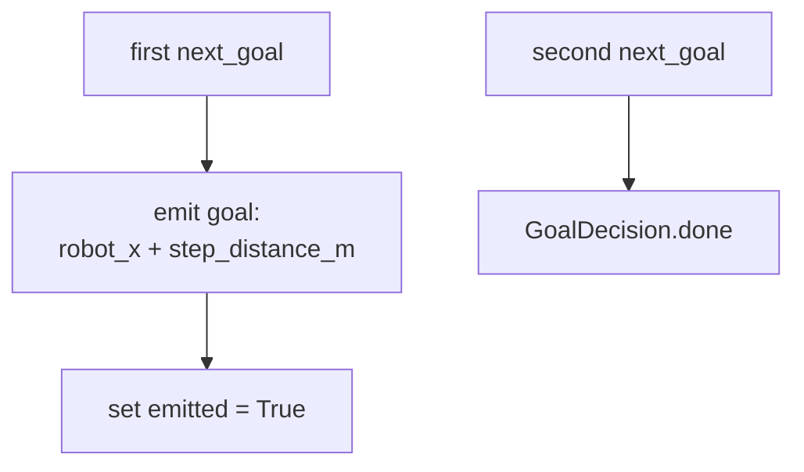

# Appendix — `hello_world_algorithm.py`

The smallest possible exploration algorithm, and the template for writing a new
one. It exists to answer a single question for anyone extending the package:
*what is the absolute minimum I must implement to be a valid
`ExplorationAlgorithm`?* The answer, demonstrated here, is: **one method.**

## The whole thing

`HelloWorldAlgorithm` emits exactly one goal — a fixed distance straight ahead in
the map's +x direction — and then reports done. It ignores the map entirely. That
is intentionally useless as a real strategy but perfect as a reference: it shows
the protocol's shape with nothing else in the way.

```python
class HelloWorldAlgorithm:
    """Emits ONE goal a step ahead of the robot (map +x), then done. Ignores the map."""

    def __init__(self):
        self.emitted = False
        self.step_distance_m = 1.0

    def declare_params(self, node):
        node.declare_parameter("preferred_goal_distance", self.step_distance_m)
        self.step_distance_m = node.get_parameter("preferred_goal_distance").value

    def next_goal(self, ctx: ExplorationContext) -> GoalDecision:
        if self.emitted:
            return GoalDecision.done()
        self.emitted = True
        rx, ry = ctx.robot_xy
        return GoalDecision.new_goal((rx + self.step_distance_m, ry))
```

## What it teaches

Reading it against the protocol in `04-explore_context.md` makes three things
concrete:

- **Only `next_goal` is required.** The optional viz/diagnostic hooks
  (`render_markers`, `telemetry_extra`, and friends) are simply *absent*. The node
  calls them via `getattr` and falls back to a default when they are missing, so
  omitting them costs nothing — no stubs, no `NotImplementedError`.
- **`declare_params` declares one knob of its own.** Since F34 T03 moved
  `preferred_goal_distance` out of the shared `ExploreParams`, HelloWorld — a
  second reader — declares its own same-named step param (default `1.0`) rather
  than borrowing the node's. Contrast with `FrontierAlgorithm`, whose
  `declare_params` registers a dozen ROS parameters; a truly tuning-free
  algorithm could still leave the body `pass`.
- **`GoalDecision` is how you speak to the node.** One goal, then
  `GoalDecision.done()` — the same `done` the node interprets as "session
  complete." A minimal algorithm never needs `GoalDecision.blocked()`; that
  distinction only matters when a strategy can be *temporarily* out of targets.

It is also a structural (not inherited) match: the class subclasses nothing. It
*is* an `ExplorationAlgorithm` purely because it has a `next_goal` with the right
signature — the payoff of using a `typing.Protocol` for the contract.



## Using it

The node's registry lists it as `"hello"`, so
`--explore_algorithm hello` (or the `explore_algorithm` ROS param) selects it —
handy for smoke-testing the whole goal-sending / Nav2 pipeline without frontier
detection in the mix. If Nav2 drives the robot one step forward and the session
ends cleanly, the plumbing works and any remaining trouble is in the real
algorithm.

## Observations and possible improvements

- **The heading is ignored.** It always aims along map +x, regardless of which way
  the robot faces, so the one goal may point into a wall. Reading the robot's yaw
  from TF and stepping *forward* would make it a slightly more honest smoke test —
  though at the cost of the radical simplicity that is its whole point.
- **As a template it is undercommented for its purpose.** A short "to add a hook,
  define a method named X returning Y" note in the file would turn it from an
  example into documentation.
